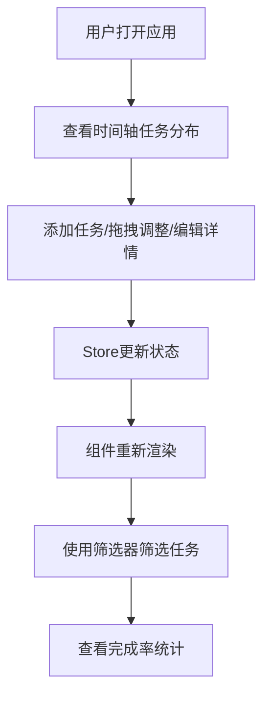

## 1. 产品概述

时间轴待办看板是一款团队协作任务管理工具，解决待办事项分散在不同平台、缺乏直观时间轴视图和拖拽调整优先级的问题，帮助团队避免任务遗漏或重复。

- 核心价值：将分散的任务集中在可视化时间轴上，通过拖拽操作直观管理任务优先级和截止日期
- 目标用户：需要多任务并行管理的团队和个人
- 市场价值：提供比传统待办清单更直观的时间维度视图，比复杂项目管理工具更轻量易用

## 2. 核心功能

### 2.1 用户角色
| 角色 | 注册方式 | 核心权限 |
|------|----------|----------|
| 普通用户 | 无需注册，本地使用 | 任务的增删改查、拖拽排序、筛选统计 |

### 2.2 功能模块
1. **时间轴主视图**：无限横向滚动时间轴，按日期显示任务卡片，支持虚拟化渲染
2. **任务卡片管理**：创建、编辑、删除任务，标记完成状态，拖拽排序
3. **侧面板筛选统计**：多维度筛选任务，显示完成率进度和当日任务概览

### 2.3 页面详情
| 页面名称 | 模块名称 | 功能描述 |
|----------|----------|----------|
| 主页面 | 时间轴区域 | 横向滚动时间轴，日期刻度，任务卡片按日期排列，当前日期红色竖线指示 |
| 主页面 | 任务卡片 | 显示标题、标签颜色、截止日期、优先级，支持拖拽和点击展开详情 |
| 主页面 | 添加任务模态框 | 中央弹出表单，输入标题、截止日期、标签颜色、优先级 |
| 主页面 | 侧面板 | 优先级/颜色/状态筛选器，圆形完成率进度条，当日任务统计 |

## 3. 核心流程

用户打开应用 → 查看时间轴上的任务分布 → 点击空白处或按钮添加新任务 → 填写表单创建任务 → 拖拽任务调整日期或优先级 → 点击卡片展开编辑详情 → 勾选完成标记任务 → 使用侧面板筛选查看特定任务 → 查看完成率统计

## 4. 用户界面设计

### 4.1 设计风格
- 主色调：背景 `#1A1A2E`，主色 `#16213E`，强调色 `#E94560`
- 时间轴背景：深灰 `#2A2A40`
- 任务卡片：白色背景，圆角 8px，左上角 2px 标签色条
- 完成状态：浅绿色背景 `#E8F5E9`
- 侧面板：深色半透明 `#0F3460` 0.8 透明度，顶部圆角 10px
- 字体：日期刻度 12px 白色，标题 14px 白色
- 动画：0.2-0.3 秒 ease-in-out 平滑过渡，拖拽弹性动画，完成勾选动画

### 4.2 页面设计概述
| 页面名称 | 模块名称 | UI 元素 |
|----------|----------|----------|
| 主页面 | 时间轴区域 | 横向滚动容器，日期刻度（每格 140px），当前日期红色竖线，任务卡片网格 |
| 主页面 | 任务卡片 | 宽 120px 高 80px，标签色条，标题文字，截止日期，完成复选框 |
| 主页面 | 模态框 | 居中半透明遮罩，表单输入框，日期选择器，颜色选择器，优先级选择，确认/取消按钮 |
| 主页面 | 侧面板 | 宽 280px，筛选标签组，圆形进度条（渐变色 `#FF5722` → `#4CAF50`），统计数字 |

### 4.3 响应式设计
- 桌面端（≥1024px）：横向时间轴，完整侧面板
- 移动端（<1024px）：垂直排列时间轴，侧面板收窄为图标栏，点击展开

### 4.4 性能优化
- 虚拟化渲染：只渲染当前视野前后各 3 天的任务卡片
- 拖拽操作保持 60FPS，使用 CSS transform 实现
- 状态更新通过 Zustand 按需触发重渲染
