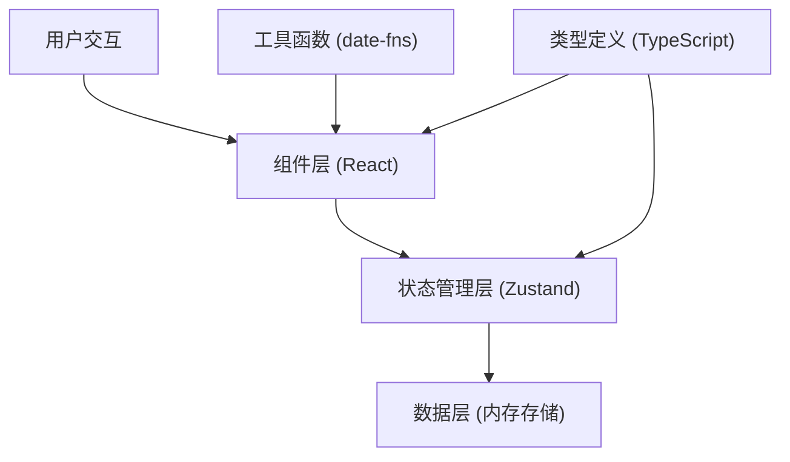

## 1. 架构设计



## 2. 技术描述
- 前端框架：React 18 + TypeScript
- 构建工具：Vite 5
- 状态管理：Zustand 4
- 拖拽库：@hello-pangea/dnd (react-beautiful-dnd 维护版)
- 日期处理：date-fns 3
- 样式方案：CSS Modules + CSS Variables

## 3. 目录结构
```
src/
├── types.ts          # 类型定义，被所有文件引用
├── store.ts          # Zustand 状态管理，CRUD 方法
├── components/
│   ├── Timeline.tsx  # 时间轴组件，虚拟化 + 拖拽
│   ├── TaskCard.tsx  # 任务卡片组件
│   └── SidePanel.tsx # 侧面板组件
├── App.tsx           # 主应用入口
├── main.tsx          # React 挂载入口
└── index.css         # 全局样式
```

## 4. 数据流向

```
用户操作 → 组件事件 → Store 方法 → 更新状态 → 订阅组件重渲染
  ↑                                                         ↓
  └─────────────────────────────────────────────────────────┘
```

- **types.ts**：定义 Task 接口和 Filter 枚举，是所有文件的基础依赖
- **store.ts**：依赖 types.ts，管理任务列表、筛选状态和 CRUD 方法
- **Timeline.tsx**：依赖 types.ts + store.ts，接收按日期分组的任务，渲染时间轴
- **TaskCard.tsx**：依赖 types.ts + store.ts，渲染单个任务，处理拖拽和编辑
- **SidePanel.tsx**：依赖 types.ts + store.ts，处理筛选和统计展示
- **App.tsx**：组合所有组件，处理布局和响应式

## 5. 数据模型

### 5.1 Task 接口
```typescript
interface Task {
  id: string;
  title: string;
  dueDate: string; // ISO date string
  tagColor: TagColor;
  priority: Priority;
  completed: boolean;
  createdAt: string;
  order: number; // 同一天内的排序
}
```

### 5.2 Filter 状态
```typescript
interface FilterState {
  priority: Priority | 'all';
  tagColor: TagColor | 'all';
  status: 'all' | 'pending' | 'completed';
}
```

### 5.3 枚举定义
```typescript
enum Priority {
  HIGH = 'high',
  MEDIUM = 'medium',
  LOW = 'low',
}

enum TagColor {
  RED = '#E94560',
  BLUE = '#2196F3',
  GREEN = '#4CAF50',
  YELLOW = '#FFC107',
  PURPLE = '#9C27B0',
  ORANGE = '#FF9800',
}
```

## 6. 核心方法定义

### Store 方法
- `addTask(task: Omit<Task, 'id' | 'createdAt' | 'order'>)`: 创建任务
- `updateTask(id: string, updates: Partial<Task>)`: 更新任务
- `deleteTask(id: string)`: 删除任务
- `toggleComplete(id: string)`: 切换完成状态
- `reorderTasks(date: string, fromIndex: number, toIndex: number)`: 同日排序
- `moveTask(taskId: string, toDate: string, toIndex: number)`: 跨日期移动
- `setFilter(filter: Partial<FilterState>)`: 设置筛选条件

### 组件 Props
- **Timeline**: `{ tasks: Task[], onAddTask: (date: string) => void }`
- **TaskCard**: `{ task: Task, isFiltered: boolean }`
- **SidePanel**: `{ tasks: Task[], filter: FilterState, onFilterChange: (filter: Partial<FilterState>) => void }`
