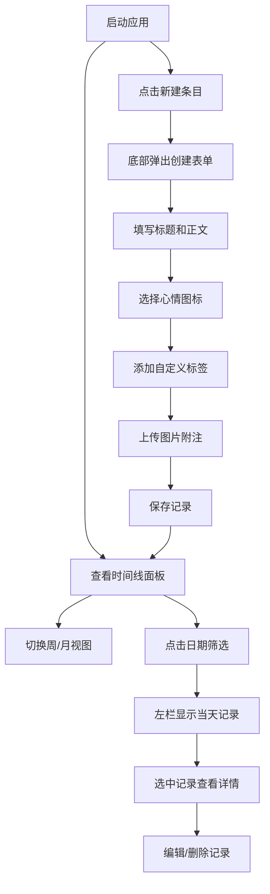

## 1. 产品概述
"手账时光"是一款网页端个人手账记录管理器，让用户像使用实体手账本一样在网页上创建、编辑和整理日记条目。
- 主要目的：提供温暖、直观的数字手账体验，帮助用户记录日常生活点滴
- 目标用户：喜欢记录生活、追求仪式感的个人用户
- 产品价值：结合实体手账的温暖感与数字工具的便利性，支持时间线浏览、心情标记和图片附注

## 2. 核心功能

### 2.1 功能模块
1. **主界面布局**：左右两栏布局，左栏缩略列表，右栏详细卡片展示
2. **记录管理**：创建、编辑、删除手账条目，支持 Markdown 简单语法
3. **时间线面板**：周视图/月视图切换，支持按日期筛选记录
4. **心情与标签**：6种心情图标选择，自定义标签管理（最多3个）
5. **图片附注**：本地图片上传、缩略图生成、模态框预览

### 2.2 页面详情
| 页面名称 | 模块名称 | 功能描述 |
|-----------|-------------|---------------------|
| 主界面 | 顶部导航栏 | 新建条目按钮、周/月视图切换按钮 |
| 主界面 | 左栏 Sidebar | 按日期分组的缩略列表，每组显示最近3条，可展开收起 |
| 主界面 | 右栏 EntryCard | 详细卡片展示：标题、正文、心情、标签、图片 |
| 主界面 | TimelinePanel | 时间线面板，周视图7列，月视图网格，点击日期筛选 |
| 创建表单 | 底部弹出表单 | 半屏滑入，包含标题、正文、心情、标签、图片输入 |

## 3. 核心流程
用户打开应用 → 浏览时间线（周/月视图） → 点击日期筛选记录 → 在左栏选择具体条目 → 右栏查看详情（支持编辑）→ 点击新建按钮 → 底部弹出表单 → 填写内容、选择心情、添加标签和图片 → 保存后回到主界面

## 4. 用户界面设计

### 4.1 设计风格
- **主色调**：品牌深绿 #1b4332、中绿 #2e7d6f、浅绿 #c8e6c9、#a5d6a7
- **背景色**：暖米色 #fdf6e3、纯白 #ffffff
- **文字色**：深棕 #4a3b2f、灰色 #757575
- **按钮风格**：圆角矩形，导航栏高56px，背景深绿
- **字体**：标题使用 'Patrick Hand' 手写衬线体，正文使用系统字体
- **布局风格**：左右两栏布局（左320px），卡片式设计，内阴影柔和
- **图标风格**：心情使用 emoji，标签为小药丸形状

### 4.2 页面设计概览
| 页面名称 | 模块名称 | UI 元素 |
|-----------|-------------|-------------|
| 主界面 | 顶部导航栏 | 高度56px，背景#2e7d6f，白色文字，圆角，新建按钮，视图切换按钮组 |
| 主界面 | Sidebar | 宽度320px，日期分组，缩略标题+图片，展开/收起动画 |
| 主界面 | EntryCard | 暖米色背景#fdf6e3，内阴影rgba(0,0,0,0.08)，手写体标题，圆形日期戳，Markdown正文，心情emoji，标签药丸，缩略图 |
| 主界面 | TimelinePanel | 周视图7列，月视图网格，当天标记，淡入淡出切换动画 |
| 创建表单 | 底部弹出层 | 背景#ffffff，圆角16px，从底部滑入0.3s缓出 |

### 4.3 响应式
- 桌面端优先设计
- 移动端自适应：左栏可折叠，卡片全宽展示
- 触摸操作优化：大点击区域，滑动手势

### 4.4 动效设计
- 心情图标点击：弹跳缩放 1.2x → 恢复
- 创建表单：从底部滑入，缓出0.3s
- 视图切换：淡入淡出，opacity 0→1，0.2s
- Sidebar 分组展开/收起：平滑过渡动画
- 标签悬停：显示删除按钮×
