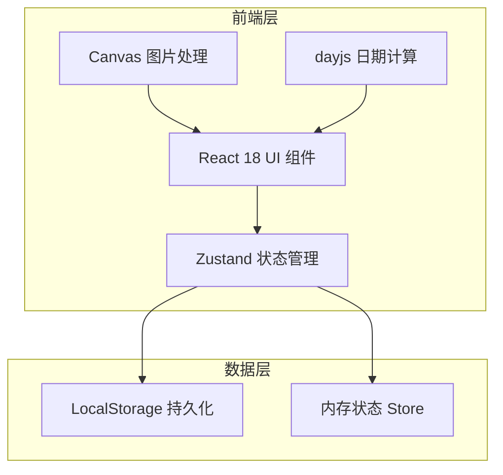
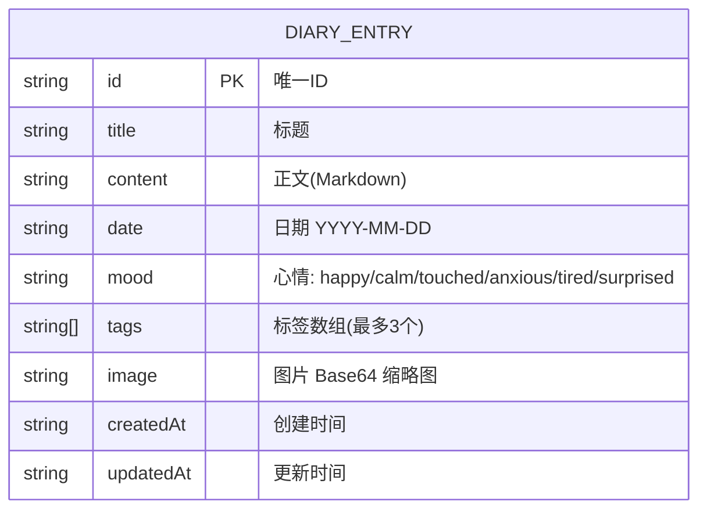

## 1. 架构设计



## 2. 技术说明
- **前端框架**：React@18 + TypeScript
- **构建工具**：Vite@5 + @vitejs/plugin-react
- **状态管理**：Zustand@4
- **日期处理**：dayjs@1
- **唯一ID**：uuid@9
- **图片处理**：Canvas 原生 API
- **样式方案**：原生 CSS（CSS 变量 + 关键帧动画）
- **初始化方式**：手动创建项目结构（用户指定文件列表）

## 3. 项目结构
```
e:\solo\SoloAutoDemo\tasks\auto6\
├── index.html
├── package.json
├── tsconfig.json
├── vite.config.js
└── src/
    ├── main.tsx
    ├── store.ts
    ├── styles.css
    └── components/
        ├── Sidebar.tsx
        ├── EntryCard.tsx
        └── TimelinePanel.tsx
```

## 4. 数据模型

### 4.1 数据模型定义



### 4.2 Store 状态定义
```typescript
interface DiaryEntry {
  id: string;
  title: string;
  content: string;
  date: string;
  mood: 'happy' | 'calm' | 'touched' | 'anxious' | 'tired' | 'surprised';
  tags: string[];
  image?: string;
  createdAt: string;
  updatedAt: string;
}

interface AppState {
  entries: DiaryEntry[];
  currentView: 'week' | 'month';
  selectedDate: string;
  selectedEntryId: string | null;
  searchQuery: string;
  expandedGroups: string[];
  isCreating: boolean;
  
  // Actions
  addEntry: (entry: Omit<DiaryEntry, 'id' | 'createdAt' | 'updatedAt'>) => void;
  updateEntry: (id: string, updates: Partial<DiaryEntry>) => void;
  deleteEntry: (id: string) => void;
  setCurrentView: (view: 'week' | 'month') => void;
  setSelectedDate: (date: string) => void;
  setSelectedEntryId: (id: string | null) => void;
  setSearchQuery: (query: string) => void;
  toggleGroupExpanded: (dateKey: string) => void;
  setIsCreating: (isCreating: boolean) => void;
}
```

## 5. 核心模块说明

### 5.1 组件职责
| 组件 | 职责 |
|------|------|
| Sidebar.tsx | 按日期分组渲染缩略列表，展开/收起动画，选中条目 |
| EntryCard.tsx | 渲染详情卡片：Markdown正文、心情选择器、标签管理、图片上传预览 |
| TimelinePanel.tsx | 周/月视图切换，日期网格渲染，点击筛选，淡入淡出动画 |

### 5.2 关键算法
- **Canvas 缩略图生成**：FileReader → Image → Canvas drawImage(resize) → toDataURL
- **日期分组**：使用 dayjs 按 YYYY-MM-DD 分组，按创建时间倒序排列
- **周视图计算**：dayjs startOf('week') endOf('week') 遍历7天
- **月视图计算**：dayjs startOf('month') endOf('month') 填充日历网格（最多6行）

### 5.3 性能要求
- 视图切换和动画帧率 ≥ 55fps（使用 CSS transform/opacity）
- 图片上传和缩略图生成 ≤ 1s（Canvas 原生处理，限制 2MB）
- 状态更新使用 Zustand 浅比较，避免不必要的重渲染
