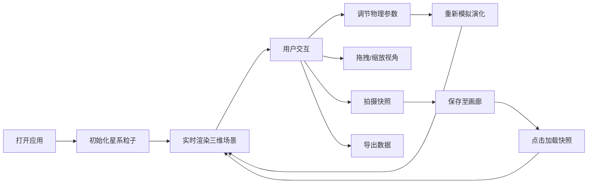

## 1. 产品概述

三维星系形成与演化模拟器，为天文学教学和科普演示提供交互式三维宇宙模拟工具，替代传统静态星图，让用户直观理解星系动力学。

- 核心目标：通过实时可调的物理参数，展示引力、角动量、暗物质等因素对星系形态的影响
- 目标用户：天文学教师、科普工作者、天文爱好者
- 市场价值：填补即开即用、可自由调参的三维星系模拟工具空白

## 2. 核心功能

### 2.1 用户角色
| 角色 | 注册方式 | 核心权限 |
|------|----------|----------|
| 普通用户 | 无需注册 | 调整参数、观察模拟、保存快照、导出数据 |

### 2.2 功能模块
1. **三维星系主场景**：数千颗粒子组成的旋转星系盘，实时物理模拟
2. **参数控制面板**：6个物理参数滑块，实时调节星系演化
3. **统计数据面板**：显示粒子数、平均速度、动能、势能等实时数据
4. **快照画廊**：保存和加载星系形态快照
5. **操作控制区**：重置、快照、导出功能按钮

### 2.3 页面详情
| 页面名称 | 模块名称 | 功能描述 |
|----------|----------|----------|
| 主页面 | 三维星系场景 | 指数盘分布粒子，支持拖拽旋转、滚轮缩放、Shift+拖拽平移 |
| 主页面 | 控制面板 | 6个参数滑块：质点质量、初始角动量、碰撞阻尼、暗物质晕质量、初始温度、时间倍速 |
| 主页面 | 统计面板 | 实时显示粒子总数、平均速度、总动能、总势能 |
| 主页面 | 快照画廊 | 缩略图展示、点击加载快照、悬停动画效果 |
| 主页面 | 操作按钮 | 重置模拟、拍摄快照、导出JSON数据 |

## 3. 核心流程

用户打开应用 → 查看初始星系模拟 → 调节参数滑块 → 观察星系形态变化 → 拍摄感兴趣的快照 → 导出粒子数据用于分析

## 4. 用户界面设计

### 4.1 设计风格
- **主色调**：深太空暗色调，背景#0a0a1a
- **面板样式**：半透明毛玻璃效果，背景#1a1a2e（透明度0.85，模糊10px），边框#2a2a4e细线1px
- **文字颜色**：#d0d0ff
- **字体**：monospace系列，增强科技感
- **滑块样式**：轨道6px宽#2a2a4e，圆形滑块10px#6a6aff，悬停#8a8aff，0.15秒ease-out动画
- **按钮效果**：点击缩放0.95倍（0.1秒）+ 涟漪波纹效果（半径25px，0.3秒）

### 4.2 页面设计概述
| 页面名称 | 模块名称 | UI元素 |
|----------|----------|--------|
| 主页面 | 三维场景 | 深邃星空背景、数千颗动态粒子、数百颗静态背景星、粒子颜色随速度变化 |
| 主页面 | 控制面板 | 半透明左侧面板、6个带标签的滑块、参数值实时显示 |
| 主页面 | 统计面板 | 左上角半透明文本框、4项统计数据、每秒更新 |
| 主页面 | 快照画廊 | 右侧半透明面板、200x150px缩略图、圆角12px、悬停缩放1.05倍+投影 |
| 主页面 | 操作按钮 | 底部三个按钮、重置/快照/导出、点击动画 |

### 4.3 响应式设计
- **桌面端（≥768px）**：左控制面板 + 中央主场景 + 右快照画廊
- **移动端（<768px）**：主场景占满，控制面板和画廊折叠为底部抽屉

### 4.4 3D场景设计
- **环境**：深邃星空背景#0a0a1a，散布静态背景星
- **光照**：环境光+点光源，突出粒子立体感
- **相机**：透视相机，支持OrbitControls拖拽旋转、滚轮缩放、Shift平移
- **粒子系统**：BufferGeometry + PointsMaterial，Vertex Shader实现颜色随速度变化
- **动画**：粒子运动60FPS，演化完成提示动画（淡入淡出2秒）
- **性能**：10000粒子保持≥45FPS，参数调整后500ms内完成重模拟

## 5. 交互细节
- **视角控制**：鼠标拖拽旋转（每帧0.4度），滚轮缩放（0.1-20单位），Shift+拖拽平移
- **参数调节**：滑块实时更新，1秒内平滑过渡到新状态
- **演化完成**：超过设定步数自动暂停，显示"演化完成"提示动画
- **快照**：点击缩略图平滑过渡到保存的状态
- **粒子颜色**：低速偏橙红#ffaa66，高速偏蓝白#aaccff，速度阈值0.5-2.0线性插值
