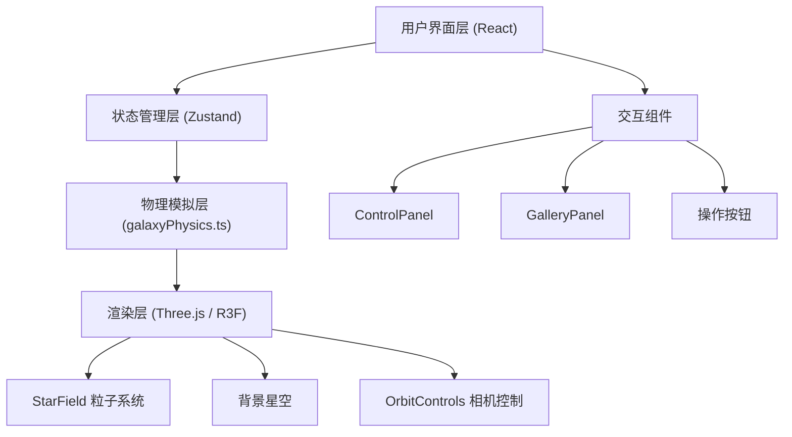

## 1. 架构设计



## 2. 技术栈描述

- **前端框架**：React 18 + TypeScript
- **构建工具**：Vite 5 + @vitejs/plugin-react
- **3D渲染**：Three.js + @react-three/fiber + @react-three/drei
- **状态管理**：Zustand
- **数据处理**：d3-scale
- **样式方案**：原生CSS + CSS变量

## 3. 目录结构

```
auto61/
├── index.html
├── package.json
├── vite.config.ts
├── tsconfig.json
└── src/
    ├── App.tsx
    ├── components/
    │   ├── StarField.tsx
    │   ├── ControlPanel.tsx
    │   └── GalleryPanel.tsx
    ├── simulation/
    │   └── galaxyPhysics.ts
    └── store/
        └── galaxyStore.ts
```

## 4. 核心数据结构

### 4.1 粒子数据结构
```typescript
interface Particle {
  id: number;
  x: number;
  y: number;
  z: number;
  vx: number;
  vy: number;
  vz: number;
  size: number;
}
```

### 4.2 模拟参数结构
```typescript
interface SimulationParams {
  particleMass: number;      // 质点质量 0.5-5.0
  initialAngularMomentum: number;  // 初始角动量 0.1-2.0
  collisionDamping: number;  // 碰撞阻尼系数 0.0-1.0
  darkMatterMass: number;    // 暗物质晕质量 0-10
  initialTemperature: number; // 初始温度 0.1-2.0
  timeScale: number;         // 时间倍速 0.5-5.0
}
```

### 4.3 快照数据结构
```typescript
interface Snapshot {
  id: string;
  timestamp: number;
  particles: Particle[];
  params: SimulationParams;
  thumbnail: string;  // base64 图片数据
}
```

### 4.4 统计数据结构
```typescript
interface SimulationStats {
  particleCount: number;
  averageVelocity: number;
  totalKineticEnergy: number;
  totalPotentialEnergy: number;
}
```

## 5. 模块说明

### 5.1 galaxyPhysics.ts - 物理模拟引擎
- **initializeParticles(params, count)**: 按指数盘分布初始化粒子位置和速度
- **simulateStep(particles, params, dt)**: 执行单步N体引力模拟，更新粒子状态
- **引力计算**：简化的Barnes-Hut算法，保证10000粒子性能
- **暗物质晕**：球形暗物质晕引力势计算
- **碰撞处理**：阻尼系数控制粒子聚合

### 5.2 galaxyStore.ts - Zustand状态管理
- **状态**：particles, params, snapshots, isPaused, stats, stepCount
- **方法**：
  - `updateParams(partialParams)`: 更新参数并重新初始化
  - `resetSimulation()`: 重置到初始状态
  - `takeSnapshot(canvas)`: 拍摄并保存快照
  - `loadSnapshot(id)`: 加载指定快照
  - `togglePause()`: 暂停/继续模拟
  - `exportData()`: 导出粒子数据为JSON

### 5.3 StarField.tsx - 粒子渲染组件
- **技术**：Three.js Points + BufferGeometry + ShaderMaterial
- **Vertex Shader**：根据粒子速度计算颜色（低速橙红，高速蓝白）
- **数据流向**：监听store.particles变化 → 更新BufferAttribute
- **性能优化**：使用Float32Array，避免频繁GC

### 5.4 ControlPanel.tsx - 控制面板
- **6个滑块组件**：每个绑定对应参数，实时调用store.updateParams
- **统计数据显示**：每秒刷新显示stats
- **响应式**：移动端折叠为抽屉

### 5.5 GalleryPanel.tsx - 快照画廊
- **缩略图网格**：200x150px，圆角12px，悬停动画
- **点击加载**：调用store.loadSnapshot恢复状态
- **淡入动画**：每个快照0.3秒淡入

### 5.6 App.tsx - 主应用组件
- **布局**：左控制面板 + 中央Canvas + 右快照画廊 + 底部按钮
- **响应式**：<768px时面板折叠为底部抽屉
- **主循环**：useFrame驱动模拟步进
- **演化完成检测**：stepCount超过阈值时触发暂停和提示动画

## 6. 性能优化策略

1. **物理模拟**：
   - 简化N体算法，使用网格近似引力计算
   - 物理步长与渲染帧率分离
   - Web Worker可选（当前版本主线程）

2. **渲染优化**：
   - BufferGeometry + Float32Array
   - ShaderMaterial减少Draw Call
   - 粒子大小范围限制避免Overdraw

3. **React优化**：
   - Zustand选择器避免不必要重渲染
   - useMemo/useCallback优化
   - 模拟数据更新使用setTimeout批量处理

4. **参数过渡**：
   - 1秒平滑过渡动画
   - 粒子位置插值避免闪烁

## 7. 物理模型说明

### 7.1 指数盘分布
```
R = h * ln(1/random)  // 径向指数分布
z = z0 * randomGaussian()  // 垂直方向高斯分布
```

### 7.2 旋转曲线
```
v_circular = sqrt(G * (M_baryon + M_darkMatter) / R)
```

### 7.3 暗物质晕（NFW轮廓）
```
ρ(r) = ρ_s / ((r/r_s) * (1 + r/r_s)²)
```

### 7.4 温度与速度弥散
```
σ_v = sqrt(T * k_B / m_particle)
```
