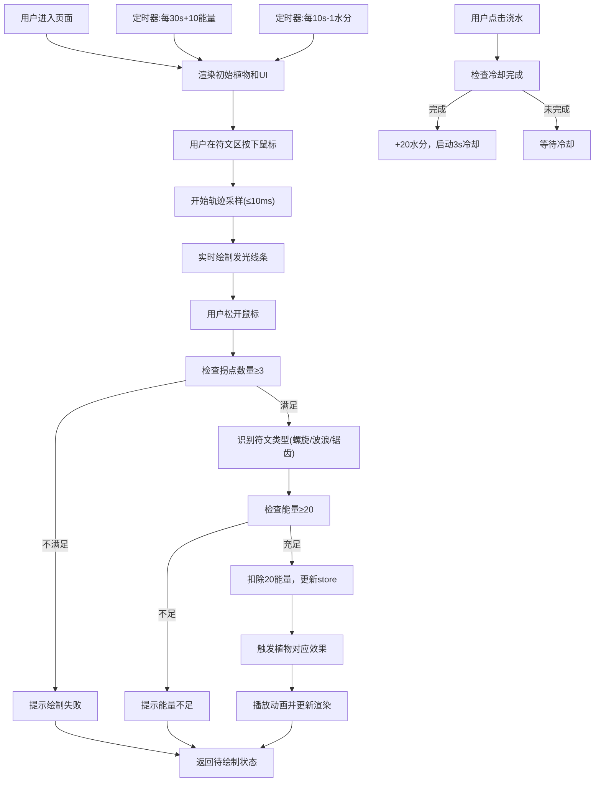

## 1. 产品概述
符文能量与植物融合交互应用，玩家通过在画布上绘制不同符文来触发植物的生长、开花或异变效果，提供沉浸式的魔法创造体验。
- 面向自然魔法主题沙盒游戏玩家，提供可视化符文识别与植物生长反馈
- 核心价值：将手绘输入转化为魔法效果，打造富有创造力和沉浸感的互动体验

## 2. 核心功能

### 2.1 功能模块
1. **符文绘制区**：手绘轨迹采集、符文识别判定、能量显示
2. **植物画布区**：植物渲染、生长动画、开花动画、异变特效、呼吸动画
3. **底部控制栏**：能量值显示、水分值显示、浇水按钮、植物状态记录

### 2.2 功能详情
| 页面/模块名称 | 子模块名称 | 功能描述 |
|-----------|-------------|---------------------|
| 符文绘制区 | 手绘轨迹采集 | 鼠标按下开始、移动采样(≤10ms)、松开结束，实时显示半透明发光线条(#00ffcc, 4px) |
| 符文绘制区 | 符文识别算法 | 基于拐点数量、弧度、封闭性判定3种符文：螺旋形(生长)、波浪形(开花)、锯齿形(异变)，至少3个拐点 |
| 符文绘制区 | 能量消耗 | 每次成功绘制消耗20点能量，能量不足时禁止绘制 |
| 符文绘制区 | 能量显示 | 数字右侧发光圆点，颜色随能量从红(#ff4444)渐变到绿(#00ff00) |
| 植物画布区 | 植物初始状态 | 中央幼苗，茎绿色(#4caf50)，高40px |
| 植物画布区 | 生长效果 | 生长符文→茎加高10px，叶片+1片(颜色从#66bb6a渐变到#2e7d32)，0.5秒弹出动画，总高≤200px |
| 植物画布区 | 开花效果 | 开花符文→顶部随机绽放花朵，花瓣颜色从#ff4081/#ffeb3b/#e040fb选取，花瓣5-7片，旋转扩散动画0.8秒，20秒后凋谢 |
| 植物画布区 | 异变效果 | 异变符文→紫色调(茎#7b1fa2, 叶#9c27b0)，随机晶状三角形凸起(10px, #e1bee7)，提示文字持续15秒 |
| 植物画布区 | 水分不足效果 | 水分<10时叶片变黄(#fdd835) |
| 植物画布区 | 呼吸动画 | scale 1.0-1.03，周期3秒 |
| 底部控制栏 | 能量管理 | 初始100，上限200，每30秒自动恢复10点 |
| 底部控制栏 | 水分管理 | 初始50，每10秒消耗1点，浇水按钮+20点，冷却3秒 |
| 底部控制栏 | 状态记录 | 显示生长高度、叶片数、花朵数、变异剩余时间，白色14px，半透明黑圆角背景 |

## 3. 核心流程
用户在符文绘制区按住鼠标绘制轨迹→系统采样点集并实时显示发光线条→鼠标松开后识别符文类型→消耗能量→将符文应用到植物→植物画布触发生长/开花/异变动画→能量和水分随时间自动更新

## 4. 用户界面设计

### 4.1 设计风格
- **主色调**：深蓝神秘基调(#1a1a2e, #16213e, #0f3460)，魔法青绿(#00ffcc)为强调色
- **配色方案**：径向渐变背景(中心#1a1a2e→边缘#16213e)，符文区边框#00ffcc实线2px
- **按钮样式**：圆角矩形，悬浮发光效果，cubic-bezier(0.4, 0, 0.2, 1)缓动
- **字体**：使用特殊衬线或魔法风格字体，正文14px白色
- **布局风格**：左-中-底三栏布局(桌面端)，上-中-下(移动端)
- **动画风格**：缓动统一使用cubic-bezier(0.4, 0, 0.2, 1)

### 4.2 页面布局
| 区域 | 模块 | UI元素与样式 |
|-----------|-------------|-------------|
| 左侧(30%宽) | 符文绘制区 | 背景#0f3460，边框2px实线#00ffcc，顶部能量值+发光圆点，中央手绘Canvas |
| 中间(剩余) | 植物画布区 | 背景径向渐变#1a1a2e→#16213e，植物居中，呼吸动画，SVG/Canvas渲染 |
| 底部(高60px) | 控制栏 | 背景#1a1a2e，flex居中，能量条、水分条、浇水按钮、状态记录面板 |

### 4.3 响应式设计
- **桌面端(≥768px)**：左侧符文区30%宽 + 中间植物区 + 底部控制栏60px
- **移动端(<768px)**：顶部符文区30%高 + 中间植物区 + 底部控制栏60px
- 触控优化：符文绘制支持touch事件

### 4.4 性能优化
- 植物状态更新使用requestAnimationFrame节流(≤60fps)
- 符文绘制轨迹采样频率≥每10ms一点
- 脏标记机制：仅重绘变化的植物部位
- 目标帧率：5株植物同时存在时稳定55fps+
