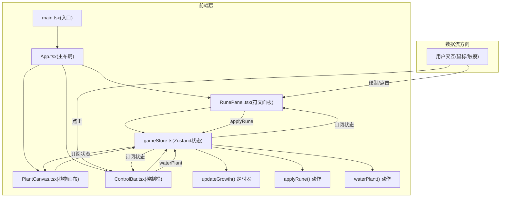
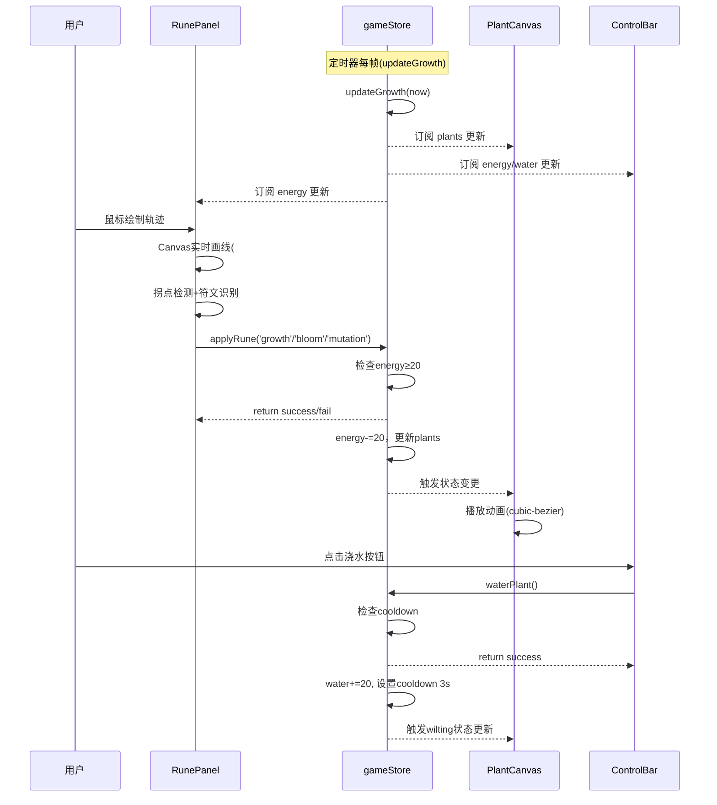

## 1. 架构设计



## 2. 技术描述
- **前端框架**：React 18 + TypeScript (严格模式)
- **构建工具**：Vite 5 + @vitejs/plugin-react
- **状态管理**：Zustand (轻量全局store)
- **渲染技术**：HTML5 Canvas (符文轨迹) + SVG/DOM (植物渲染，便于CSS动画)
- **样式方案**：CSS Modules / 内联样式 (组件内聚)

## 3. 文件结构与职责

| 文件路径 | 职责 | 调用关系/数据流向 |
|---------|------|-------------------|
| package.json | 依赖声明: react, react-dom, typescript, vite, @vitejs/plugin-react, zustand; 脚本: npm run dev | - |
| index.html | 入口HTML，挂载#app | 加载main.tsx |
| vite.config.ts | Vite构建配置，启用React插件 | - |
| tsconfig.json | TypeScript严格模式配置 | - |
| src/main.tsx | React入口，createRoot渲染App组件 | 导入App.tsx |
| src/App.tsx | 主布局组件：三栏分区管理，响应式布局 | 读取gameStore → 传递给子组件props/callback |
| src/store/gameStore.ts | Zustand全局状态：energy, plants[], selectedRuneId；action: applyRune, waterPlant, updateGrowth | 被三个组件订阅，内部定时器驱动 |
| src/components/RunePanel.tsx | 符文绘制与选择：Canvas绘制轨迹，拐点识别算法，3种符文分类 | 用户绘制 → 调用store.applyRune() |
| src/components/PlantCanvas.tsx | 植物2D画布渲染：SVG/DOM渲染茎、叶、花、晶体，动画控制 | 从store读取plants → diff更新 → requestAnimationFrame渲染 |
| src/components/ControlBar.tsx | 底部控制栏：能量/水分显示，浇水按钮，状态记录 | 读取store → 调用store.waterPlant() |

## 4. 核心数据模型

### 4.1 Zustand Store 类型定义

```typescript
// 符文类型
type RuneType = 'growth' | 'bloom' | 'mutation';

// 花朵
interface Flower {
  id: string;
  color: string;       // #ff4081 | #ffeb3b | #e040fb
  petalCount: number;  // 5-7
  createdAt: number;   // 凋谢计时 20s
  position: { x: number; y: number };
}

// 晶体凸起
interface Crystal {
  id: string;
  x: number;
  y: number;
  rotation: number;
}

// 叶子
interface Leaf {
  id: string;
  side: 'left' | 'right';
  y: number;           // 沿茎的位置
  colorIndex: number;  // 颜色渐变索引
}

// 植物
interface Plant {
  id: string;
  stemHeight: number;     // 茎高度，初始40，上限200
  leaves: Leaf[];
  flowers: Flower[];
  crystals: Crystal[];
  isMutating: boolean;
  mutationEndsAt: number; // 变异剩余时间戳
  growthAnimation: number; // 生长动画时间戳 0.5s
  bloomAnimation: number;  // 开花动画时间戳 0.8s
  wilting: boolean;        // 水分<10时叶片变黄
}

// Store 状态
interface GameState {
  energy: number;         // 0-200，初始100
  maxEnergy: number;      // 200
  water: number;          // 水分值
  waterCooldownUntil: number; // 浇水冷却截止
  plants: Plant[];
  selectedRuneId: string | null;
  lastEnergyRegen: number;
  lastWaterDecay: number;
  
  // Actions
  applyRune: (runeType: RuneType) => boolean;
  waterPlant: () => boolean;
  updateGrowth: (now: number) => void;
}
```

### 4.2 数据流向图



## 5. 关键算法与实现要点

### 5.1 符文识别算法
1. **轨迹采样**：pointerdown开始记录，pointermove每≤10ms记录一个点{x,y,time}
2. **拐点检测**：计算相邻三点的夹角变化率，超过阈值即为拐点
3. **分类判定**：
   - **螺旋形(生长)**：轨迹近似封闭，拐点均匀分布环绕，整体旋转趋势一致
   - **波浪形(开花)**：多个上下波动，Y方向变化幅度大，X方向均匀展开
   - **锯齿形(异变)**：锐角拐点(夹角<60°)数量≥3，方向交替反转

### 5.2 渲染性能优化
1. **requestAnimationFrame节流**：植物状态更新与渲染绑定rAF，避免多次setState
2. **脏标记(Dirty Flag)**：Plant对象标记dirty属性，仅重绘变化部位
3. **DOM Diff优化**：使用React.memo包装子组件，stable key避免重渲染
4. **CSS硬件加速**：动画使用transform/opacity，开启will-change

### 5.3 时间驱动状态更新
- updateGrowth(now)在每次rAF中被调用，根据now与各时间戳(energyRegen, waterDecay, flowerExpiry, mutationEnd)比较触发状态变化
