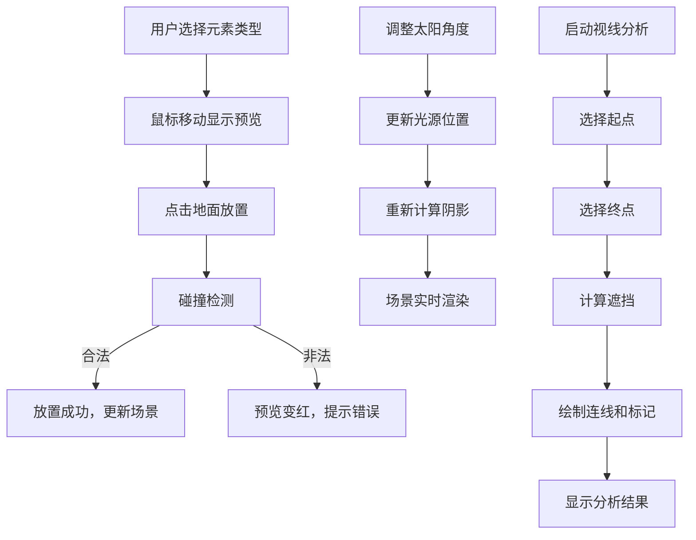

## 1. 产品概述
三维数字沙盘环境模拟应用，让用户通过交互方式在3D场景中添加地形、建筑和植被元素，观察不同布局下的日照阴影变化与视线通廊分析，为城市规划、建筑设计提供可视化决策支持。

- 主要用途：城市规划辅助、建筑日照分析、视线通廊评估
- 目标用户：城市规划师、建筑师、景观设计师、相关专业学生
- 产品价值：提供直观的3D可视化分析工具，降低专业分析门槛，提高设计决策效率

## 2. 核心功能

### 2.1 用户角色
| 角色 | 注册方式 | 核心权限 |
|------|----------|----------|
| 普通用户 | 无需注册 | 完整使用所有功能，创建和编辑沙盘场景 |

### 2.2 功能模块
1. **3D场景渲染模块**：Three.js三维场景渲染、相机控制、元素管理
2. **元素放置模块**：地形格、建筑块、树木的选择与放置
3. **元素编辑模块**：选中、拖拽移动、高度调整
4. **日照阴影分析模块**：太阳角度控制、实时阴影计算与渲染
5. **视线通廊分析模块**：两点间遮挡检测、可视化展示
6. **环境切换模块**：晴天/黄昏天气模式切换

### 2.3 页面详情
| 页面名称 | 模块名称 | 功能描述 |
|----------|----------|----------|
| 主应用页面 | 左侧工具面板 | 元素选择（地形/建筑/树木）、高度调整滑块、元素删除按钮 |
| 主应用页面 | 中央3D视口 | Three.js场景渲染、鼠标交互放置、相机控制 |
| 主应用页面 | 右侧分析面板 | 太阳角度控制（方位角/高度角）、视线分析按钮、天气切换按钮、分析结果显示 |

## 3. 核心流程

### 3.1 元素放置流程
用户打开应用 → 从左侧面板选择元素类型 → 鼠标移动显示半透明预览 → 点击地面放置元素 → 系统进行碰撞检测 → 合法位置放置成功，元素加入场景

### 3.2 阴影分析流程
用户调整太阳角度滑块 → Zustand状态更新 → 阴影分析模块重新计算光源位置 → 场景实时更新阴影投射 → 用户观察不同时间段的阴影覆盖情况

### 3.3 视线分析流程
用户点击"开始视线分析"按钮 → 点击场景中第一个点（起点）→ 点击场景中第二个点（终点）→ 系统计算两点间连线 → 检测遮挡物 → 绘制连线和遮挡标记 → 右侧面板显示分析结果

## 4. 用户界面设计

### 4.1 设计风格
- **主色调**：深灰背景 #2a2a2a，搭配科技感蓝 #4a9eff、高亮橙 #ffaa00
- **按钮样式**：圆形图标按钮 60x60px，选中状态底部发光条
- **滑块样式**：自定义轨道 #555，圆形滑块直径20px，颜色 #ffaa00
- **字体**：现代无衬线字体，白色文字，层次分明
- **布局风格**：三栏布局，左右面板各240px，中间自适应3D视口
- **面板边框**：0.5px实线 #444，暗色调科技风

### 4.2 交互细节
- 所有交互元素有0.2秒的hover和active状态过渡动画
- 元素选中时显示蓝色边缘发光效果
- 放置预览：合法位置绿色半透明，非法位置红色半透明
- 天气切换：1.5秒平滑过渡动画
- 高度调整：0.3秒平滑升降动画

### 4.3 页面设计概述
| 页面名称 | 模块名称 | UI元素 |
|----------|----------|--------|
| 主应用 | 左侧工具面板 | 元素选择按钮组、高度滑块、删除按钮、操作提示 |
| 主应用 | 3D视口 | 10x10网格地面、坐标原点标记、场景元素、阴影效果 |
| 主应用 | 右侧分析面板 | 太阳角度滑块组、视线分析按钮、天气切换按钮、分析结果展示区 |

### 4.4 响应性
- Desktop-first设计，主要面向桌面端用户
- 固定左右面板宽度240px，中间3D视口自适应
- 不考虑移动端适配，专注桌面端专业操作体验

### 4.5 3D场景指引
- **环境**：简洁的灰色调背景，突出场景元素和阴影效果
- **光照设置**：主光源模拟太阳光，支持方位角和高度角调整；环境光配合天气模式变化
- **相机设置**：初始位置 (5,8,10)，目标点为原点；支持轨道旋转、滚轮缩放、右键平移
- **阴影效果**：级联阴影映射 (CSM)，柔和边缘 penumbra 0.5，半透明深灰色阴影
- **后处理**：选中物体边缘发光效果
- **性能预算**：最多50个同时渲染元素，帧率维持55fps以上
