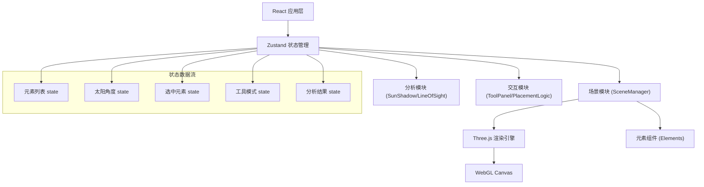

## 1. 架构设计



## 2. 技术描述

### 2.1 核心技术栈
- **前端框架**：React 18 + TypeScript
- **构建工具**：Vite 5
- **3D渲染**：Three.js r160 + @react-three/fiber 8 + @react-three/drei 9
- **状态管理**：Zustand 4
- **阴影优化**：@react-three/drei CSM (级联阴影映射)

### 2.2 模块职责划分

| 模块 | 文件路径 | 核心职责 |
|------|----------|----------|
| 场景管理 | [src/scene/SceneManager.ts](file:///e:/solo/SoloAutoDemo/tasks/auto64/src/scene/SceneManager.ts) | Three.js场景初始化、渲染循环、射线拾取、相机控制 |
| 元素组件 | [src/scene/Elements.ts](file:///e:/solo/SoloAutoDemo/tasks/auto64/src/scene/Elements.ts) | 地形格、建筑块、树木的3D几何体与材质定义 |
| 阴影分析 | [src/analysis/SunShadow.ts](file:///e:/solo/SoloAutoDemo/tasks/auto64/src/analysis/SunShadow.ts) | 太阳角度计算、阴影投射配置、CSM设置 |
| 视线分析 | [src/analysis/LineOfSight.ts](file:///e:/solo/SoloAutoDemo/tasks/auto64/src/analysis/LineOfSight.ts) | 两点间遮挡检测、射线检测算法 |
| 工具面板 | [src/interaction/ToolPanel.ts](file:///e:/solo/SoloAutoDemo/tasks/auto64/src/interaction/ToolPanel.ts) | React UI组件、用户交互控制 |
| 放置逻辑 | [src/interaction/PlacementLogic.ts](file:///e:/solo/SoloAutoDemo/tasks/auto64/src/interaction/PlacementLogic.ts) | 元素放置、碰撞检测、拖拽移动 |
| 状态管理 | [src/store.ts](file:///e:/solo/SoloAutoDemo/tasks/auto64/src/store.ts) | Zustand全局状态、action定义 |

### 2.3 数据结构定义

```typescript
// 元素类型
type ElementType = 'terrain' | 'building' | 'tree';

// 场景元素
interface SceneElement {
  id: string;
  type: ElementType;
  position: { x: number; y: number; z: number };
  height: number;
  color?: string;
}

// 太阳角度
interface SunAngle {
  azimuth: number;    // 方位角 0-360度
  altitude: number;   // 高度角 0-90度
}

// 视线分析结果
interface LineOfSightResult {
  visible: boolean;
  occluders: Array<{
    id: string;
    type: ElementType;
    position: { x: number; y: number; z: number };
  }>;
  startPoint: { x: number; y: number; z: number };
  endPoint: { x: number; y: number; z: number };
}

// 天气模式
type WeatherMode = 'sunny' | 'sunset';

// 工具模式
type ToolMode = 'select' | 'place' | 'lineOfSight';
```

## 3. 路由定义

| 路由 | 用途 |
|------|------|
| / | 主应用页面，包含3D沙盘和控制面板 |

## 4. 状态管理 (Zustand Store)

### 4.1 Store 接口

```typescript
interface SandboxState {
  // 状态
  elements: SceneElement[];
  selectedElementId: string | null;
  sunAngle: SunAngle;
  weatherMode: WeatherMode;
  toolMode: ToolMode;
  placingElementType: ElementType | null;
  placingHeight: number;
  previewPosition: { x: number; y: number; z: number } | null;
  isPreviewValid: boolean;
  lineOfSightResult: LineOfSightResult | null;
  isDragging: boolean;
  
  // Actions
  addElement: (element: Omit<SceneElement, 'id'>) => void;
  removeElement: (id: string) => void;
  updateElement: (id: string, updates: Partial<SceneElement>) => void;
  selectElement: (id: string | null) => void;
  setSunAngle: (angle: Partial<SunAngle>) => void;
  setWeatherMode: (mode: WeatherMode) => void;
  setToolMode: (mode: ToolMode) => void;
  setPlacingElementType: (type: ElementType | null) => void;
  setPlacingHeight: (height: number) => void;
  setPreviewPosition: (pos: { x: number; y: number; z: number } | null, valid: boolean) => void;
  setLineOfSightResult: (result: LineOfSightResult | null) => void;
  setIsDragging: (dragging: boolean) => void;
  clearAll: () => void;
}
```

## 5. 性能优化策略

1. **CSM级联阴影**：使用@react-three/drei的CSM组件优化大场景阴影质量和性能
2. **元素数量限制**：最多同时渲染50个元素，超出时提示用户
3. **实例化渲染**：对于重复元素（如树木）考虑使用InstancedMesh
4. **阴影贴图优化**：合理设置阴影贴图分辨率，平衡质量与性能
5. **渲染循环优化**：仅在必要时触发重渲染，使用useFrame的delta参数

## 6. 文件结构

```
auto64/
├── package.json
├── index.html
├── vite.config.ts
├── tsconfig.json
├── src/
│   ├── main.tsx
│   ├── App.tsx
│   ├── store.ts
│   ├── types.ts
│   ├── scene/
│   │   ├── SceneManager.tsx
│   │   └── Elements.tsx
│   ├── analysis/
│   │   ├── SunShadow.tsx
│   │   └── LineOfSight.ts
│   └── interaction/
│       ├── ToolPanel.tsx
│       └── PlacementLogic.tsx
└── .trae/
    └── documents/
        ├── prd.md
        └── technical-architecture.md
```
