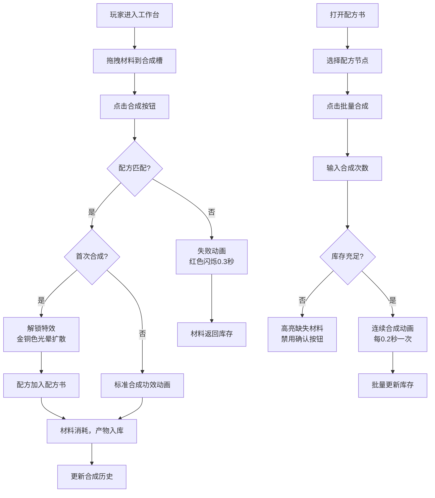

## 1. 产品概述

炼金合成工作台是一款以炼金术为核心玩法的手游功能模块，为玩家提供材料组合、配方发现、合成记录的完整体验。通过直观的拖拽交互和精美的炼金视觉效果，让玩家沉浸于神秘的炼金世界。

- **核心目标**：实现自由材料组合、配方自动发现、批量高效合成的闭环游戏体验
- **目标用户**：手游玩家，喜爱探索、收集和策略合成类游戏玩法的用户群体
- **产品价值**：通过深度的配方探索系统和流畅的交互体验，提升玩家留存和游戏乐趣

## 2. 核心功能

### 2.1 用户角色
本应用为单用户本地应用，无多角色区分。

| 角色 | 注册方式 | 核心权限 |
|------|---------|---------|
| 炼金术士（玩家） | 本地进入 | 全部功能：材料管理、合成、配方探索、批量操作 |

### 2.2 功能模块
1. **工作台主界面**：材料栏（6x6网格）、合成槽（3x3网格）、合成按钮、效果预览区
2. **配方书系统**：树形配方展示、配方详情查看、批量合成入口、解锁状态标识
3. **批量合成模态框**：次数输入、材料消耗预览、产出预估、连续合成动画
4. **库存管理系统**：材料/产物数量徽章、实时搜索过滤、拖拽支持

### 2.3 页面详情

| 页面名称 | 模块名称 | 功能描述 |
|---------|---------|---------|
| 工作台主页 | 材料栏 | 6x6网格展示可用材料，支持拖拽到合成槽，右上角数量徽章，实时搜索过滤 |
| 工作台主页 | 合成槽 | 3x3网格接收拖拽材料，金色边框装饰，虚线占位提示，支持移除已放材料 |
| 工作台主页 | 合成按钮 | 金铜色渐变椭圆按钮，悬停发光效果，点击触发合成逻辑 |
| 工作台主页 | 效果预览区 | 显示合成成功/失败动画，展示产出物信息 |
| 工作台主页 | 配方书抽屉 | 左侧滑入抽屉（300px宽度），树形结构展示已解锁配方 |
| 配方书 | 配方树 | 缩进层级展示，基础材料为根节点，合成产物为子节点，展开/收起箭头 |
| 配方书 | 配方详情 | 显示材料组合、产出物、所需数量，点击产物触发批量合成 |
| 批量合成模态框 | 次数输入 | 1-99范围输入，数字增减控件 |
| 批量合成模态框 | 消耗预览 | 显示总材料需求，不足材料高亮红色标记 |
| 批量合成模态框 | 连续动画 | 每次合成间隔0.2秒，材料旋转缩放融合动画，共1.2秒/次 |

## 3. 核心流程

### 3.1 基础合成流程
玩家从材料栏拖拽材料到3x3合成槽中 → 点击合成按钮 → 系统校验配方匹配 → 匹配成功：播放合成动画，材料消耗，产物入库，首次发现解锁配方 → 匹配失败：红色闪烁动画，材料返回

### 3.2 批量合成流程
打开配方书 → 点击已解锁配方的产物节点 → 弹出批量合成模态框 → 输入合成次数 → 校验库存材料充足性 → 确认执行 → 连续播放合成动画 → 更新库存和合成记录

### 3.3 配方发现流程
执行新配方合成 → 检测产物未在配方书中 → 自动加入配方树 → 配方书图标变金色 → 播放扩散光晕动画（0→80px，0.6秒） → 记录到合成历史

## 4. 用户界面设计

### 4.1 设计风格
- **设计主题**：深色炼金神秘风格，神秘华丽
- **主色调**：#1a1a2e（深紫黑背景）
- **辅色调**：#e2a76f（金铜色主强调）、#3a3a5c（深紫灰次级背景）、#c9a86c（淡金色装饰边框）、#5a5a7c（占位虚线色）
- **按钮样式**：金铜色渐变椭圆形按钮（#e2a76f → #d18b47），圆角饱满，悬停时外发光
- **字体建议**：标题使用Cinzel Decorative（古典炼金风格），正文使用思源黑体或Roboto（清晰易读）
- **布局风格**：左右分栏卡片式布局，合成区居中突出，配方书抽屉式导航
- **图标风格**：炼金术风格图标，采用SVG手绘质感，金属渐变填充

### 4.2 页面设计概述

| 页面名称 | 模块名称 | UI元素 |
|---------|---------|--------|
| 工作台主页 | 整体布局 | 左右分栏（材料栏+合成区），顶部标题栏+配方书图标按钮，深色背景+微弱星空噪点纹理 |
| 工作台主页 | 材料栏 | 6x6网格（48px格子，圆角6px），悬停时金铜渐变+scale(1.05)+0.2s过渡，右上角圆形数量徽章（12px字号） |
| 工作台主页 | 合成槽 | 3x3网格，2px金色实线边框，内部虚线占位提示（#5a5a7c），拖入材料高亮反馈 |
| 工作台主页 | 合成按钮 | 140x48px金铜渐变椭圆，文字色#1a1a2e，悬停box-shadow 0 0 12px #e2a76f，按下scale(0.95) |
| 工作台主页 | 效果预览区 | 合成产物卡片展示，成功时发光晕环，失败时红色抖动 |
| 工作台主页 | 配方书抽屉 | 300px宽度左侧抽屉，0.3秒滑入，全屏遮罩（移动端），半透明深紫黑背景 |
| 配方书 | 配方树节点 | 每级缩进16px，展开/收起箭头（90度旋转0.2s动画），已解锁金铜色，未解锁灰色 |
| 配方书 | 配方详情卡片 | 材料组合网格+产出箭头+产物卡片，点击产物触发批量合成 |
| 批量合成模态框 | 整体外观 | 居中深色模态框，金色圆角边框，背景模糊遮罩 |
| 批量合成模态框 | 材料消耗区 | 材料列表+所需数量/库存数量，不足时红色高亮 |
| 批量合成模态框 | 动画区域 | 合成槽迷你版+材料旋转缩放融合动画（1.2秒 ease-out） |

### 4.3 响应式设计
- **设计策略**：桌面优先，移动端自适应
- **断点定义**：768px
- **桌面端（≥768px）**：材料栏和合成槽左右并列布局，配方书300px左侧抽屉
- **移动端（<768px）**：材料栏和合成槽垂直堆叠，材料栏网格改为4列，配方书抽屉全屏覆盖模式
- **触控优化**：材料格子最小触控区域44x44px，按钮添加触控反馈态

### 4.4 动画规范
- **统一缓动**：所有动画统一使用 `cubic-bezier(0.4, 0, 0.2, 1)`
- **拖拽高亮**：0.2秒，背景色过渡+轻微缩放
- **合成成功**：1.2秒，材料旋转360度+缩放至0.8后融合，产物从中心放大出现+光晕扩散
- **合成失败**：0.3秒，合成槽边框红色闪烁+左右轻微抖动
- **配方解锁**：0.6秒，图标从灰色渐变到金色+光晕半径0→80px扩散
- **抽屉滑入**：0.3秒，translateX(-100%) → translateX(0)
- **箭头旋转**：0.2秒，rotate(0deg) → rotate(90deg)
