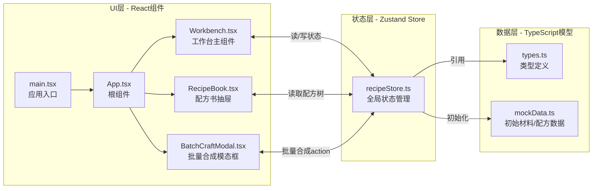
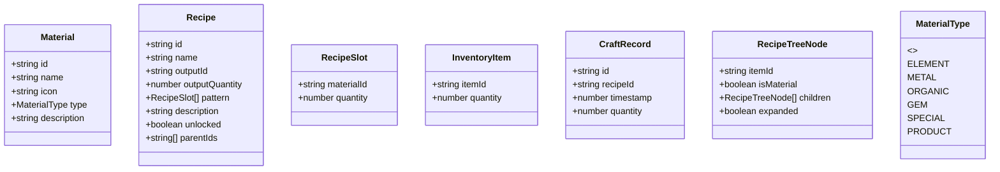

## 1. 架构设计

炼金合成工作台采用纯前端单页应用架构，基于React组件化开发，状态管理集中在Zustand Store中，组件间通过单向数据流进行通信。



**文件调用关系与数据流向：**
- `src/main.tsx` → 挂载 `App.tsx` 到DOM
- `src/App.tsx` → 组合三大组件：`Workbench`、`RecipeBook`、`BatchCraftModal`
- `src/components/Workbench.tsx` → 调用 `recipeStore`：`materials`/`slots`/`craft()`/`setSlot()`/`clearSlot()`/`searchKeyword`
- `src/components/RecipeBook.tsx` → 调用 `recipeStore`：`recipeTree`/`unlockedRecipes`/`openBatchCraft()`
- `src/components/BatchCraftModal.tsx` → 调用 `recipeStore`：`batchCraft()`/`selectedRecipe`/`closeBatchCraft()`
- `src/store/recipeStore.ts` → 定义状态：材料库存、合成槽、配方树、解锁状态、搜索关键字；提供action：合成、批量合成、设置槽位、添加材料、解锁配方

## 2. 技术描述

- **前端框架**：React@18 + TypeScript@5（严格模式）
- **构建工具**：Vite@5 + @vitejs/plugin-react@4
- **状态管理**：Zustand@4（轻量级Flux状态管理，减少样板代码）
- **唯一ID生成**：uuid@9（用于合成记录、配方实例标识）
- **样式方案**：CSS Modules + CSS Variables（深色炼金主题变量集中管理）
- **动画方案**：原生CSS Keyframes + CSS Transitions（高性能，避免第三方动画库开销）
- **拖拽方案**：HTML5原生Drag & Drop API（支持60FPS流畅拖拽）
- **后端**：无（纯前端本地应用，数据保存在内存中）
- **数据库**：无（内存存储，如需持久化可扩展使用localStorage）

## 3. 项目目录结构

```
src/
├── main.tsx                    # 应用入口，挂载React根
├── App.tsx                     # 根组件，组合所有子组件
├── styles/
│   ├── variables.css           # 全局CSS变量（主题色、尺寸等）
│   └── global.css              # 全局样式（重置、字体、动画关键帧）
├── store/
│   └── recipeStore.ts          # Zustand全局状态管理
├── types/
│   └── index.ts                # TypeScript类型定义
├── data/
│   └── mockData.ts             # 初始材料数据、初始配方数据
├── components/
│   ├── Workbench.tsx           # 工作台主组件
│   ├── RecipeBook.tsx          # 配方书抽屉组件
│   └── BatchCraftModal.tsx     # 批量合成模态框组件
└── utils/
    └── recipeMatcher.ts        # 配方匹配算法工具函数
```

## 4. 数据模型定义

### 4.1 核心TypeScript类型



### 4.2 Zustand Store状态模型

```typescript
interface RecipeStore {
  // 材料与库存
  materials: Material[];                    // 所有材料定义
  inventory: Record<string, number>;        // 库存映射：itemId -> 数量
  
  // 合成槽（3x3 = 9个槽位）
  craftingSlots: (RecipeSlot | null)[];     // 长度9的数组
  
  // 配方系统
  allRecipes: Recipe[];                     // 所有配方定义
  unlockedRecipeIds: Set<string>;           // 已解锁配方ID集合
  recipeTree: RecipeTreeNode[];             // 配方展示树
  
  // 合成历史
  craftHistory: CraftRecord[];              // 合成记录
  
  // UI状态
  searchKeyword: string;
  isRecipeBookOpen: boolean;
  batchCraftState: {
    isOpen: boolean;
    recipeId: string | null;
  };
  
  // 动画状态
  animationState: {
    isCrafting: boolean;
    isSuccess: boolean | null;
    lastUnlockedRecipeId: string | null;
  };
  
  // Actions
  setSearchKeyword(keyword: string): void;
  setCraftingSlot(index: number, slot: RecipeSlot | null): void;
  craft(): { success: boolean; recipeId?: string };
  batchCraft(recipeId: string, times: number): Promise<boolean>;
  addMaterial(itemId: string, quantity: number): void;
  unlockRecipe(recipeId: string): void;
  toggleRecipeBook(): void;
  openBatchCraft(recipeId: string): void;
  closeBatchCraft(): void;
  toggleTreeNode(itemId: string): void;
}
```

## 5. 核心算法说明

### 5.1 配方匹配算法
- **数据结构**：将3x3合成槽序列化为排序后的字符串key（`materialId:quantity` pairs按位置拼接）
- **匹配策略**：每个Recipe预计算patternKey，合成时直接O(1)哈希查表
- **边界处理**：空槽位不参与key计算，支持无序配方（可选，需额外处理位置无关的标准化）

### 5.2 配方树构建算法
- **初始状态**：所有基础材料（isMaterial=true）作为根节点
- **层级构建**：遍历已解锁配方，按outputId找到对应父节点挂载children
- **层级深度**：递归构建，支持多级合成产物（A+B→C，C+D→E）

### 5.3 批量合成库存校验
- **计算公式**：所需材料 = recipe.pattern[i].quantity × times
- **校验逻辑**：遍历所有材料，检查inventory[materialId] >= 所需数量
- **不足标记**：返回缺失材料数组供UI高亮显示

## 6. 性能优化方案

| 优化目标 | 实施方案 | 预期效果 |
|---------|---------|---------|
| 合成响应≤200ms | 配方匹配使用O(1)哈希表，状态更新批量处理 | 从点击到视觉反馈<150ms |
| 60FPS渲染 | CSS动画代替JS动画，使用transform/opacity（不触发重排） | 每帧<16ms |
| 拖拽流畅 | HTML5原生API，避免频繁setState，仅在dragend时更新状态 | 拖拽帧率稳定60FPS |
| 列表渲染 | 材料/配方节点使用React.memo包裹，避免不必要重渲染 | 组件重渲染次数减少80% |
| 批量合成性能 | 动画使用requestAnimationFrame调度，状态批量更新而非逐次 | 连续合成流畅无卡顿 |

## 7. 初始Mock数据规划

### 7.1 基础材料（10种，覆盖5种类型）
- **元素类**：火元素、水元素、土元素、风元素
- **金属类**：铁矿、铜矿、银矿
- **有机类**：草药、蘑菇
- **宝石类**：水晶原石
- **特殊类**：贤者之尘

### 7.2 初始配方（设计多级配方树）
- **一级配方**：火+土→铜矿、水+风→水晶
- **二级配方**：铜矿+银→青铜锭、水晶+草药→治疗药水
- **三级配方**：青铜锭+贤者之尘→贤者之石（终极产物）
共约8-10个配方，形成3级深度的配方树
