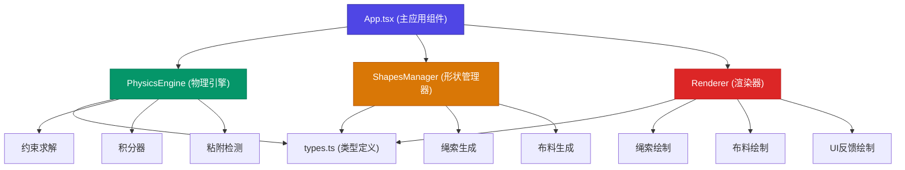
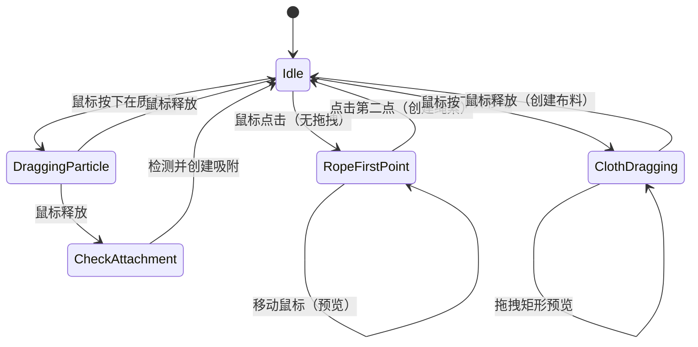

## 1. 架构设计



## 2. 技术描述

### 2.1 技术栈

- **前端框架**：React 18 + TypeScript
- **构建工具**：Vite 5
- **渲染技术**：Canvas 2D API
- **不使用外部物理引擎**：自主实现质点-弹簧系统

### 2.2 核心技术选型

| 技术 | 用途 | 说明 |
|------|------|------|
| React 18 | UI 框架 | 管理组件状态和生命周期 |
| TypeScript | 类型系统 | 严格模式，target ES2020 |
| Canvas 2D | 渲染引擎 | 高性能物理对象绘制 |
| Vite | 构建工具 | 快速开发服务器和构建 |
| 半隐式欧拉积分 | 物理积分 | 稳定性优于显式欧拉 |
| 松弛迭代约束求解 | 弹簧约束 | 多次迭代提高精度 |

## 3. 项目结构

```
e:\solo\SoloAutoDemo\tasks\auto7\
├── index.html                 # 入口HTML，全屏容器
├── package.json               # 项目依赖
├── tsconfig.json              # TypeScript配置
├── vite.config.js             # Vite配置
├── .trae/
│   └── documents/
│       ├── PRD.md
│       └── TECHNICAL_ARCHITECTURE.md
└── src/
    ├── types.ts               # 类型定义（质点、弹簧、绳索、布料等）
    ├── physicsEngine.ts       # 物理引擎（核心迭代逻辑）
    ├── shapesManager.ts       # 形状管理器（绳索/布料创建）
    ├── renderer.ts            # 渲染器（Canvas绘制）
    └── App.tsx                # 主应用组件
```

## 4. 核心数据模型

### 4.1 类型定义 (types.ts)

```typescript
// 质点
interface Particle {
  x: number;           // 当前位置x
  y: number;           // 当前位置y
  oldX: number;        // 上一帧位置x
  oldY: number;        // 上一帧位置y
  pinned: boolean;     // 是否固定
  mass: number;        // 质量
  tension: number;     // 张力值（用于布料着色）
}

// 弹簧约束
interface SpringConstraint {
  p1: Particle;        // 质点1索引
  p2: Particle;        // 质点2索引
  restLength: number;  // 静止长度
  stiffness: number;   // 刚度系数
  type: 'structural' | 'shear' | 'bend';  // 约束类型
}

// 绳索
interface Rope {
  id: string;
  particles: Particle[];
  constraints: SpringConstraint[];
}

// 布料
interface Cloth {
  id: string;
  particles: Particle[];
  constraints: SpringConstraint[];
  gridSize: number;    // 网格大小（如10x10）
  width: number;
  height: number;
}

// 粘附绑定
interface Attachment {
  ropeId: string;
  ropeParticleIndex: number;
  clothId: string;
  clothParticleIndex: number;
}

// 物理世界
interface PhysicsWorld {
  ropes: Rope[];
  cloths: Cloth[];
  attachments: Attachment[];
  gravity: number;
  airResistance: number;
  elasticity: number;
  damping: number;     // 阻尼系数（0.98）
}

// 物理参数
interface PhysicsParams {
  gravity: number;     // 0-5，默认1
  airResistance: number;  // 0-1，默认0.02
  elasticity: number;  // 50-500，默认200
}
```

### 4.2 物理引擎核心算法

1. **半隐式欧拉积分**：
   - 计算速度：`vx = (x - oldX) * damping`
   - 更新旧位置：`oldX = x`
   - 应用加速度：`x += vx + ax * dt * dt`

2. **约束求解（松弛迭代）**：
   - 每帧迭代5-10次
   - 修正质点位置使弹簧长度接近静止长度
   - 对角约束防止剪切变形

3. **粘附检测**：
   - 拖拽绳索端点时检测附近布料边缘质点
   - 距离小于30px时触发吸附
   - 创建绑定后两个质点位置同步

## 5. 性能优化策略

### 5.1 物理模拟

- 固定时间步长：`dt = 1/60`
- 每帧最多进行3次物理迭代（确保稳定性）
- 使用约束松弛迭代而非矩阵求解
- 对象池复用减少GC

### 5.2 渲染优化

- 批量绘制减少Canvas状态切换
- 离屏画布预渲染静态元素
- requestAnimationFrame 驱动渲染循环
- 张力颜色值缓存，避免每帧重复计算

### 5.3 交互优化

- 质点拾取使用空间网格加速
- 拖拽阈值防止误操作
- 平滑拖拽位置插值

## 6. 模块职责划分

### 6.1 physicsEngine.ts

**职责**：
- 维护物理世界状态
- 实现 `update(dt)` 方法进行物理迭代
- 实现 `addConstraint()` 方法添加约束
- 处理重力、空气阻力应用
- 约束求解（弹簧松弛迭代）
- 粘附绑定逻辑处理

**关键方法**：
```typescript
class PhysicsEngine {
  update(dt: number): void;
  addConstraint(constraint: SpringConstraint): void;
  setParams(params: Partial<PhysicsParams>): void;
  checkAttachment(particle: Particle): Attachment | null;
  createAttachment(rope: Rope, ropeIdx: number, cloth: Cloth, clothIdx: number): void;
}
```

### 6.2 shapesManager.ts

**职责**：
- 管理所有绳索和布料对象
- 实现 `createRope(p1, p2, segments)` 创建绳索
- 实现 `createCloth(rect)` 创建布料
- 维护对象ID和引用列表
- 生成质点网格和约束关系

**关键方法**：
```typescript
class ShapesManager {
  createRope(p1: {x: number, y: number}, p2: {x: number, y: number}, segments?: number): Rope;
  createCloth(rect: {x: number, y: number, width: number, height: number}): Cloth;
  removeRope(id: string): void;
  removeCloth(id: string): void;
  getParticleAt(x: number, y: number, radius: number): {particle: Particle, parent: Rope | Cloth, index: number} | null;
}
```

### 6.3 renderer.ts

**职责**：
- Canvas 2D 渲染所有物理对象
- 实现张力颜色映射（绿→红）
- 绘制绳索、布料、控制面板
- 提供交互反馈（吸附高亮、拖拽指示）

**关键方法**：
```typescript
class Renderer {
  constructor(canvas: HTMLCanvasElement);
  render(world: PhysicsWorld, draggedParticle: Particle | null): void;
  clear(): void;
  drawBackground(): void;
  drawRope(rope: Rope): void;
  drawCloth(cloth: Cloth): void;
  getTensionColor(tension: number): string;
}
```

### 6.4 App.tsx

**职责**：
- React 主组件，初始化所有模块
- 绑定鼠标事件（mousedown/mousemove/mouseup）
- 管理控制面板滑块状态
- 驱动 requestAnimationFrame 渲染循环
- 处理拖拽和吸附交互逻辑
- 响应窗口大小变化

**关键状态**：
```typescript
// 创建模式：'none' | 'rope-first' | 'cloth-dragging'
const [createMode, setCreateMode] = useState<'none' | 'rope-first' | 'cloth-dragging'>('none');
const [ropeStart, setRopeStart] = useState<{x: number, y: number} | null>(null);
const [clothStart, setClothStart] = useState<{x: number, y: number} | null>(null);
const [draggedParticle, setDraggedParticle] = useState<DraggedInfo | null>(null);
const [params, setParams] = useState<PhysicsParams>({gravity: 1, airResistance: 0.02, elasticity: 200});
```

## 7. 交互状态机



---

**文档版本**：v1.0  
**创建日期**：2026-06-19  
**最后更新**：2026-06-19
