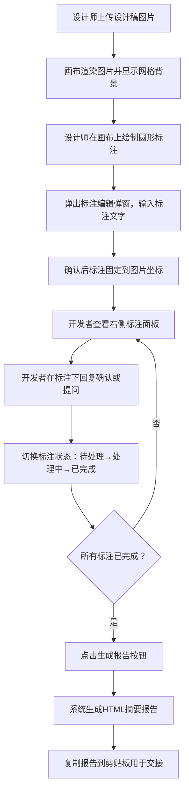

## 1. 产品概述

设计稿标注与交接协作工具，解决设计师和前端开发者之间因设计稿细节（颜色、间距、动画曲线）沟通不一致导致的反复修改和版本混乱问题。设计师上传设计稿图片并添加圆形标注，开发者在标注下方直接回复确认或提问，系统自动生成包含所有标注及状态的摘要报告。

- 目标用户：UI设计师、前端开发者
- 核心价值：消除设计-开发沟通鸿沟，实现标注、讨论、状态追踪一站式闭环

## 2. 核心功能

### 2.1 功能模块

1. **画布工作区**：图片上传展示、圆形标注绘制与拖拽、缩放平移
2. **标注面板**：标注列表、讨论回复、状态切换
3. **摘要报告**：一键生成HTML格式摘要、复制到剪贴板

### 2.2 页面详情

| 页面名称 | 模块名称 | 功能描述 |
|---------|---------|---------|
| 主工作区 | 图片上传与展示 | 拖拽/点击上传PNG/JPG，画布自动适配，最大宽度1280px等比缩放居中，浅灰网格背景 |
| 主工作区 | 圆形标注绘制 | 点击拖拽绘制圆形标注（默认半径12px，边框#FF6B35，半透明填充），弹出编辑弹窗输入最多200字，确认后固定并支持拖拽调整位置 |
| 主工作区 | 画布交互 | 鼠标滚轮缩放（0.5-3倍），空格+拖拽平移，标注随图片等比缩放 |
| 标注面板 | 标注列表 | 按时间倒序列出所有标注，显示64x64缩略图、文字内容、1-3条回复 |
| 标注面板 | 讨论回复 | 每条回复可输入256字文本 |
| 标注面板 | 状态切换 | 下拉菜单切换：待处理（#FF6B35）、处理中（#4B7BEC）、已完成（#20BF6B），颜色同步变化 |
| 顶部工具栏 | 生成报告 | 收集所有标注位置截图、讨论内容和状态，生成HTML摘要页面，可复制粘贴 |

## 3. 核心流程

## 4. 用户界面设计

### 4.1 设计风格

- **主色调**：极简主义，以白色和浅灰为主，标注使用鲜明的橙色(#FF6B35)、蓝色(#4B7BEC)、绿色(#20BF6B)区分状态
- **按钮样式**：6px圆角，扁平化设计，悬停微反馈
- **字体**：系统字体栈（Apple SF Pro风格），正文14px，标题16-20px
- **布局风格**：左侧画布主体 + 右侧固定320px边栏
- **图标风格**：简洁线性图标

### 4.2 页面设计概览

| 页面名称 | 模块名称 | UI元素 |
|---------|---------|--------|
| 主工作区 | 画布区域 | 浅灰网格背景(#F0F0F0, 网格线#D0D0D0, 20px间距)，图片居中显示，圆形标注带呼吸动画 |
| 主工作区 | 标注编辑弹窗 | 居中弹窗，输入框最多200字，确认/取消按钮 |
| 标注面板 | 标注列表卡片 | 64x64缩略图、标注文字、回复列表、状态下拉菜单 |
| 顶部工具栏 | 工具栏 | 48px高，白色背景，底部1px #E0E0E0分隔线，上传按钮、生成报告按钮 |

### 4.3 响应式设计

- 桌面端优先（最小视口1024px以上）
- 视口宽度 < 1024px 时，右侧边栏自动收起至屏幕边缘
- 收起状态通过箭头按钮（背景#333，白色箭头）悬停显示
- 画布最小宽度800px

### 4.4 动效设计

- 标注悬停呼吸动画：1.5秒周期，透明度0.5-1.0之间变化
- 状态切换时标注颜色平滑过渡
- 画布缩放使用requestAnimationFrame保证55fps+
- 面板收起/展开使用CSS过渡动画
