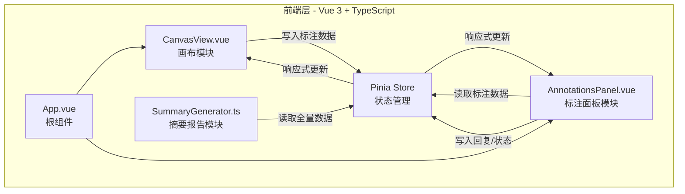
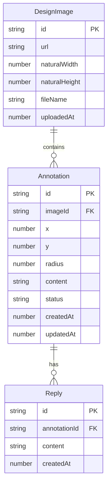

## 1. 架构设计



## 2. 技术说明

- **前端框架**：Vue 3 + TypeScript + Vite
- **状态管理**：Pinia
- **路由**：vue-router（单页面应用，主要用于后续扩展）
- **HTTP客户端**：axios（预留接口，当前纯前端）
- **构建工具**：Vite + @vitejs/plugin-vue
- **唯一ID生成**：uuid
- **初始化工具**：vite-init (vue-ts 模板)
- **后端**：无（纯前端应用，数据存储在Pinia store内存中）

## 3. 路由定义

| 路由 | 用途 |
|------|------|
| / | 主工作区页面，包含画布和标注面板 |

## 4. 数据模型

### 4.1 数据模型定义



### 4.2 类型定义

```typescript
type AnnotationStatus = 'pending' | 'in-progress' | 'completed'

interface DesignImage {
  id: string
  url: string
  naturalWidth: number
  naturalHeight: number
  fileName: string
  uploadedAt: number
}

interface Annotation {
  id: string
  imageId: string
  x: number
  y: number
  radius: number
  content: string
  status: AnnotationStatus
  createdAt: number
  updatedAt: number
}

interface Reply {
  id: string
  annotationId: string
  content: string
  createdAt: number
}
```

## 5. 文件结构与调用关系

```
src/
├── App.vue                          ← 根组件，整合画布模块和右侧面板
├── main.ts                          ← 入口，挂载Pinia和Router
├── stores/
│   └── designStore.ts               ← Pinia store，管理图片/标注/回复数据
├── modules/
│   ├── canvas/
│   │   └── CanvasView.vue           ← 画布模块，上传图片+绘制标注+缩放平移
│   ├── annotations/
│   │   └── AnnotationsPanel.vue     ← 标注面板，列表+讨论+状态切换
│   └── summary/
│       └── SummaryGenerator.ts      ← 摘要报告生成，读取store生成HTML
├── types/
│   └── index.ts                     ← TypeScript类型定义
└── composables/
    └── useCanvas.ts                 ← 画布交互逻辑（缩放/平移/绘制）
```

### 数据流向

1. **用户上传图片** → CanvasView.vue → Pinia store (`setCurrentImage`)
2. **用户绘制标注** → CanvasView.vue → Pinia store (`addAnnotation`)
3. **用户添加回复** → AnnotationsPanel.vue → Pinia store (`addReply`)
4. **用户切换状态** → AnnotationsPanel.vue → Pinia store (`updateAnnotationStatus`)
5. **生成报告** → SummaryGenerator.ts ← Pinia store (`getAllData`) → HTML → 剪贴板
6. **画布渲染** → CanvasView.vue ← Pinia store (响应式读取标注列表和图片)
7. **面板渲染** → AnnotationsPanel.vue ← Pinia store (响应式读取标注列表和回复)

## 6. 性能策略

- 画布渲染使用 requestAnimationFrame 驱动，确保55fps+
- 标注绘制使用离屏canvas缓存，200个标注时拖拽响应<100ms
- 缩放和平移使用CSS transform代替canvas重绘，减少渲染开销
- Pinia store使用computed缓存派生数据，避免重复计算
