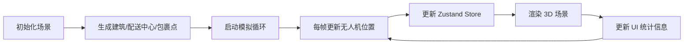
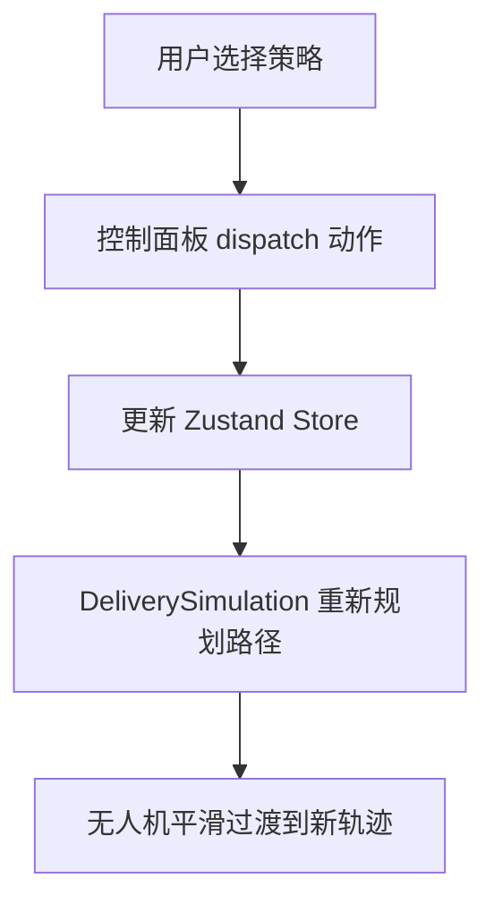

# 无人机城市物流路径可视化应用 - 产品需求文档

## 1. 产品概述

无人机城市物流路径可视化应用是一个基于 Three.js 的 3D 交互式模拟系统，用于直观展示智慧城市中多无人机物流配送的动态路径规划。用户可以观察不同调度策略下的飞行效率和冲突情况，辅助理解无人机物流系统的运作机制。

- **核心目的**：可视化模拟城市无人机物流配送，支持多种调度策略的效果对比
- **目标用户**：智慧城市规划者、物流调度员、技术研究人员
- **产品价值**：提供直观的 3D 可视化交互，帮助理解不同调度策略对配送效率的影响

## 2. 核心功能

### 2.1 功能模块

1. **3D 城市场景**：网格城市俯视图、随机建筑、无人机、配送中心、包裹投放点
2. **无人机调度模拟**：三种调度策略（最短路径、负载均衡、紧急优先）
3. **路径可视化**：半透明彩色轨迹线、渐进式绘制
4. **控制面板**：策略选择、速度调节、任务生成
5. **信息统计**：活跃无人机数、已送达包裹数、总飞行里程、时间轴
6. **小地图**：2D 迷你地图，实时同步视角
7. **粒子特效**：包裹送达时的粒子爆炸效果

### 2.2 页面详情

| 页面名称 | 模块名称 | 功能描述 |
|----------|----------|----------|
| 主页面 | 3D 场景 | 展示城市建筑、无人机、配送中心、包裹点的三维视图 |
| 主页面 | 控制面板 | 调度策略切换、速度滑块、生成新任务按钮 |
| 主页面 | 信息覆盖层 | 实时统计数据展示、时间轴进度条 |
| 主页面 | 小地图 | 左下角 2D 迷你地图，同步显示所有元素位置 |

## 3. 核心流程

### 3.1 模拟运行流程

### 3.2 调度策略切换流程

## 4. 用户界面设计

### 4.1 设计风格

- **整体风格**：深色科技风、未来感
- **背景渐变**：深蓝 #0a1a2a 到 #162a3a
- **主色调**：霓虹绿 #00ff88
- **辅助色**：红色 #ff4d4d、绿色 #4dff4d、蓝色 #4d4dff、橙色 #ffa500
- **字体**：Orbitron（未来感字体）

### 4.2 界面元素设计

**控制面板**：
- 半透明白色毛玻璃效果
- 背景：rgba(255,255,255,0.08)
- 边框：1px solid rgba(255,255,255,0.12)
- 圆角：12px
- 模糊：10px

**按钮**：
- 未来感字体（Orbitron）
- 主色调霓虹绿 #00ff88
- 悬停光晕：box-shadow: 0 0 12px #00ff88
- 策略切换脉冲动画：0.2秒 scale 1→1.05→1

**信息覆盖层**：
- 数字计数动画：0.5秒 easeOutCubic
- 时间轴进度条：背景 #333，填充 #00ff88

**小地图**：
- 位置：左下角
- 尺寸：150x150px
- 背景：#00000080（半透明黑色）

### 4.3 3D 场景设计

**城市环境**：
- 网格范围：100x100 单位
- 建筑：灰色立方体，高度 2-8 单位，间距均匀
- 默认视角：45 度俯角
- 相机控制：轨道控制器，拖拽旋转灵敏度 0.4 度/帧，滚轮缩放 0.5-10 单位

**无人机**：
- 彩色小球，半径 0.5 单位
- 颜色按路线：红 #ff4d4d、绿 #4dff4d、蓝 #4d4dff
- 白色光晕效果

**配送中心**：
- 蓝色圆柱 #3399ff，半径 1.5 单位，高 0.5 单位
- 顶部旋转雷达天线动画

**包裹投放点**：
- 橙色方柱 #ffa500，高 0.3 单位

**轨迹线**：
- 半透明彩色，线宽 0.15 单位，透明度 0.5
- 渐进式绘制（到达节点时绘制到该节点）

**粒子效果**：
- 包裹送达时触发向上飘散的粒子爆炸
- 粒子数量：40
- 寿命：1.2 秒
- 颜色：随无人机颜色渐变
- 同时最多触发 3 次

### 4.4 响应式设计

- 自适应窗口宽度：800px - 1920px
- 布局方式：Flex 布局，元素居中排列
- 控制面板和信息层位置固定

## 5. 性能约束

- 帧率不低于 40 FPS
- 无人机数量上限：30 架
- 同时粒子爆炸效果上限：3 次
- 场景对象高效复用，避免频繁创建销毁
