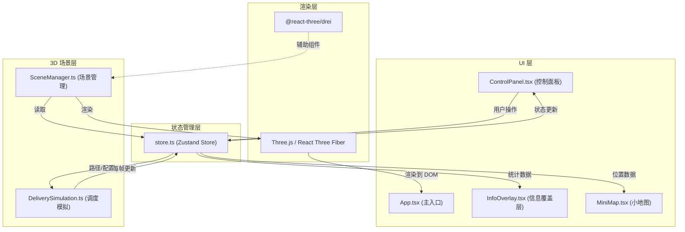
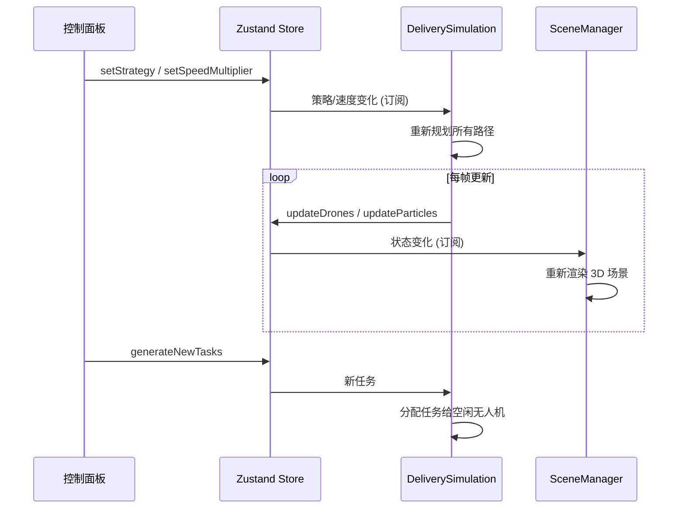

# 无人机城市物流路径可视化应用 - 技术架构文档

## 1. 架构设计

### 1.1 整体架构图



### 1.2 模块职责与数据流向

| 模块 | 文件路径 | 职责 | 输入数据 | 输出数据 |
|------|----------|------|----------|----------|
| 全局状态 | src/store/store.ts | 统一管理无人机、路径、统计、模拟状态 | 所有模块的 action | 所有模块的 state |
| 调度模拟 | src/simulation/DeliverySimulation.ts | 无人机调度与路径规划 | store 中的策略、速度、任务 | 每帧更新无人机位置、路径、统计 |
| 场景管理 | src/scene/SceneManager.ts | Three.js 场景创建与渲染 | store 中的无人机、路径、建筑 | 3D 场景渲染 |
| 控制面板 | src/ui/ControlPanel.tsx | 用户交互控制 | store 中的当前策略、速度 | dispatch 策略切换、速度调节、生成任务 |
| 信息覆盖 | src/ui/InfoOverlay.tsx | 实时数据展示 | store 中的统计数据 | 数字动画显示 |
| 小地图 | src/ui/MiniMap.tsx | 2D 迷你地图 | store 中的所有位置数据 | 2D 画布渲染 |

## 2. 技术选型

### 2.1 前端技术栈

- **框架**：React 18 + TypeScript
- **构建工具**：Vite 5
- **3D 渲染**：Three.js + @react-three/fiber + @react-three/drei
- **状态管理**：Zustand
- **UI 样式**：CSS Modules / 内联样式（科技风主题）
- **唯一 ID**：uuid

### 2.2 依赖说明

| 依赖 | 版本 | 用途 |
|------|------|------|
| react | ^18.2.0 | UI 框架 |
| react-dom | ^18.2.0 | DOM 渲染 |
| three | ^0.160.0 | 3D 图形库 |
| @react-three/fiber | ^8.15.0 | React Three.js 渲染器 |
| @react-three/drei | ^9.92.0 | Three.js 辅助组件库 |
| zustand | ^4.4.0 | 状态管理 |
| uuid | ^9.0.0 | 唯一 ID 生成 |
| typescript | ^5.3.0 | 类型系统 |
| vite | ^5.0.0 | 构建工具 |
| @vitejs/plugin-react | ^4.2.0 | React Vite 插件 |

## 3. 项目结构

```
src/
├── main.tsx              # 应用入口
├── App.tsx               # 根组件
├── store/
│   └── store.ts          # Zustand 全局状态
├── simulation/
│   └── DeliverySimulation.ts  # 无人机调度与路径规划
├── scene/
│   ├── SceneManager.tsx  # 3D 场景管理组件
│   ├── Buildings.tsx     # 建筑组件
│   ├── Drone.tsx         # 无人机组件
│   ├── TrailLine.tsx     # 轨迹线组件
│   ├── DeliveryCenter.tsx # 配送中心组件
│   ├── PackagePoint.tsx  # 包裹点组件
│   └── ParticleEffect.tsx # 粒子效果组件
├── ui/
│   ├── ControlPanel.tsx  # 控制面板
│   ├── InfoOverlay.tsx   # 信息覆盖层
│   └── MiniMap.tsx       # 小地图
└── types/
    └── index.ts          # 类型定义
```

## 4. 数据模型

### 4.1 核心类型定义

```typescript
// 调度策略类型
type SchedulingStrategy = 'astar' | 'load_balance' | 'priority';

// 三维坐标
interface Vector3 {
  x: number;
  y: number;
  z: number;
}

// 无人机状态
interface Drone {
  id: string;
  position: Vector3;
  color: string;
  path: Vector3[];
  currentPathIndex: number;
  speed: number;
  status: 'idle' | 'flying' | 'delivering' | 'returning';
  carriedPackageId: string | null;
  homeCenterId: string;
  distanceTraveled: number;
}

// 包裹点
interface PackagePoint {
  id: string;
  position: Vector3;
  priority: number;
  status: 'pending' | 'in_transit' | 'delivered';
  assignedDroneId: string | null;
}

// 配送中心
interface DeliveryCenter {
  id: string;
  position: Vector3;
  droneCount: number;
}

// 建筑
interface Building {
  id: string;
  position: Vector3;
  width: number;
  depth: number;
  height: number;
}

// 粒子效果
interface Particle {
  id: string;
  position: Vector3;
  velocity: Vector3;
  color: string;
  life: number;
  maxLife: number;
}

// 统计数据
interface Statistics {
  activeDrones: number;
  deliveredPackages: number;
  totalDistance: number;
  simulationTime: number;
}

// Store 状态
interface SimulationState {
  // 配置
  strategy: SchedulingStrategy;
  speedMultiplier: number;
  isRunning: boolean;
  
  // 实体
  drones: Drone[];
  packages: PackagePoint[];
  deliveryCenters: DeliveryCenter[];
  buildings: Building[];
  particles: Particle[];
  
  // 统计
  statistics: Statistics;
  
  // Actions
  setStrategy: (strategy: SchedulingStrategy) => void;
  setSpeedMultiplier: (speed: number) => void;
  toggleRunning: () => void;
  generateNewTasks: (count: number) => void;
  updateSimulation: (deltaTime: number) => void;
  addParticleEffect: (position: Vector3, color: string) => void;
}
```

### 4.2 数据流图



## 5. 核心算法

### 5.1 A* 最短路径算法

- **网格大小**：100x100，网格单元 1x1 单位
- **启发函数**：欧几里得距离
- **障碍物**：建筑物占据的网格单元
- **飞行高度**：固定高度 5 单位

### 5.2 负载均衡调度

- 统计每个配送中心的当前任务数
- 新任务分配给任务最少的配送中心的空闲无人机
- 若所有无人机都忙碌，则分配给总负载最轻的中心

### 5.3 紧急优先调度

- 按包裹优先级排序（高优先级先处理）
- 紧急包裹可插队，中断低优先级任务
- 被中断的任务重新排队

### 5.4 路径平滑过渡

- 策略切换时，无人机从当前位置平滑过渡到新路径
- 使用 lerp 插值在 1 秒内完成过渡
- 过渡期间保持当前飞行方向

## 6. 性能优化策略

### 6.1 3D 渲染优化

- 使用 InstancedMesh 渲染大量建筑
- 轨迹线使用 BufferGeometry 动态更新
- 粒子系统使用 Points 批量渲染
- 按需更新，避免每帧全量重建

### 6.2 状态更新优化

- Zustand selector 精确订阅，避免不必要重渲染
- 模拟逻辑与渲染分离，使用 requestAnimationFrame
- 粒子对象池复用，减少 GC

### 6.3 粒子系统限制

- 同时最多 3 个粒子爆炸效果
- 每个效果 40 个粒子
- 粒子寿命 1.2 秒后自动回收

## 7. 构建配置

### 7.1 Vite 配置

- React 插件支持
- 路径别名：@ → src
- 开发服务器端口：5173
- 构建目标：ES2020

### 7.2 TypeScript 配置

- 严格模式（strict: true）
- JSX: react-jsx
- 模块解析：bundler
- 路径别名与 Vite 同步
