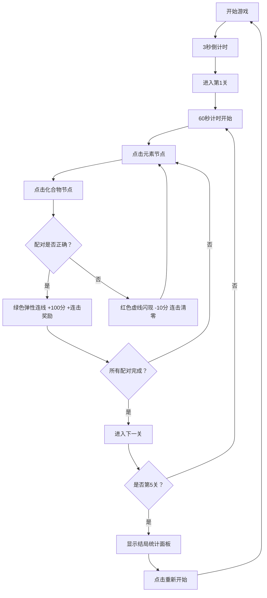

## 1. 产品概述

元素连线是一款化学配对教育游戏，玩家需要在限时内将化学元素符号与对应的化合物或反应式进行正确连线配对。通过寓教于乐的方式帮助学生记忆常见化学反应和化学式。

- **目标用户**：初高中化学学习者、对化学感兴趣的普通玩家
- **产品价值**：将枯燥的化学记忆转化为有趣的游戏挑战，提升学习效率和兴趣

## 2. 核心功能

### 2.1 用户角色
| 角色 | 注册方式 | 核心权限 |
|------|----------|----------|
| 普通玩家 | 无需注册 | 进行游戏、查看得分统计、重新开始 |

### 2.2 功能模块
1. **倒计时页面**：3秒开场倒计时动画
2. **游戏主界面**：元素节点、化合物节点、SVG连线、得分面板
3. **关卡流转**：5个关卡逐关挑战，自动进入下一关
4. **结局统计**：完成所有关卡后显示总分、平均耗时、完美关卡数

### 2.3 页面详情
| 页面名称 | 模块名称 | 功能描述 |
|---------|---------|---------|
| 倒计时页面 | 数字动画 | 3→2→1逐秒缩小淡出动画 |
| 游戏主界面 | 游戏棋盘 | 8个元素节点+8个化合物节点随机排列，支持点击配对 |
| 游戏主界面 | 得分面板 | 显示得分、剩余时间、进度条、连击数 |
| 结局统计 | 统计面板 | 总分、平均耗时、完美关卡数、重新开始按钮 |

## 3. 核心流程

## 4. 用户界面设计

### 4.1 设计风格
- **主色调**：深色太空主题 #1a1a2e（主背景）、#16213e（副背景）、#0f3460（卡片背景）
- **节点颜色**：元素节点浅蓝 #d0e8f2、化合物节点浅粉 #f2d0e8
- **强调色**：成功绿 #4caf50、警告橙 #ff9800、危险红 #f44336
- **字体**：数字使用加粗字体，标题清晰可读
- **节点样式**：圆形节点，渐变玻璃质感（backdrop-filter: blur(4px)），hover放大1.1倍+光晕
- **按钮**：圆角矩形，绿色成功色，hover过渡0.3s

### 4.2 页面设计概述
| 页面名称 | 模块名称 | UI元素 |
|---------|---------|---------|
| 倒计时页面 | 数字动画 | 居中大号数字，缩放淡出动画 |
| 游戏主界面 | 顶部得分区 | 左：得分+连击、中：倒计时+颜色变化+脉冲、右：进度条 |
| 游戏主界面 | 游戏棋盘 | 左侧列元素节点，右侧列化合物节点，SVG连线层 |
| 游戏主界面 | 节点效果 | 选中环形波纹、成功绿色缩小动画、错误虚线闪现 |
| 结局统计 | 弹窗面板 | 半透明黑背景遮罩，居中圆角卡片，统计项，重新开始按钮 |

### 4.3 响应式设计
- **设计策略**：Desktop-first，最小支持320px宽度
- **棋盘布局**：响应式居中，节点间距根据屏幕宽度自适应
- **断点**：320px（最小）、768px（平板）、1920px（最大桌面）
- **触摸支持**：节点点击区域足够大（≥40px直径），支持移动端触摸操作
