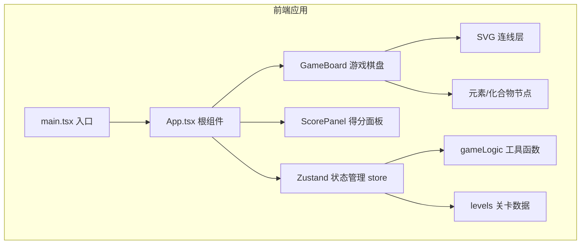

## 1. 架构设计



## 2. 技术描述

- **前端框架**：React@18 + TypeScript（严格模式）
- **构建工具**：Vite@5 + @vitejs/plugin-react
- **状态管理**：Zustand（轻量级状态管理，管理游戏全局状态）
- **唯一标识**：uuid（生成节点唯一ID）
- **样式方案**：原生CSS（CSS变量主题系统，全局样式index.css）
- **绘制方案**：原生SVG（绘制连线、动画效果）

## 3. 文件结构定义

| 文件路径 | 用途说明 |
|---------|---------|
| `/package.json` | 项目依赖配置（react, react-dom, typescript, vite, zustand, uuid, @vitejs/plugin-react） |
| `/index.html` | Vite入口HTML页面 |
| `/vite.config.ts` | Vite构建配置（React插件） |
| `/tsconfig.json` | TypeScript严格模式配置 |
| `/src/main.tsx` | React应用入口，渲染根组件到#root |
| `/src/App.tsx` | 应用主组件：游戏状态管理、倒计时、关卡流转、结局面板 |
| `/src/components/GameBoard.tsx` | 游戏棋盘：节点渲染、SVG连线、点击配对逻辑 |
| `/src/components/ScorePanel.tsx` | 得分面板：得分、剩余时间、进度条、连击数显示 |
| `/src/data/levels.ts` | 5个关卡数据，每关6-8对元素-化合物映射 |
| `/src/utils/gameLogic.ts` | 核心逻辑：配对检测、得分计算、通关判断 |
| `/src/styles/index.css` | 全局样式、CSS变量主题、动画定义 |

## 4. 状态管理设计（Zustand Store）

### 4.1 State 字段
```typescript
{
  // 游戏阶段
  phase: 'countdown' | 'playing' | 'levelComplete' | 'finished';
  // 当前关卡索引
  currentLevel: number; // 0-4
  // 当前得分
  score: number;
  // 剩余时间（秒）
  timeLeft: number;
  // 连击数
  combo: number;
  // 当前选中的元素节点ID
  selectedElementId: string | null;
  // 已完成的配对列表
  matchedPairs: Array<{ elementId: string; compoundId: string }>;
  // 错误的临时配对（用于动画）
  wrongPair: { elementId: string; compoundId: string } | null;
  // 关卡统计
  levelStats: Array<{
    levelIndex: number;
    timeSpent: number;
    isPerfect: boolean;
    wrongCount: number;
  }>;
}
```

### 4.2 Actions
```typescript
{
  startCountdown(): void;        // 开始3秒倒计时
  startLevel(): void;            // 开始当前关卡
  selectElement(id: string): void;     // 选中元素节点
  tryMatch(compoundId: string): void;  // 尝试与化合物配对
  tickTime(): void;              // 每秒计时
  nextLevel(): void;             // 进入下一关
  restart(): void;               // 重新开始游戏
  clearWrongPair(): void;        // 清除错误配对显示
}
```

## 5. 数据模型

### 5.1 关卡数据类型
```typescript
interface PairData {
  id: string;          // uuid
  element: string;     // 元素符号，如 "H"
  elementName: string; // 元素名称，如 "氢"
  compound: string;    // 化合物/反应式，如 "H2O"
  compoundName: string;// 化合物名称，如 "水"
}

interface LevelData {
  levelNumber: number; // 1-5
  pairs: PairData[];   // 6-8对
}
```

### 5.2 节点类型
```typescript
interface GameNode {
  id: string;
  pairId: string;        // 所属配对ID
  text: string;          // 显示文本
  type: 'element' | 'compound';
  position: { x: number; y: number }; // 棋盘坐标
  isMatched: boolean;    // 是否已配对
}
```

## 6. 核心逻辑设计

### 6.1 配对检测流程
1. 用户点击元素节点 → 设置 selectedElementId，触发波纹动画
2. 用户点击化合物节点 → 调用 tryMatch()
3. gameLogic.checkMatch(elementId, compoundId) → 比较 pairId 是否相同
4. 正确 → 加入 matchedPairs，更新得分，增加连击
5. 错误 → 设置 wrongPair，扣分，清零连击，0.3s后清除wrongPair

### 6.2 得分计算规则
```
基础分 = 100 分/正确配对
连击奖励：
  - 2连 = +20 分
  - 3连及以上 = +30 分/次
错误扣分 = -10 分
```

### 6.3 关卡判断
```
通关条件：matchedPairs.length === 当前关卡配对数
完美关卡：该关卡 wrongCount === 0
```

### 6.4 计时器颜色规则
```
剩余时间 > 30s → 白色
10s < 剩余时间 ≤ 30s → 橙色 #ff9800
剩余时间 ≤ 10s → 红色 #f44336 + pulse 闪烁动画
```
