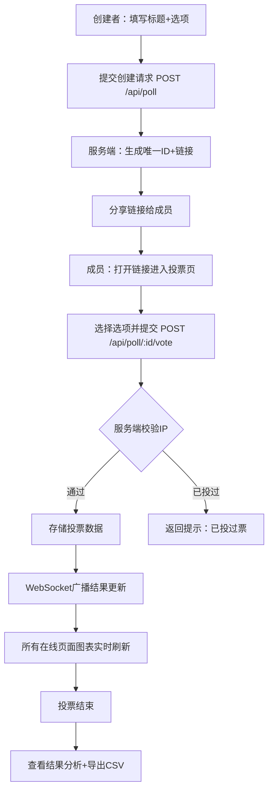

## 1. 产品概述

团队匿名投票与结果统计看板——一款面向远程协作团队的轻量级决策工具，解决"开会太重、闲聊太轻"的痛点，让团队通过结构化投票快速达成共识，并以动态图表实时呈现投票结果与趋势分析。

- 目标用户：远程工作团队、项目组、社区组织
- 核心价值：匿名投票降低社交压力、实时图表提升决策透明度、一键导出简化归档流程

## 2. 核心功能

### 2.1 用户角色

| 角色 | 注册方式 | 核心权限 |
|------|----------|----------|
| 投票创建者 | 无需注册 | 创建投票、关闭投票、导出结果 |
| 投票参与者 | 无需注册 | 通过链接匿名投票、查看实时结果 |

### 2.2 功能模块

1. **投票列表页**：展示所有投票卡片，支持创建新投票，状态标签区分进行中/已结束
2. **投票页**：选项列表、匿名投票、实时结果图表（柱状图+饼图）、结果分析（折线图+CSV导出）

### 2.3 页面详情

| 页面名称 | 模块名称 | 功能描述 |
|----------|----------|----------|
| 投票列表页 | 创建投票表单 | 输入标题（≤50字）、添加选项（≥2个，每项≤30字）、设置截止时间（可选）、生成分享链接 |
| 投票列表页 | 投票卡片列表 | 展示所有投票卡片，显示标题、状态标签、参与人数、截止时间，点击进入投票页 |
| 投票页 | 选项投票区 | 单选/多选选项列表，点击选项触发微震动动画，提交投票按钮，IP限制每人一次 |
| 投票页 | 实时结果看板 | 柱状图（选项名vs得票数，紫渐变色）、饼图（8色调色板）、WebSocket实时更新（0.5s缓动） |
| 投票页 | 结果分析区 | 总票数、各选项排名、得票率变化折线图（按时间序列）、一键导出CSV |

## 3. 核心流程

**创建投票流程**：用户在左侧创建区填写标题和选项 → 点击创建 → 服务端生成唯一ID和分享链接 → 跳转到投票页 → 通过链接分享给团队成员

**投票流程**：成员通过链接进入 → 选择选项 → 提交投票 → 服务端校验IP → 存储投票 → WebSocket广播结果更新 → 所有在线页面图表实时刷新

**结果分析流程**：投票结束/手动关闭 → 展示总票数和排名 → 查看得票率时间序列折线图 → 一键导出CSV

## 4. 用户界面设计

### 4.1 设计风格

- 主色调：紫色 #6c5ce7，渐变到 #a29bfe
- 辅助色：8色调色板（番茄#e17055、青绿#00b894、紫#6c5ce7、粉#fd79a8、蓝#0984e3、橙#fdcb6e、绿#00cec9、灰#b2bec3）
- 按钮样式：微渐变背景，圆角12px，悬浮时 brightness(1.1)
- 卡片样式：圆角16px，box-shadow: 0 4px 12px rgba(108,92,231,0.15)
- 字体：系统字体栈，标题加粗，正文常规
- 布局：左右两栏，左侧创建区（360px，背景#f8f9fa），右侧展示区（白色#ffffff）

### 4.2 页面设计概览

| 页面名称 | 模块名称 | UI元素 |
|----------|----------|--------|
| 投票列表页 | 左侧创建区 | 浅灰背景#f8f9fa，标题输入框，选项输入框（可添加/删除），截止时间选择器，创建按钮（紫渐变） |
| 投票列表页 | 右侧投票卡片列表 | 白色背景，投票卡片（圆角16px阴影），状态标签（进行中/已结束），参与人数，截止时间 |
| 投票页 | 选项投票区 | 选项卡片列表，选中态（scale(1.02)+蓝色外发光0.1s），提交按钮，已投票提示 |
| 投票页 | 柱状图 | x轴选项名，y轴得票数，柱体紫渐变(#6c5ce7→#a29bfe)，0.5s缓动过渡 |
| 投票页 | 饼图 | 8色调色板扇区，0.5s缓动过渡，图例 |
| 投票页 | 折线图 | x轴时间序列，y轴得票率，各选项独立线条，8色调色板 |
| 投票页 | 导出按钮 | CSV导出，紫渐变按钮 |

### 4.3 响应式

- 桌面端（≥768px）：左右两栏布局
- 移动端（<768px）：上下堆叠布局，创建区在上，展示区在下
- 图表区域响应式适配，自动调整宽高

### 4.4 动画效果

- 选项点击：transform: scale(1.02) 0.1s + 蓝色外发光 0.1s
- 图表更新：0.5s ease-in-out 缓动过渡
- 按钮悬浮：filter: brightness(1.1)
- 错误提示：输入框边框变红 #d63031
