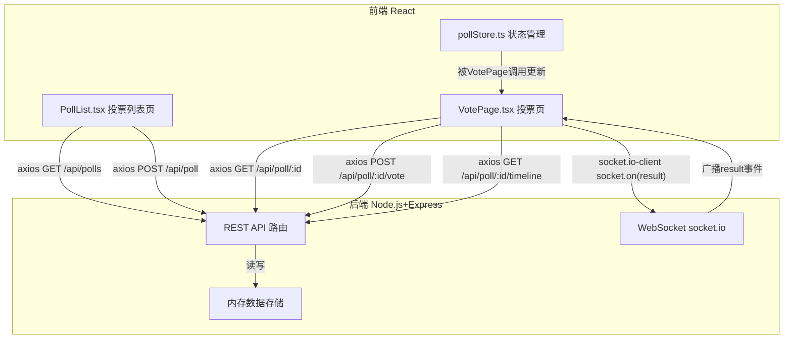
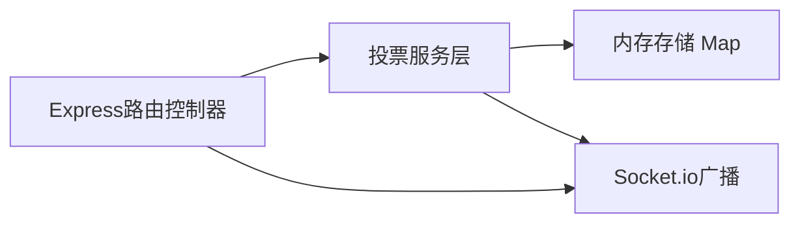
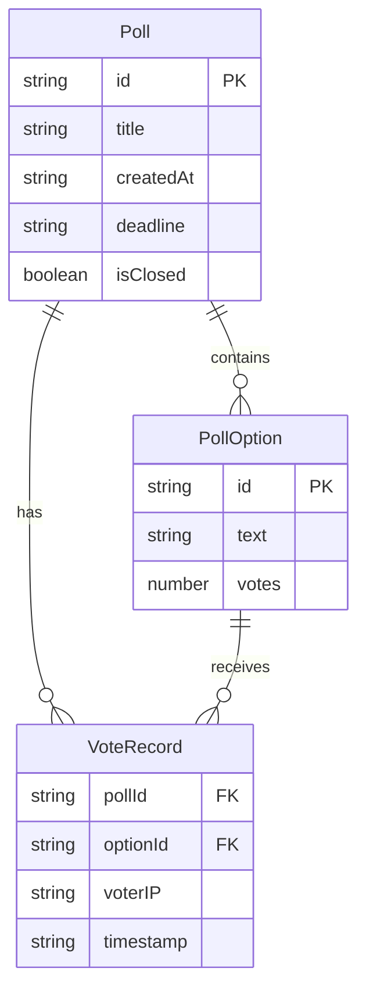

## 1. 架构设计



## 2. 技术说明

- 前端：React@18 + TypeScript + Vite + Tailwind CSS + Zustand + Recharts + Socket.io-client + Axios
- 初始化工具：vite-init（react-express-ts模板）
- 后端：Express@4 + Socket.io + UUID
- 数据库：内存存储（Map结构），无外部数据库依赖

## 3. 路由定义

| 路由 | 用途 |
|------|------|
| / | 投票列表页（创建+列表） |
| /vote/:id | 投票页（投票+实时图表+结果分析） |

## 4. API定义

### 4.1 TypeScript类型定义

```typescript
interface Poll {
  id: string;
  title: string;
  options: PollOption[];
  createdAt: string;
  deadline: string | null;
  isClosed: boolean;
  voterIPs: string[];
}

interface PollOption {
  id: string;
  text: string;
  votes: number;
}

interface VoteRecord {
  pollId: string;
  optionId: string;
  timestamp: string;
}

interface TimelinePoint {
  timestamp: string;
  optionId: string;
  cumulativeVotes: number;
}
```

### 4.2 API端点

| 方法 | 路径 | 请求体 | 响应 | 说明 |
|------|------|--------|------|------|
| GET | /api/polls | - | Poll[] | 获取所有投票列表 |
| POST | /api/poll | {title, options[], deadline?} | Poll | 创建新投票 |
| GET | /api/poll/:id | - | Poll | 获取投票详情 |
| POST | /api/poll/:id/vote | {optionIds: string[]} | Poll | 提交投票（服务端校验IP） |
| PATCH | /api/poll/:id/close | - | Poll | 关闭投票 |
| GET | /api/poll/:id/timeline | - | TimelinePoint[] | 获取得票率时间序列 |
| GET | /api/poll/:id/export | - | CSV文件 | 导出投票结果CSV |

### 4.3 WebSocket事件

| 事件名 | 方向 | 数据 | 说明 |
|--------|------|------|------|
| join | Client→Server | pollId | 加入投票房间 |
| result | Server→Client | Poll | 投票结果更新广播 |

## 5. 服务端架构图



## 6. 数据模型

### 6.1 数据模型定义



### 6.2 数据定义

内存数据结构（使用Map）：
- `polls: Map<string, Poll>` — 以pollId为键存储所有投票
- `voteRecords: Map<string, VoteRecord[]>` — 以pollId为键存储投票记录
- `timeline: Map<string, TimelinePoint[]>` — 以pollId为键存储时间序列数据

## 7. 文件结构与调用关系

```
├── package.json
├── vite.config.js          ← 代理/api到:3001
├── tsconfig.json
├── index.html              ← 入口页面
├── server/
│   └── server.ts           ← Express+Socket.io后端
│       职责：投票CRUD、IP校验、WebSocket广播
│       数据流：POST /api/poll → 内存存储 → socket.emit('result')
├── src/
│   ├── main.tsx            ← React入口
│   ├── App.tsx             ← 路由配置
│   ├── pages/
│   │   ├── PollList.tsx    ← 投票列表页
│   │   │   职责：渲染投票卡片、创建表单
│   │   │   数据流：GET /api/polls → 渲染 → 点击卡片 → /vote/:id
│   │   └── VotePage.tsx    ← 投票页
│   │       职责：选项投票、实时图表、结果分析
│   │       数据流：GET /api/poll/:id → 渲染 → socket.on('result') → recharts渲染
│   └── store/
│       └── pollStore.ts    ← Zustand状态管理
│           职责：维护投票数据、投票状态、错误信息
│           数据流：被VotePage调用更新 → 触发重新渲染
└── shared/
    └── types.ts            ← 前后端共享类型定义
```
