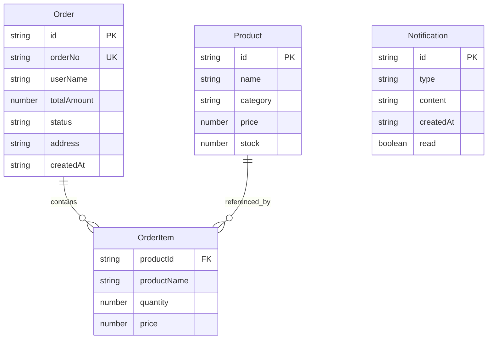

## 1. 架构设计

```mermaid
graph TB
    subgraph "前端层 (React + TypeScript)"
        "Dashboard大盘页" --> "API Service"
        "OrderList订单页" --> "API Service"
        "SortHelper分拣页" --> "API Service"
        "ProductManage商品页" --> "API Service"
        "Statistics统计页" --> "API Service"
        "API Service" --> "Zustand Store"
        "Zustand Store" --> "React组件"
    end

    subgraph "后端层 (Node.js + Express)"
        "Express Router" --> "Order Controller"
        "Express Router" --> "Product Controller"
        "Express Router" --> "Sort Controller"
        "Express Router" --> "Stats Controller"
    end

    subgraph "数据层 (本地JSON文件)"
        "orders.json" --> "Order Controller"
        "products.json" --> "Product Controller"
        "notifications.json" --> "Notification Controller"
    end

    "API Service" -->|"HTTP请求"| "Express Router"
    "Order Controller" -->|"读写"| "orders.json"
    "Product Controller" -->|"读写"| "products.json"
```

## 2. 技术说明

- **前端**: React@18 + TypeScript + Vite + Zustand + CSS Modules
- **初始化工具**: Vite (vite-init)
- **后端**: Express@4 + TypeScript + cors
- **数据库**: 本地JSON文件模拟（orders.json、products.json）
- **图表**: 纯CSS/SVG实现（环形图）+ Canvas实现（折线图、柱状图、饼图）
- **状态管理**: Zustand（全局订单状态、分拣状态、通知状态）
- **路由**: react-router-dom v6
- **样式方案**: CSS-in-JS（内联样式+CSS模块混合），不引入额外CSS框架

## 3. 路由定义

| 路由 | 用途 |
|------|------|
| / | 团长大盘页面，展示今日统计和进度 |
| /orders | 订单列表页面，搜索筛选和详情 |
| /sort | 分拣辅助页面，按分类拣货 |
| /products | 商品管理页面，商品目录CRUD |
| /statistics | 数据统计页面，图表展示 |

## 4. API定义

### 4.1 订单相关

```typescript
interface Order {
  id: string;
  orderNo: string;
  userName: string;
  items: OrderItem[];
  totalAmount: number;
  status: "pending" | "paid" | "sorted" | "completed";
  address: string;
  createdAt: string;
}

interface OrderItem {
  productId: string;
  productName: string;
  quantity: number;
  price: number;
}

// GET /api/orders - 获取订单列表（支持?status=&keyword=筛选）
// GET /api/orders/:id - 获取订单详情
// PUT /api/orders/:id/status - 更新订单状态
// GET /api/orders/stats/today - 获取今日统计
```

### 4.2 商品相关

```typescript
interface Product {
  id: string;
  name: string;
  category: "水果蔬菜" | "肉禽蛋奶" | "调味品" | "零食饮料";
  price: number;
  stock: number;
}

// GET /api/products - 获取商品列表（支持?category=筛选）
// POST /api/products - 新增商品
// PUT /api/products/:id - 编辑商品
// DELETE /api/products/:id - 删除商品
```

### 4.3 分拣相关

```typescript
interface SortItem {
  productId: string;
  productName: string;
  category: string;
  totalQuantity: number;
  sources: { userName: string; quantity: number; checked: boolean }[];
}

// GET /api/sort/list - 获取分拣清单（按商品分组）
// PUT /api/sort/check - 更新勾选状态
// POST /api/sort/complete - 标记全部分拣完成
```

### 4.4 统计相关

```typescript
// GET /api/stats/trend - 获取7天订单趋势
// GET /api/stats/top-products - 获取热销商品前十
// GET /api/stats/category-distribution - 获取分类销量占比
```

### 4.5 通知相关

```typescript
interface Notification {
  id: string;
  type: "new_order" | "cancel" | "system";
  content: string;
  createdAt: string;
  read: boolean;
}

// GET /api/notifications - 获取通知列表
// PUT /api/notifications/:id/read - 标记已读
// GET /api/notifications/unread-count - 获取未读数
```

## 5. 服务端架构图

```mermaid
graph LR
    "Express App" --> "cors中间件"
    "Express App" --> "JSON解析中间件"
    "Express App" --> "路由层"
    "路由层" --> "订单路由"
    "路由层" --> "商品路由"
    "路由层" --> "分拣路由"
    "路由层" --> "统计路由"
    "路由层" --> "通知路由"
    "订单路由" --> "读写orders.json"
    "商品路由" --> "读写products.json"
    "分拣路由" --> "读写orders.json"
    "统计路由" --> "读orders.json"
    "通知路由" --> "读写notifications.json"
```

## 6. 数据模型

### 6.1 数据模型定义



### 6.2 初始数据

- orders.json：预生成50条模拟订单数据
- products.json：预生成20条商品数据（每个分类5个）
- notifications.json：预生成5条通知数据

## 7. 文件结构与调用关系

```
├── package.json
├── index.html
├── vite.config.ts
├── tsconfig.json
├── server/
│   ├── index.ts          ← 后端入口，挂载所有路由
│   └── data/
│       ├── orders.json   ← 订单数据
│       ├── products.json ← 商品数据
│       └── notifications.json ← 通知数据
├── src/
│   ├── main.tsx          ← 前端入口
│   ├── App.tsx           ← 路由配置+布局
│   ├── types.ts          ← 类型定义（被所有模块引用）
│   ├── api.ts            ← API请求封装
│   ├── store.ts          ← Zustand状态管理
│   ├── components/
│   │   ├── Sidebar.tsx   ← 侧边栏导航
│   │   └── NotificationBell.tsx ← 通知铃铛
│   └── pages/
│       ├── Dashboard.tsx  ← 大盘页面
│       ├── OrderList.tsx  ← 订单列表
│       ├── SortHelper.tsx ← 分拣辅助
│       ├── ProductManage.tsx ← 商品管理
│       └── Statistics.tsx ← 数据统计
```

数据流向：
- 页面组件 → api.ts → 后端API → JSON文件 → 返回响应 → 页面渲染
- Zustand Store 缓存常用数据（订单列表、商品列表、通知列表），减少请求
- 分拣页面勾选操作：本地状态即时更新 → 定时同步后端
- 侧边栏：轮询后端获取未处理订单数
