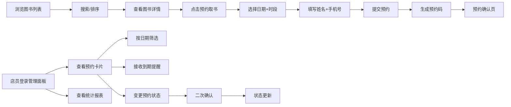

## 1. 产品概述

本产品是一款面向小型独立书店的图书预约与到店自提管理应用，旨在解决顾客在线选书后无法实时确认库存、预约时段混乱以及店员手动登记信息易出错的问题。

- 核心价值：提升书店运营效率，优化顾客购书体验，减少人工登记错误
- 目标用户：小型独立书店运营者（店员/店主）和书店顾客
- 市场价值：帮助传统书店实现数字化转型，降低运营成本，提升客户满意度

## 2. 核心功能

### 2.1 用户角色

| 角色 | 登录方式 | 核心权限 |
|------|----------|----------|
| 顾客 | 无需登录 | 浏览图书、搜索筛选、提交预约、查看预约详情 |
| 店员 | 无需登录 | 查看所有预约、更新预约状态、日期筛选、查看统计报表 |

### 2.2 功能模块

1. **图书浏览页**：图书列表展示、搜索过滤、排序功能、图书详情页
2. **预约系统**：预约表单、日期选择、时段选择、预约码生成、预约确认
3. **管理面板**：预约卡片列表、状态管理、日期筛选、到期提醒横幅
4. **统计报表**：每日预约统计、时段分布柱状图、完成率/取消率展示

### 2.3 页面详情

| 页面名称 | 模块名称 | 功能描述 |
|---------|----------|----------|
| 图书浏览页 | 图书列表 | 展示50本图书，每本显示封面160x220px、书名、作者、价格、库存状态标签 |
| 图书浏览页 | 搜索排序 | 书名/作者搜索（200ms防抖），按价格/出版年份排序 |
| 图书详情页 | 详情展示 | ISBN、出版社、简介、目录摘要，预约取书按钮 |
| 预约表单 | 日期选择 | 未来7天可选，当天不可选，可选项淡紫色#b39ddb高亮 |
| 预约表单 | 时段选择 | 上午10-12点、下午2-5点，每时段最多5个预约，实时显示剩余名额 |
| 预约表单 | 信息填写 | 姓名、手机号，提交后生成6位字母数字预约码 |
| 预约确认页 | 结果展示 | 预约详情、倒计时提醒（距离取书剩余小时数） |
| 管理面板 | 预约卡片 | 卡片网格（宽280px，背景#fff8e1，阴影0 4px 12px rgba(0,0,0,0.08)，圆角12px） |
| 管理面板 | 状态管理 | 左上角色块标识状态（待取书#ffd54f、已取书#81c784、已取消#bdbdbd），二次确认弹窗 |
| 管理面板 | 提醒横幅 | 预约到期前30分钟顶部渐变横幅（#fff3e0到#ffe0b2，淡入动画0.5s） |
| 统计报表 | 数据展示 | 总预约数、时段分布柱状图（柱宽40px，#9575cd，悬停#7e57c2）、完成率、取消率 |

## 3. 核心流程

### 顾客预约流程
顾客浏览图书列表，使用搜索或排序功能查找目标图书，点击进入详情页查看完整信息，确认库存后点击"预约取书"按钮，弹出预约表单，选择取书日期（未来7天内）和时段（查看剩余名额），填写姓名和手机号，提交后系统生成唯一预约码，显示预约成功确认页和倒计时提醒。

### 店员管理流程
店员进入管理面板查看所有预约卡片，可按日期筛选预约记录，查看即将到期的预约提醒横幅，点击卡片上的状态按钮进行状态变更（待取书→已取书/已取消），系统弹出二次确认框，确认后状态更新。店主可查看每日统计报表，了解预约情况。

## 4. 用户界面设计

### 4.1 设计风格

- **主色调**：#8d6e63（暖棕色）
- **辅助色**：#a5d6a7（薄荷绿）
- **背景色**：#faf3e0（米白色）
- **字体**：系统无衬线字体
- **导航栏**：固定顶部，高度64px，背景#8d6e63，白色文字，backdrop-filter: blur(8px) 毛玻璃效果
- **按钮**：#a5d6a7填充，hover时变#81c784并上移2px，过渡0.25s
- **卡片**：hover时阴影加重0 8px 24px rgba(0,0,0,0.12)，transform: scale(1.02)，0.3s ease
- **输入框**：聚焦时边框从#bdbdbd变为#8d6e63，过渡0.2s

### 4.2 页面设计概览

| 页面名称 | 模块名称 | UI元素 |
|---------|----------|--------|
| 图书浏览页 | 图书列表 | 网格布局，卡片hover效果，库存状态标签颜色区分 |
| 图书浏览页 | 搜索栏 | 输入框聚焦动画，防抖搜索提示 |
| 预约表单 | 日期选择器 | 日历组件，可选日期#b39ddb高亮，不可选日期灰色禁用 |
| 预约表单 | 时段选择 | 卡片式时段选项，显示剩余名额，满员禁用 |
| 管理面板 | 预约卡片 | 左上角色块状态标识，卡片网格布局，状态变更按钮 |
| 管理面板 | 提醒横幅 | 渐变背景，淡入动画，图标+文字提醒 |
| 统计报表 | 柱状图 | 柱宽40px，颜色过渡动画，悬停显示数值 |

### 4.3 响应式设计

- **设计方式**：桌面优先（Desktop-first），移动端自适应
- **关键断点**：768px（平板）、1024px（桌面）
- **移动端适配**：
  - 卡片网格改为单列布局
  - 时段选择改为下拉选择器
  - 容器宽度和边距平滑过渡（transition: width 0.3s ease）
  - 最小适配宽度：320px
- **触摸优化**：按钮最小尺寸44x44px，增加触摸反馈

## 5. 性能要求

- 图书列表加载时间 ≤ 1秒（模拟50本图书数据）
- 搜索响应时间 ≤ 300ms（200ms防抖 + 100ms处理）
- 所有动画帧率 ≥ 50fps
- 首屏渲染优化，关键CSS内联
- 图片懒加载，封面图预加载优化
