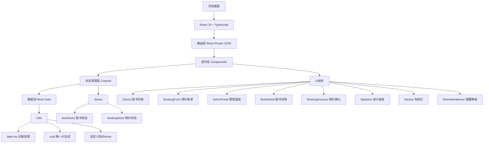
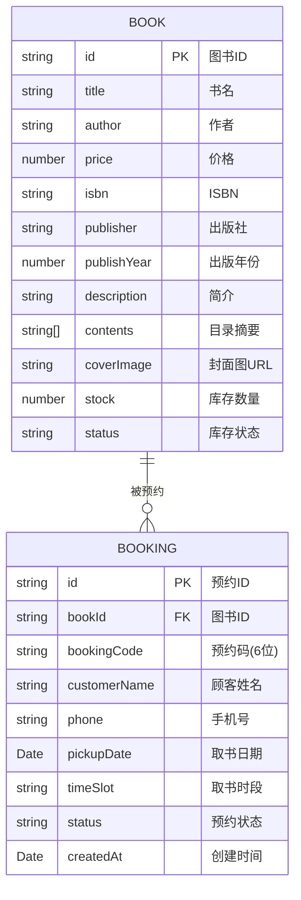

## 1. 架构设计



## 2. 技术说明

- **前端框架**：React 18 + TypeScript 5
- **构建工具**：Vite 5
- **路由管理**：React Router DOM 6
- **状态管理**：Zustand 4
- **日期处理**：date-fns 3
- **唯一ID**：uuid 9
- **样式方案**：原生CSS + CSS变量
- **开发服务器**：Vite Dev Server

## 3. 路由定义

| 路由 | 页面/组件 | 用途 |
|------|----------|------|
| `/` | Library | 图书列表首页，包含搜索和排序 |
| `/book/:id` | BookDetail | 图书详情页，展示完整信息和预约按钮 |
| `/booking/success/:id` | BookingSuccess | 预约成功确认页，显示预约码和倒计时 |
| `/admin` | AdminPanel | 店员管理面板，展示预约卡片和状态管理 |
| `/admin/statistics` | Statistics | 统计报表页，展示预约数据和柱状图 |

## 4. 数据模型

### 4.1 数据模型定义



### 4.2 TypeScript 类型定义

```typescript
// 图书类型
interface Book {
  id: string;
  title: string;
  author: string;
  price: number;
  isbn: string;
  publisher: string;
  publishYear: number;
  description: string;
  contents: string[];
  coverImage: string;
  stock: number;
  status: 'in-stock' | 'low-stock' | 'out-of-stock';
}

// 预约状态类型
type BookingStatus = 'pending' | 'picked-up' | 'cancelled';

// 时段类型
type TimeSlot = 'morning' | 'afternoon';

// 预约类型
interface Booking {
  id: string;
  bookId: string;
  bookingCode: string;
  customerName: string;
  phone: string;
  pickupDate: string;
  timeSlot: TimeSlot;
  status: BookingStatus;
  createdAt: string;
}

// 时段预约统计
interface TimeSlotAvailability {
  date: string;
  timeSlot: TimeSlot;
  total: number;
  remaining: number;
}

// 每日统计
interface DailyStatistics {
  date: string;
  totalBookings: number;
  morningCount: number;
  afternoonCount: number;
  completedCount: number;
  cancelledCount: number;
  completionRate: number;
  cancellationRate: number;
}
```

## 5. 项目文件结构

```
e:\solo\SoloAutoDemo\tasks\auto86\
├── package.json
├── index.html
├── vite.config.ts
├── tsconfig.json
├── src/
│   ├── main.tsx
│   ├── App.tsx
│   ├── index.css
│   ├── types/
│   │   └── index.ts          # 类型定义
│   ├── data/
│   │   └── mockBooks.ts      # 50本模拟图书数据
│   ├── stores/
│   │   ├── bookStore.ts      # 图书状态管理
│   │   └── bookingStore.ts   # 预约状态管理
│   ├── components/
│   │   ├── Library.tsx       # 图书列表与搜索
│   │   ├── BookDetail.tsx    # 图书详情页
│   │   ├── BookingForm.tsx   # 预约表单
│   │   ├── BookingSuccess.tsx # 预约成功页
│   │   ├── AdminPanel.tsx    # 管理面板
│   │   ├── Statistics.tsx    # 统计报表
│   │   ├── Navbar.tsx        # 导航栏
│   │   ├── ReminderBanner.tsx # 提醒横幅
│   │   ├── BookingCard.tsx   # 预约卡片组件
│   │   ├── DatePicker.tsx    # 日期选择器
│   │   └── TimeSlotPicker.tsx # 时段选择器
│   ├── hooks/
│   │   ├── useDebounce.ts    # 防抖Hook
│   │   └── useCountdown.ts   # 倒计时Hook
│   └── utils/
│       ├── bookingCode.ts    # 预约码生成
│       └── dateUtils.ts      # 日期工具函数
└── .trae/
    └── documents/
        ├── prd.md
        └── tech-arch.md
```

## 6. 关键技术实现

### 6.1 状态管理 (Zustand)

**bookStore** 负责：
- 存储50本模拟图书数据
- 搜索过滤逻辑（200ms防抖）
- 排序逻辑（价格/出版年份）
- 单本图书查询

**bookingStore** 负责：
- 存储预约记录
- 提交预约（生成预约码、扣减库存）
- 状态变更（二次确认后更新）
- 时段可用性计算
- 每日统计数据计算
- 到期提醒检测

### 6.2 核心业务逻辑

1. **预约码生成**：6位字母数字随机组合，确保唯一性
2. **时段配额管理**：每时段最多5个预约，实时计算剩余名额
3. **日期限制**：仅未来7天可选，当天不可选
4. **倒计时计算**：实时计算距离取书时间的剩余小时数
5. **到期提醒**：预约时间前30分钟触发横幅提醒
6. **库存管理**：预约成功后自动扣减库存，取消后恢复

### 6.3 性能优化

- **搜索防抖**：useDebounce Hook 实现200ms防抖
- **列表虚拟化**：模拟50本图书，渲染优化
- **CSS动画**：使用transform和opacity实现高性能动画
- **图片优化**：封面图使用合适尺寸，添加loading状态
- **状态选择器**：Zustand useShallow 优化重渲染
