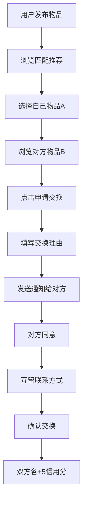

## 1. 产品概述

社区闲置物品交换平台，让用户上传闲置物品与其他用户进行等价或协商交换，通过信用评分和智能匹配算法提升交换体验。

- 主要用途：帮助用户交换闲置物品，减少浪费，促进社区资源循环
- 目标用户：社区居民、环保意识强的年轻人群体
- 市场价值：建立信任机制，解决闲置物品高效匹配，促进可持续消费

## 2. 核心功能

### 2.1 用户角色

| 角色 | 注册方式 | 核心权限 |
|------|----------|----------|
| 普通用户 | 注册登录 | 发布物品、浏览物品、发起交换、管理个人信息 |

### 2.2 功能模块

1. **首页**：导航栏、物品推荐列表、搜索和筛选
2. **物品列表页**：无限滚动加载、搜索框、类别筛选、物品卡片网格
3. **个人中心**：信用分展示、已发布物品、成就徽章、发布新物品表单
4. **消息页面**：交换请求通知、消息列表

### 2.3 页面详情

| 页面名称 | 模块名称 | 功能描述 |
|---------|---------|----------|
| 首页 | 物品推荐 | 展示推荐物品卡片，支持搜索和类别筛选 |
| 物品列表页 | 无限滚动 | 每页12项，支持搜索和类别筛选 |
| 个人中心 | 信用分展示 | 显示信用分、已发布物品数、成功交换次数、成就徽章 |
| 个人中心 | 发布物品表单 | 填写物品信息并发布 |
| 消息页面 | 消息列表 | 展示交换请求和通知消息 |

## 3. 核心流程

用户发布物品 → 浏览匹配推荐 → 选择自己物品 → 发起交换请求 → 对方接收通知 → 同意交换 → 双方互留联系方式 → 确认交换 → 信用分奖励

## 4. 用户界面设计

### 4.1 设计风格

- 主色调：珊瑚粉 #ff7e67
- 背景色：暖白 #faf8f5
- 成功反馈：薄荷绿 #7ec8a3
- 按钮：圆角设计，点击微弹效果 transform: scale(0.95) → 1.0
- 字体：使用现代无衬线字体，标题18-24px，正文14-16px
- 布局：左右分栏，左侧固定导航栏（60px宽），右侧内容区
- 图标：使用 lucide-react 图标库，24x24px

### 4.2 页面设计概述

| 页面名称 | 模块名称 | UI元素 |
|---------|---------|--------|
| 物品卡片 | 卡片设计 | 300x340px，白色背景，圆角16px，阴影悬停加深上移 |
| 物品卡片 | 图片缩略图 | 200x200px，圆角12px，点击放大，懒加载 |
| 物品卡片 | 标签 | 背景#e8f0fe，文字#1a73e8，圆角6px |
| 导航栏 | 左侧固定 | 背景#2d3436，图标悬停渐变 |
| 通知气泡 | 右下角 | 背景#323232，圆角12px，4秒自动消失 |
| 骨架屏 | 加载状态 | 渐变背景#e0e0e0到#f5f5f5，0.8s脉冲动画 |

### 4.3 响应式

- 桌面端：左右分栏，卡片3列网格
- 移动端：导航栏变为底部Tab栏（64px高），卡片1列布局

### 4.4 性能要求

- 物品列表首次加载时间 ≤ 1.5秒
- 交换请求API响应 ≤ 600ms
- 图片懒加载优化
