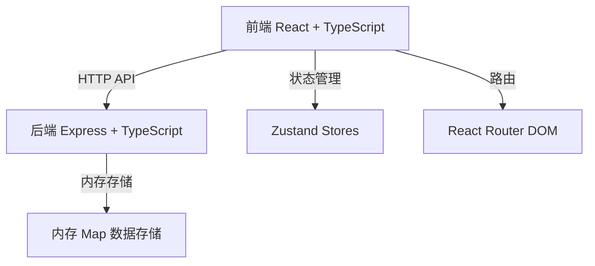
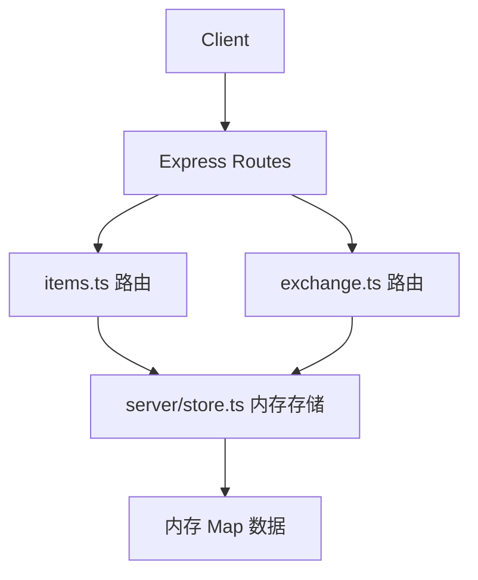

## 1. 架构设计



## 2. 技术描述

- **前端框架**：React 18 + TypeScript + Vite
- **状态管理**：Zustand
- **路由**：React Router DOM 6
- **图标**：Lucide React
- **后端**：Express 4 + TypeScript
- **文件上传**：Formidable
- **数据存储**：内存 Map（开发演示）
- **跨域**：CORS

## 3. 路由定义

| 路由 | 用途 |
|------|------|
| / | 首页 - 物品推荐列表 |
| /items | 物品列表页 - 无限滚动加载 |
| /profile | 个人中心 - 信用分、发布物品 |
| /messages | 消息页面 - 交换请求通知 |

## 4. API 定义

### 4.1 类型定义

```typescript
interface User {
  id: string;
  name: string;
  avatar: string;
  creditScore: number;
  successfulExchanges: number;
  badges: string[];
  consecutiveSuccess: number;
}

interface Item {
  id: string;
  userId: string;
  title: string;
  description: string;
  category: 'electronics' | 'books' | 'home' | 'clothing' | 'other';
  condition: number; // 1-5
  expectedCategory: string;
  expectedValueMin: number;
  expectedValueMax: number;
  imageUrl: string;
  createdAt: number;
}

interface ExchangeRequest {
  id: string;
  fromUserId: string;
  toUserId: string;
  fromItemId: string;
  toItemId: string;
  reason: string;
  contactTime: string;
  status: 'pending' | 'accepted' | 'rejected' | 'cancelled';
  createdAt: number;
}
```

### 4.2 API 接口

| 方法 | 路径 | 描述 |
|------|------|------|
| POST | /api/items | 发布物品 |
| GET | /api/items | 获取物品列表（page, limit, search, category） |
| POST | /api/exchange/request | 发起交换请求 |
| GET | /api/exchange/recommendations/:userId | 获取匹配推荐列表 |

## 5. 服务器架构



## 6. 项目文件结构

```
project/
├── package.json
├── index.html
├── vite.config.ts
├── tsconfig.json
├── src/
│   ├── main.tsx
│   ├── App.tsx
│   ├── stores/
│   │   ├── authStore.ts
│   │   └── itemStore.ts
│   ├── pages/
│   │   ├── ItemList.tsx
│   │   └── Profile.tsx
│   └── components/
│       ├── ItemCard.tsx
│       └── ExchangeModal.tsx
└── server/
    ├── index.ts
    ├── routes/
    │   ├── items.ts
    │   └── exchange.ts
    └── store.ts
```

## 7. 匹配算法

- 物品类别相似度权重：70%
- 价值区间重叠度权重：30%
- 信用分低于60分的用户物品排名权重降低50%

## 8. 信用分规则

- 初始信用分：100分
- 成功交换：+5分
- 无正当理由取消：-10分
- 连续3次成功交换：+20分，获得"交换达人"徽章
