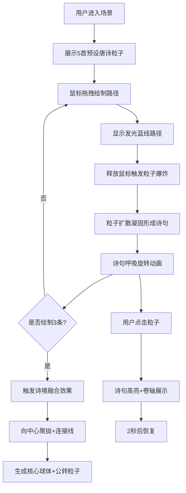

## 1. 产品概述

粒子诗境是一个基于Three.js的3D交互可视化艺术项目，用户通过鼠标手势在三维空间中绘制轨迹，轨迹将实时转化为由彩色粒子流组成的动态诗句图案。所有诗句粒子群在空间中漂浮、碰撞、融合，最终形成一幅不断演化的大型粒子诗文画卷。

- 核心价值：将中国古典诗词与现代粒子艺术结合，创造沉浸式的交互式诗意体验
- 目标用户：艺术爱好者、教育者、展览观众
- 市场价值：可用于艺术展览、文化教育、数字艺术展示等场景

## 2. 核心功能

### 2.1 用户角色

| 角色 | 注册方式 | 核心权限 |
|------|----------|----------|
| 访客用户 | 无需注册 | 体验完整交互功能，绘制轨迹，查看诗句 |

### 2.2 功能模块

1. **3D场景渲染**：深空背景、星光粒子、相机控制、光照系统
2. **手势绘制系统**：鼠标拖拽绘制路径、路径发光效果、粒子爆炸动画
3. **粒子诗句系统**：Bitmap字体映射、粒子形成文字、呼吸动画、整体旋转
4. **交互系统**：点击粒子高亮、诗句卷轴卡片展示、诗境融合效果
5. **控制面板**：清空场景、重置视角、诗句数量统计
6. **音频系统**：诗境融合背景音乐生成

### 2.3 页面详情

| 页面名称 | 模块名称 | 功能描述 |
|-----------|-------------|---------------------|
| 主场景 | 3D粒子系统 | 显示5首预设唐诗的粒子群落，支持用户绘制新路径 |
| 主场景 | 绘制交互 | 鼠标拖拽绘制发光路径，释放后触发生成诗句粒子 |
| 主场景 | 诗境融合 | 连续绘制3条路径后触发融合效果，生成核心球体 |
| 主场景 | 控制面板 | 顶部控制栏，包含清空、重置按钮和计数器 |
| 主场景 | 诗句展示 | 右下角卷轴卡片展示选中诗句的原文和作者 |

## 3. 核心流程

### 用户绘制流程
用户进入场景 → 看到预设的5首唐诗粒子群落漂浮动画 → 鼠标拖拽绘制路径 → 路径显示发光蓝线 → 释放鼠标触发粒子爆炸 → 粒子扩散后凝固形成诗句形状 → 诗句粒子开始呼吸和旋转动画

### 诗境融合流程
用户绘制第1条路径 → 生成第1句诗 → 绘制第2条路径 → 生成第2句诗 → 绘制第3条路径 → 生成第3句诗 → 自动触发融合效果 → 三句诗向中心聚拢 → 粒子间产生连接线 → 背景音乐淡入 → 生成旋转的诗词核心球体 → 周围产生公转小粒子

### 点击交互流程
用户点击任意粒子 → 所属诗句整体高亮（金色，放大1.5倍） → 右下角浮现卷轴卡片 → 显示诗句原文和作者名 → 2秒后诗句恢复原状

## 4. 用户界面设计

### 4.1 设计风格

- **主色调**：深空蓝 #0a0e27 → 深紫 #1a0a2e 渐变背景
- **强调色**：发光蓝 #4fc3f7（路径）、金色 #ffd700（高亮）、暖色粒子（#ff6b6b #feca57 #ff9ff3 #54a0ff #5f27cd）
- **按钮样式**：圆角18px，悬停过渡0.2s ease
- **字体**：使用优雅的中文字体，诗句展示采用古典风格
- **布局风格**：全屏3D场景，顶部半透明控制栏，右下角浮动卡片
- **动效风格**：粒子爆炸、呼吸脉动、平滑过渡、缓慢旋转

### 4.2 页面设计概述

| 页面名称 | 模块名称 | UI元素 |
|-----------|-------------|-------------|
| 主场景 | 3D背景 | 深空蓝紫渐变，数百颗脉动星光 |
| 主场景 | 粒子系统 | 彩色粒子组成诗句，呼吸动画，整体旋转 |
| 主场景 | 绘制路径 | 半透明发光蓝线，宽度3px，发光半径6px |
| 主场景 | 顶部控制栏 | 高度50px，半透明背景，底边发光边框 |
| 主场景 | 控制按钮 | 清空（红#ff6b6b）、重置（蓝#4fc3f7）、计数器 |
| 主场景 | 卷轴卡片 | 半透明深底，金色边框，圆角16px，古典文字样式 |
| 主场景 | 核心球体 | 半径0.8单位，文字环绕，颜色渐变，周围公转粒子 |

### 4.3 响应性

- 桌面端优先设计，全屏体验
- 鼠标拖拽交互，点击选择
- 画布自适应窗口大小
- 60FPS性能目标，粒子总数≤2000

### 4.4 3D场景设计

- **环境**：深空蓝紫渐变背景，无HDRI，营造宇宙深空氛围
- **光照**：环境光 + 方向光，确保粒子清晰可见，发光效果使用自发光材质
- **相机**：PerspectiveCamera，位置(0, 0, 12)，启用OrbitControls轨道控制
- **构图**：以原点为中心，诗句随机分布在半径6单位球壳内，核心球体在原点
- **交互**：鼠标绘制路径使用射线投射，粒子拾取使用InstancedMesh的raycast
- **后处理**：Bloom发光效果增强视觉体验
- **性能**：使用InstancedMesh渲染粒子，单draw call，限制总数2000

## 5. 技术约束

- 使用InstancedMesh优化粒子渲染
- 粒子总数不超过2000个
- 稳定运行在60FPS
- 所有预设诗句：《静夜思》《登鹳雀楼》《春晓》《江雪》《枫桥夜泊》
