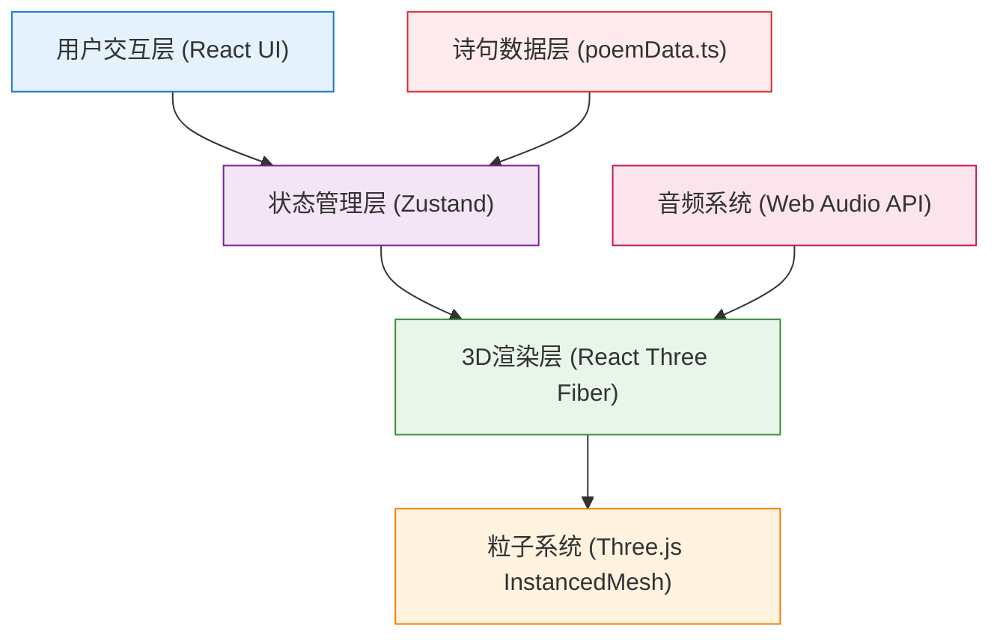

## 1. 架构设计



## 2. 技术描述

- **前端框架**: React@18 + TypeScript@5
- **构建工具**: Vite@5
- **3D引擎**: three@0.160 + @react-three/fiber@8 + @react-three/drei@9
- **状态管理**: zustand@4
- **唯一标识**: uuid@9
- **后端**: 无（纯前端项目）
- **数据库**: 无（所有数据本地生成）

## 3. 目录结构

```
auto91/
├── index.html              # 入口HTML
├── package.json            # 项目依赖
├── vite.config.ts          # Vite配置
├── tsconfig.json           # TypeScript配置
└── src/
    ├── main.tsx            # React应用入口
    ├── store.ts            # Zustand状态管理
    ├── Scene.tsx           # 3D场景主组件
    ├── particleSystem.ts   # 粒子系统核心逻辑
    ├── poemData.ts         # 预设诗句数据和Bitmap映射
    └── ui.tsx              # UI组件（控制栏、卷轴卡片）
```

## 4. 核心数据结构

### 4.1 诗句数据结构

```typescript
interface PoemData {
  id: string;
  title: string;
  author: string;
  content: string;
  particlePositions: Array<{ x: number; y: number }>; // Bitmap坐标映射
  particleCount: number;
  primaryColor: string;
}
```

### 4.2 粒子状态结构

```typescript
interface Particle {
  id: string;
  poemId: string;
  position: THREE.Vector3;
  targetPosition: THREE.Vector3;
  velocity: THREE.Vector3;
  color: THREE.Color;
  size: number;
  baseSize: number;
  phase: number; // 呼吸动画相位
  opacity: number;
  isExploding: boolean;
  explosionTime: number;
}
```

### 4.3 诗句群落结构

```typescript
interface PoemGroup {
  id: string;
  poemData: PoemData;
  particles: Particle[];
  centerPosition: THREE.Vector3;
  rotation: THREE.Euler;
  rotationSpeed: number;
  isHighlighted: boolean;
  highlightTime: number;
  isFusing: boolean;
}
```

### 4.4 全局状态结构

```typescript
interface AppState {
  poemGroups: PoemGroup[];
  isDrawing: boolean;
  currentPath: THREE.Vector3[];
  drawCount: number;
  selectedPoemId: string | null;
  showScroll: boolean;
  scrollPoem: PoemData | null;
  isFusing: boolean;
  coreSphere: CoreSphere | null;
  orbitingParticles: OrbitingParticle[];
  connectionLines: ConnectionLine[];
}
```

## 5. 核心模块说明

### 5.1 poemData.ts - 诗句数据模块

- 预定义5首唐诗：《静夜思》《登鹳雀楼》《春晓》《江雪》《枫桥夜泊》
- 每首诗生成Bitmap字体映射坐标点集（40-60个粒子）
- 使用Canvas API离屏渲染文字，提取像素坐标
- 每首诗分配一个主色调

### 5.2 store.ts - 状态管理模块

- 使用Zustand创建全局store
- 管理所有粒子、诗句群落、绘制状态
- 提供actions：addPoemGroup, removeAllPoems, setSelectedPoem, triggerFusion, resetCamera等

### 5.3 particleSystem.ts - 粒子系统模块

- 粒子类：处理粒子的生成、运动、爆炸、呼吸动画
- 使用InstancedMesh优化渲染（单draw call）
- 粒子爆炸动画：沿法线向外扩散，0.8秒线性衰减
- 呼吸动画：大小正弦变化，频率0.3Hz
- 整体旋转：绕Y轴0.05弧度/秒
- 诗境融合：聚拢、连接线、核心球体生成

### 5.4 Scene.tsx - 3D场景模块

- 使用@react-three/fiber的Canvas组件
- 相机设置：PerspectiveCamera，位置(0, 0, 12)
- 控制：OrbitControls轨道控制
- 光照：AmbientLight + DirectionalLight
- 背景：深空蓝紫渐变
- 星光粒子：数百颗静止星光，缓慢脉动
- 绘制交互：鼠标拖拽路径，射线投射计算3D坐标
- 粒子拾取：点击粒子高亮所属诗句

### 5.5 ui.tsx - UI组件模块

- ControlBar：顶部控制栏，清空/重置按钮，计数器
- ScrollCard：右下角卷轴卡片，显示诗句原文和作者
- 使用Tailwind CSS进行样式设计

## 6. 性能优化策略

### 6.1 渲染优化
- 使用InstancedMesh渲染所有粒子（最多2000个）
- 单draw call，减少GPU提交
- 使用BufferGeometry存储粒子数据
- 材质使用MeshBasicMaterial或PointsMaterial，减少光照计算

### 6.2 动画优化
- 使用requestAnimationFrame（R3F内置useFrame）
- 所有动画使用增量时间计算，帧率无关
- 粒子位置更新在CPU端，通过instanceMatrix上传

### 6.3 内存管理
- 及时清理不再使用的几何体和材质
- 粒子对象池复用，避免频繁GC

### 6.4 交互优化
- 射线检测使用InstancedMesh的raycast方法
- 限制射线检测频率
- 路径点采样优化，避免过密点

## 7. 关键算法

### 7.1 Bitmap文字转粒子坐标
```
1. 创建离屏Canvas
2. 设置字体和大小
3. 绘制文字
4. 读取ImageData像素数据
5. 采样非透明像素点（间隔采样控制粒子数）
6. 归一化坐标到[-1, 1]范围
7. 输出粒子坐标数组
```

### 7.2 粒子爆炸动画
```
1. 沿路径计算每个点的法线方向
2. 粒子初始速度 = 法线方向 × 随机(0.5, 2)
3. 位置更新：pos += vel × deltaTime
4. 速度衰减：vel *= (1 - deltaTime / 0.8)
5. 0.8秒后停止，锁定到目标位置
```

### 7.3 诗境融合效果
```
1. 标记3个诗句群落为融合状态
2. 每帧向中心位置插值移动
3. 计算粒子间距离，小于阈值则创建连接线
4. 融合完成后创建核心球体
5. 生成26个公转粒子
```

### 7.4 核心球体文字环绕
```
1. 将诗句文字环绕球面分布
2. 使用经纬度计算每个文字位置
3. 文字朝向球心（反转法线）
4. 颜色根据视角在暖色系渐变
```

## 8. 音频系统设计

使用Web Audio API的AudioContext生成钢琴和弦序列：

- 振荡器类型：sine（正弦波）
- 和弦序列：C大三和弦 → F大三和弦 → G大三和弦 → Am小三和弦
- 每个和弦持续5秒，循环播放
- 音量线性淡入（0 → 0.3，2秒）
- 诗境融合触发时启动
