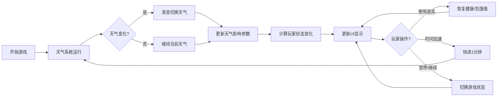

## 1. 产品概述

岛屿生存冒险游戏的天气与状态模拟系统，玩家在神秘岛屿上探索，需要根据动态变化的天气系统管理自身健康、饥饿度和移动速度，通过背包道具维持生存。

- 核心玩法：天气动态变化影响玩家状态，玩家需策略性地选择探索与休息时机
- 目标用户：休闲生存游戏爱好者
- 产品价值：提供沉浸式的天气生存模拟体验，结合策略与资源管理

## 2. 核心功能

### 2.1 用户角色
| 角色 | 注册方式 | 核心权限 |
|------|----------|----------|
| 玩家 | 无需注册，直接进入 | 体验完整游戏功能 |

### 2.2 功能模块
1. **天气系统模块**：动态天气生成、天气渐变切换、温度变化、时间加速
2. **玩家状态模块**：健康值管理、饥饿值管理、移动速度计算、状态动画
3. **背包系统模块**：道具网格展示、道具使用、重量计算、容量限制
4. **场景展示模块**：天气粒子效果、玩家角色展示、环境氛围渲染
5. **游戏控制模块**：开始/暂停、时间加速、状态更新循环

### 2.3 页面详情
| 页面名称 | 模块名称 | 功能描述 |
|----------|----------|----------|
| 主游戏界面 | 天气面板 | 显示当前天气图标、名称、温度范围渐变条 |
| 主游戏界面 | 场景区 | 展示玩家角色简笔画、天气粒子效果、环境氛围 |
| 主游戏界面 | 状态面板 | 健康值进度条、饥饿值进度条、移动速度系数、当前温度 |
| 主游戏界面 | 背包面板 | 10格道具网格、道具使用、数量标签、选中高亮 |
| 主游戏界面 | 控制区 | 开始/暂停按钮、时间加速按钮 |

## 3. 核心流程

玩家进入游戏后，天气系统自动运行，每30秒生成下一时段天气。天气变化影响玩家的健康值、饥饿值和移动速度。玩家可以使用背包中的食物和水源道具恢复状态。通过时间加速按钮可以快进游戏时间，观察天气变化对状态的影响。游戏可随时暂停，暂停时所有状态停止更新。

## 4. 用户界面设计

### 4.1 设计风格
- **主色调**：深色主题，背景渐变 #1a1a2e → #16213e
- **强调色**：健康红 #e53935、饥饿橙 #fb8c00、速度蓝 #64b5f6、晴日黄 #ffd54f、雨天蓝 #4fc3f7、雾天灰 #e0e0e0
- **按钮风格**：圆形按钮，圆角50%，悬停亮度提升，点击缩放反馈
- **字体**：现代无衬线字体，清晰易读
- **布局风格**：三栏卡片式布局，面板带边框圆角
- **图标风格**：纯CSS绘制的天气符号，简洁几何风格

### 4.2 页面设计概述
| 页面名称 | 模块名称 | UI元素 |
|----------|----------|--------|
| 主游戏界面 | 天气面板 | 64x64px CSS天气图标、天气名称文字、温度渐变条 |
| 主游戏界面 | 场景区 | 玩家简笔画角色、天气粒子系统（金色光点/蓝色雨线/白色雾气） |
| 主游戏界面 | 状态面板 | 红色健康进度条、橙色饥饿进度条、蓝色速度数字、白色温度文字 |
| 主游戏界面 | 背包面板 | 10格60x60px网格、#2e3b4e背景、#4a5a72边框、选中#64b5f6高亮、右下角数量标签 |
| 主游戏界面 | 控制区 | 48px开始/暂停圆形按钮、42px时间加速圆形按钮 |

### 4.3 响应式
- 桌面端（≥768px）：三栏水平布局，左栏240px，中栏自适应，右栏280px
- 移动端（<768px）：三栏垂直排列，每栏全宽，可滚动浏览
- 触摸优化：按钮尺寸适合触控操作，间距合理避免误触

### 4.4 动效设计
- 天气切换：2秒渐变过渡动画
- 进度条变化：0.3秒缓动动画，requestAnimationFrame驱动
- 按钮交互：悬停亮度提升20%，点击缩放至0.95，动画时长0.15s
- 粒子效果：晴天飘浮金色光点，雨天斜向蓝色线条，雾天半透明白色雾气滚动
- 整体氛围：根据天气类型调整场景色调和光影效果
