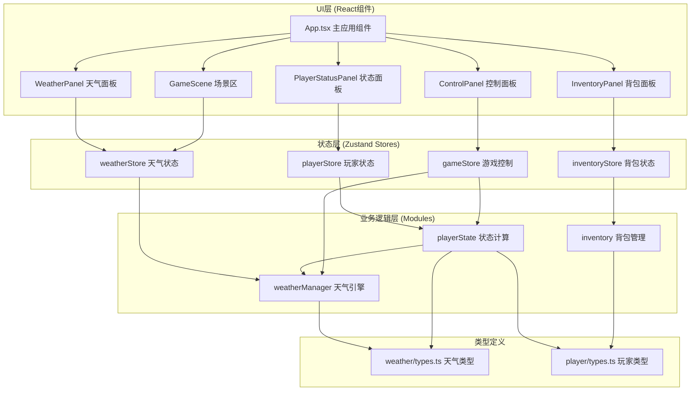

## 1. 架构设计



## 2. 技术描述

- **前端框架**：React@18 + TypeScript@5
- **构建工具**：Vite@5 + @vitejs/plugin-react
- **状态管理**：zustand@4
- **唯一ID生成**：uuid@9
- **无后端**：纯前端模拟，所有逻辑在客户端运行

### 文件结构
```
src/
├── modules/
│   ├── weather/
│   │   ├── types.ts          # 天气类型定义
│   │   └── weatherManager.ts # 天气引擎逻辑
│   └── player/
│       ├── playerState.ts    # 玩家状态计算
│       └── inventory.ts      # 背包管理逻辑
├── store/
│   ├── useWeatherStore.ts    # 天气状态store
│   ├── usePlayerStore.ts     # 玩家状态store
│   ├── useInventoryStore.ts  # 背包状态store
│   └── useGameStore.ts       # 游戏控制store
├── components/
│   ├── WeatherPanel.tsx      # 天气面板组件
│   ├── GameScene.tsx         # 场景区组件
│   ├── PlayerStatusPanel.tsx # 玩家状态面板
│   ├── InventoryPanel.tsx    # 背包面板
│   └── ControlPanel.tsx      # 控制面板
├── App.tsx                   # 主应用组件
├── main.tsx                  # 应用入口
└── index.css                 # 全局样式
```

### 数据流向
1. **weatherManager** 生成天气数据 → 写入 **weatherStore**
2. **playerState** 监听天气变化 → 计算健康/饥饿/速度 → 写入 **playerStore**
3. **inventory** 管理道具 → 写入 **inventoryStore** → 影响重量系数
4. **gameStore** 控制游戏暂停/继续/时间加速 → 驱动各模块更新
5. React组件订阅对应store → 渲染UI

## 3. 模块职责与调用关系

### 3.1 天气模块 (modules/weather/)
- **types.ts**：定义 WeatherType 枚举、WeatherState 接口、WeatherEffects 接口
- **weatherManager.ts**：
  - 基于概率模型生成天气变化序列
  - 管理天气持续时间和渐变过渡
  - 计算温度范围
  - 提供时间加速接口
  - 输出天气影响参数供玩家模块使用

### 3.2 玩家模块 (modules/player/)
- **playerState.ts**：
  - 接收天气影响数据
  - 计算健康值变化（每帧）
  - 计算饥饿值下降（线性，雨雪1.5倍加速）
  - 计算移动速度系数（雾天0.6）
  - 通过zustand store暴露状态
- **inventory.ts**：
  - 管理10格背包
  - 食物/水源道具使用
  - 重量系数计算（每件+0.05，超过5件降速5%）

### 3.3 UI组件
- **WeatherPanel**：展示天气图标、名称、温度渐变条
- **GameScene**：展示玩家角色和天气粒子效果
- **PlayerStatusPanel**：健康/饥饿进度条、速度、温度
- **InventoryPanel**：道具网格、使用操作
- **ControlPanel**：开始/暂停、时间加速按钮

## 4. 核心算法与性能

### 4.1 天气生成算法
- 5种天气类型：晴、多云、小雨、大雨、雾
- 每种天气有基础概率权重
- 天气持续时间：3-8分钟（游戏内时间）
- 每30秒（游戏内）生成下一时段天气
- 天气切换：2秒渐变动画

### 4.2 状态更新策略
- 更新频率：≤30次/秒（约33ms间隔）
- 进度条动画：requestAnimationFrame 实现60fps
- 低端设备降级：10次/秒更新
- CPU占用目标：≤15%

### 4.3 性能优化
- 使用 requestAnimationFrame 统一驱动动画
- 状态变化节流，避免频繁重渲染
- 粒子效果使用CSS动画，减少JS计算
- React.memo 优化组件渲染

## 5. 数据模型

### 5.1 天气类型定义
```typescript
enum WeatherType {
  Sunny = 'sunny',
  Cloudy = 'cloudy',
  LightRain = 'lightRain',
  HeavyRain = 'heavyRain',
  Foggy = 'foggy',
}

interface WeatherState {
  type: WeatherType;
  intensity: number; // 0-1
  temperature: number;
  duration: number; // 剩余持续时间（秒）
  isTransitioning: boolean;
  transitionProgress: number; // 0-1
  nextWeather?: WeatherType;
}

interface WeatherEffects {
  healthRate: number; // 健康变化速率
  hungerMultiplier: number; // 饥饿倍率
  speedMultiplier: number; // 速度倍率
}
```

### 5.2 玩家状态定义
```typescript
interface PlayerState {
  health: number; // 0-100
  hunger: number; // 0-100
  speedMultiplier: number;
  temperature: number;
}
```

### 5.3 背包道具定义
```typescript
interface Item {
  id: string;
  type: 'food' | 'water';
  name: string;
  healthRestore: number;
  hungerRestore: number;
  quantity: number;
}

interface InventoryState {
  items: Item[];
  maxSlots: number;
  weightMultiplier: number;
}
```

## 6. 配置文件

### 6.1 package.json
- 依赖：react, react-dom, typescript, vite, @vitejs/plugin-react, zustand, uuid
- 脚本：npm run dev

### 6.2 tsconfig.json
- 严格模式：strict: true
- JSX：react-jsx
- 模块：ESNext
- 目标：ES2020

### 6.3 vite.config.ts
- React插件配置
- 开发服务器配置
