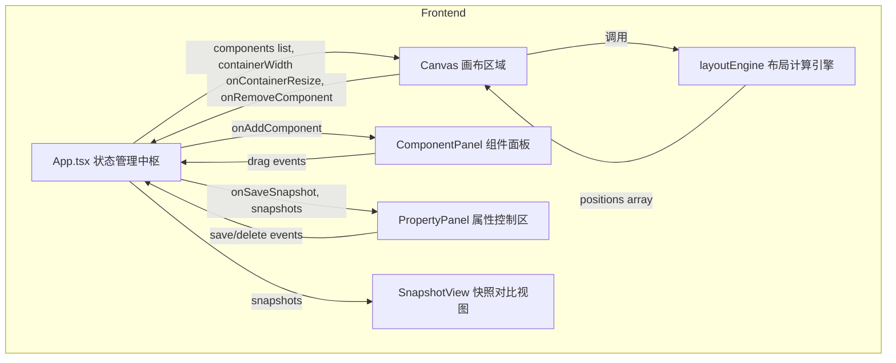

## 1. 架构设计



## 2. 技术描述
- 前端：React@18 + TypeScript + Vite@5 + framer-motion@11
- 初始化工具：vite-init (react-ts模板)
- 后端：无（纯前端应用）
- 数据库：无（状态存储于React内存）

## 3. 路由定义
| 路由 | 用途 |
|-------|---------|
| / | 主应用，单页应用无路由跳转 |

## 4. 数据模型

### 4.1 类型定义

```typescript
// 组件类型枚举
type ComponentType = 'button' | 'input' | 'card' | 'image' | 'alert' | 'navbar';

// 画布中组件实例
interface CanvasComponent {
  id: string;
  type: ComponentType;
  minWidth: number;
  defaultHeight: number;
  renderedWidth?: number;
}

// 布局快照
interface LayoutSnapshot {
  id: string;
  containerWidth: number;
  components: CanvasComponent[];
  timestamp: number;
}

// 组件位置计算结果
interface ComponentPosition {
  id: string;
  x: number;
  y: number;
  width: number;
  height: number;
}

// 预置组件元信息
interface ComponentMeta {
  type: ComponentType;
  name: string;
  icon: string;
  minWidth: number;
  defaultHeight: number;
}
```

## 5. 文件结构与调用关系

```
e:\solo\SoloAutoDemo\tasks\auto101\
├── index.html                    # 入口HTML，#root挂载点
├── package.json                  # 项目依赖与脚本
├── vite.config.js                # Vite构建配置
├── tsconfig.json                 # TypeScript配置
└── src/
    ├── App.tsx                   # [主组件] 状态管理中枢
    │   ├── 维护: components[], containerWidth, snapshots[]
    │   ├── 接收: ComponentPanel拖拽事件 → 添加组件
    │   ├── 接收: Canvas容器尺寸变化 → 更新containerWidth
    │   ├── 接收: Canvas删除事件 → 移除组件
    │   ├── 接收: PropertyPanel保存/删除 → 快照管理
    │   └── 分发: 向子组件传递state和回调
    │
    ├── components/
    │   ├── ComponentPanel.tsx    # [左面板] 预置组件列表
    │   │   ├── 接收: onAddComponent回调(App传入)
    │   │   ├── 功能: 展示两列组件卡片，支持HTML5拖拽
    │   │   └── 输出: dragstart事件携带ComponentType
    │   │
    │   ├── Canvas.tsx            # [中央画布] 组件渲染与容器调整
    │   │   ├── 接收: components[], containerWidth
    │   │   ├── 调用: layoutEngine.calculatePositions()
    │   │   ├── 功能: 容器手柄拖拽、组件渲染、删除按钮、宽度显示
    │   │   └── 输出: onContainerResize, onRemoveComponent
    │   │
    │   ├── PropertyPanel.tsx     # [右面板] 快照控制
    │   │   ├── 接收: snapshots[], onSaveSnapshot, onDeleteSnapshot
    │   │   └── 功能: 保存按钮、快照列表、删除按钮
    │   │
    │   └── SnapshotView.tsx      # [底部] 快照对比视图
    │       ├── 接收: snapshots[]
    │       ├── 调用: layoutEngine.calculatePositions()
    │       └── 功能: 0.5倍缩放并排渲染多组快照
    │
    └── utils/
        └── layoutEngine.ts       # [纯函数模块] 布局计算引擎
            ├── calculatePositions(containerWidth, components, gap)
            │   └── 根据flex-wrap算法计算每个组件x/y/width
            └── COMPONENT_METAS   # 预置组件元信息常量
```

## 6. 性能约束实现方案

- **容器尺寸拖拽节流**：使用`requestAnimationFrame`控制重排频率，避免过多计算
- **布局计算优化**：`layoutEngine`为纯函数，无副作用，计算复杂度O(n)
- **动画性能**：使用`framer-motion`的GPU加速动画，仅transform/opacity属性参与过渡
- **帧率目标**：布局计算需在50ms内完成，整体保持30fps以上

## 7. 关键算法说明

### 7.1 Flex-wrap布局计算算法
```
输入: containerWidth, components[], gap(12px)
输出: positions[] {id, x, y, width, height}

1. 初始化 currentX=0, currentY=0, rowMaxHeight=0
2. 遍历每个组件:
   a. 计算可用宽度 = containerWidth - currentX
   b. 如果 (组件.minWidth + gap) > 可用宽度 且 currentX > 0:
      - 换行: currentY += rowMaxHeight + gap
      - currentX = 0, rowMaxHeight = 0
   c. 组件渲染宽度 = 尽可能平均分配行内空间(可选) 或 取minWidth
   d. position = {x: currentX, y: currentY, width, height}
   e. currentX += width + gap
   f. rowMaxHeight = max(rowMaxHeight, height)
3. 返回 positions 数组
```
