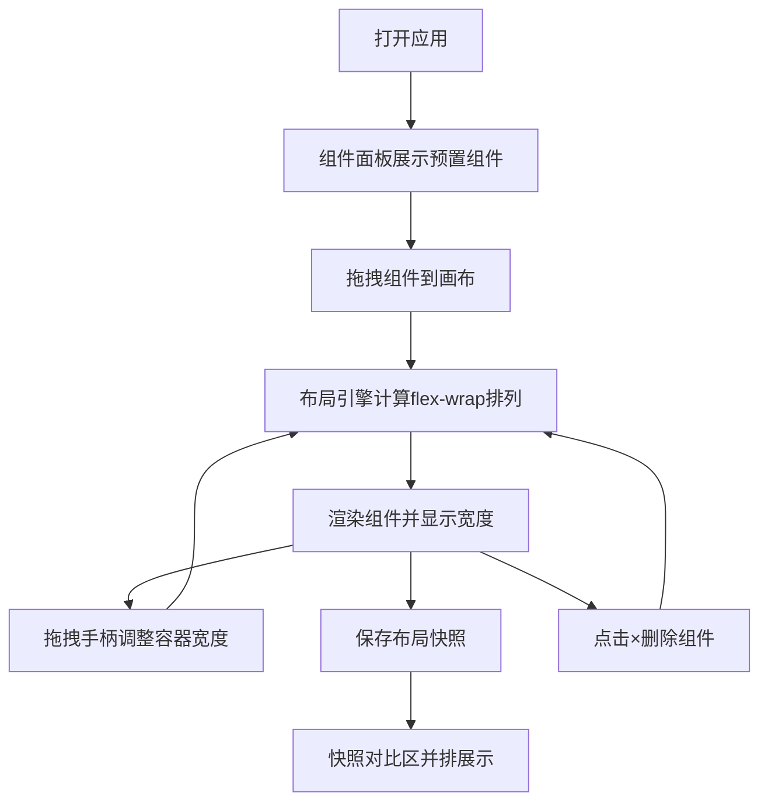

## 1. 产品概述
响应式布局调试沙盒是一款面向前端开发者的在线工具，帮助团队直观测试UI组件在不同容器尺寸下的布局自适应效果、组件间距与对齐关系。
- 解决前端开发中缺乏可视化响应式布局调试工具的痛点，提升组件库与页面开发效率
- 目标用户为前端工程师、UI设计师，核心价值在于快速验证布局方案

## 2. 核心功能

### 2.1 功能模块
1. **组件面板**：展示预置6种UI组件（按钮、输入框、卡片、图片占位符、警告条、导航栏），支持拖拽到画布
2. **画布区域**：可拖拽边界调整尺寸的容器，flex-wrap自适应布局，实时显示容器宽度和组件宽度
3. **布局引擎**：纯函数计算模块，根据容器宽度和组件最小宽度计算是否换行及排列位置
4. **快照对比**：保存最多5组布局快照，缩小并排展示便于对比不同尺寸下的效果
5. **属性控制区**：快照保存、删除和对比展示功能

### 2.2 页面详情
| 页面名称 | 模块名称 | 功能描述 |
|-----------|-------------|---------------------|
| 主应用 | 顶部标题栏 | 48px高度，深色背景，白色加粗标题 |
| 主应用 | 组件面板(左) | 220px宽度，两列网格展示组件卡片，支持拖拽添加 |
| 主应用 | 画布区域(中) | 可拖拽调整尺寸容器(200-1200px)，虚线边界，实时显示宽度，空画布提示 |
| 主应用 | 属性控制区(右) | 240px宽度，快照保存/删除/列表展示 |
| 主应用 | 快照对比区 | 画布下方，并排0.5倍缩放展示多组快照 |

## 3. 核心流程
用户从左侧组件面板拖拽组件到中间画布区域，通过拖拽右下角手柄调整容器宽度，观察组件自适应布局效果。可保存当前状态为快照，在下方对比区查看不同尺寸快照的布局差异。点击组件右上角×可删除组件。

## 4. 用户界面设计

### 4.1 设计风格
- 主色调：#2c3e50（深色标题栏）、#4a90d9（蓝色交互元素）
- 辅助色：#f5f7fa（面板背景）、#ffffff（画布背景）、#aaa（虚线边界）、#ddd（组件边框）
- 字体：系统默认字体，标题18px加粗，正文12-16px
- 按钮/卡片：圆角8px，阴影rgba(0,0,0,0.08)，悬停缩放1.05倍

### 4.2 页面设计概览
| 页面名称 | 模块名称 | UI元素 |
|-----------|-------------|-------------|
| 主应用 | 组件卡片 | 白色背景、圆角8px、rgba阴影、悬停缩放1.05、图标+名称 |
| 主应用 | 画布容器 | 虚线#aaa边框、12px内边距、10x10蓝色手柄(nwse-resize)、宽度12px标注 |
| 主应用 | 画布组件 | #ddd边框圆角4px、rgba(248,249,250,0.8)背景、12px间距、右上角×删除按钮、宽度显示 |
| 主应用 | 空画布提示 | 居中、16px、#b0b0b0、2秒周期上下浮动动画 |
| 主应用 | 快照卡片 | 0.5倍缩放、带滚动条、可删除 |
| 主应用 | 折叠按钮 | 三角形图标、点击旋转90度展开 |

### 4.3 响应式
- Desktop-first设计
- 窗口宽度<900px时，左侧组件面板折叠为顶部可收起面板，右侧控制区折叠为底部可收起面板
- 画布区域始终占据剩余可用空间

### 4.4 交互动画
- 组件拖拽跟随鼠标，半透明0.7
- 组件删除：缩小至0并淡出，0.2秒
- 容器尺寸变化触发布局重排：0.3秒ease-out过渡
- 空画布提示：2秒周期缓慢上下浮动
- 折叠面板：三角形图标旋转90度
