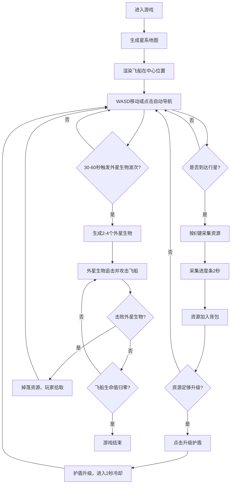

## 1. 产品概述

深空探索生存游戏是一款基于浏览器的2D太空模拟游戏，玩家操控飞船在程序化生成的星系中探索、采集资源并抵御外星生物攻击。游戏解决了玩家无法在浏览器中体验从零开始建造飞船并生存的沉浸式游戏痛点。

- **目标用户**：太空探索爱好者、休闲游戏玩家
- **核心价值**：提供可在浏览器中直接运行的沉浸式太空探索体验，支持飞船升级、资源管理和战斗生存

## 2. 核心功能

### 2.1 用户角色
| 角色 | 注册方式 | 核心权限 |
|------|----------|----------|
| 玩家 | 无需注册，直接进入游戏 | 探索星系、采集资源、升级飞船、战斗生存 |

### 2.2 功能模块
1. **星系地图系统**：程序化生成恒星、行星、轨道和背景星空
2. **飞船控制系统**：WASD移动、自动导航（A*算法）、朝向控制
3. **资源采集系统**：靠近行星采集矿石、水晶、气体，显示采集进度
4. **飞船升级系统**：消耗资源升级护盾等级，减少受到伤害
5. **外星生物战斗系统**：波次生成外星生物、攻击伤害计算、掉落物拾取
6. **游戏状态与UI系统**：HUD显示、暂停功能、星系地图全览、天体信息面板

### 2.3 页面详情
| 页面名称 | 模块名称 | 功能描述 |
|----------|----------|----------|
| 游戏主界面 | Canvas渲染层 | 1280x720自适应画布，渲染星系、飞船、外星生物、粒子效果 |
| 游戏主界面 | HUD层-左上 | 显示生命值进度条（红色8px高）和护盾等级数字 |
| 游戏主界面 | HUD层-右上 | 显示当前波次和击败数统计 |
| 游戏主界面 | HUD层-左下 | 背包UI，显示矿石、水晶、气体资源数量和升级面板 |
| 游戏主界面 | HUD层-右下 | 显示当前行星名称和到最近恒星距离 |
| 游戏主界面 | 天体信息面板 | 点击天体弹出，显示名称、类型、半径、资源丰度 |
| 游戏主界面 | 暂停覆盖层 | 按空格暂停，中央显示PAUSE文字 |
| 游戏主界面 | 星系地图全览 | 按M键打开，全屏覆盖，可点击设置导航目标 |

## 3. 核心流程

玩家进入游戏后，初始位置为星系中心。使用WASD控制飞船自由探索，或点击天体自动导航。靠近行星后按E键采集资源（2秒进度），采集完成后资源进入背包。累积资源后可在升级面板点击升级护盾等级。每隔30-60秒会有外星生物来袭，需躲避或战斗（自动攻击），击败外星生物可掉落资源。按空格键暂停游戏，按M键查看完整星系地图。

## 4. 用户界面设计

### 4.1 设计风格
- **主色调**：深蓝 `#0b0c10`、深灰 `#1a1a2e` 作为背景
- **强调色**：青蓝色 `#00b4d8` 用于文本和飞船
- **辅助色**：
  - 黄矮星 `#ffd93d`、红巨星 `#e63946`、蓝巨星 `#457b9d`
  - 行星 `#a8dadc`、`#f1faee`、`#e0a96d`
  - 矿石 `#ff6b35`、水晶 `#7209b7`、气体 `#00f5d4`
- **按钮风格**：渐变背景从 `#1d3557` 到 `#457b9d`，圆角，悬停文字变为 `#a8dadc`，点击缩放 0.95 → 1.0（0.1秒）
- **UI面板**：统一圆角12px，半透明黑色背景 `rgba(0,0,0,0.8)`
- **布局风格**：全屏Canvas为底，UI覆盖层采用绝对定位四角布局
- **动画风格**：面板fadeIn淡入0.3秒，按钮点击缩放反馈，星星闪烁CSS动画，粒子火焰喷射

### 4.2 页面设计总览
| 页面名称 | 模块名称 | UI元素 |
|----------|----------|--------|
| 游戏主界面 | Canvas画布 | 深空渐变背景、100颗闪烁星星、恒星与行星、轨道线、飞船与火焰粒子、外星生物、攻击闪电特效、掉落物光晕、采集进度环 |
| 游戏主界面 | 左上HUD | 生命值标签 + 红色进度条（8px高，#333背景）、护盾等级数字（12px，#90e0ef） |
| 游戏主界面 | 右上HUD | 波次计数、击败数统计（白色14px，右对齐） |
| 游戏主界面 | 左下HUD | 背包面板（圆角8px，半透明黑底）、资源图标（彩色方块）+ 数量、护盾升级按钮（深蓝渐变，冷却灰色） |
| 游戏主界面 | 右下HUD | 当前行星名称、到最近恒星距离（10Hz动态更新） |
| 游戏主界面 | 天体信息面板 | 半透明黑色圆角矩形、淡入0.3秒、显示名称/类型/半径/资源丰度 |
| 游戏主界面 | 暂停界面 | 全屏半透明黑、中央PAUSE文字（48px白色）、淡入0.3秒 |
| 游戏主界面 | 星系地图 | 全屏半透明黑背景、缩放适配的完整星系、可点击设置目标 |

### 4.3 响应式设计
- 采用桌面优先设计，适配 1024x768 到 1920x1080 分辨率
- Canvas使用1280x720逻辑分辨率，通过CSS等比缩放适配窗口，保持16:9比例不变形
- UI元素采用百分比和固定边距定位，确保在不同分辨率下布局一致
- 暂停界面、星系地图全览采用全屏覆盖，自动适配窗口大小

### 4.4 性能要求
- 游戏运行帧率稳定在 45FPS 以上
- 资源采集和战斗逻辑每帧计算不超过 2ms
- 自动寻路 A* 算法计算不阻塞主渲染循环
- 粒子效果、闪烁动画使用高效渲染方式
