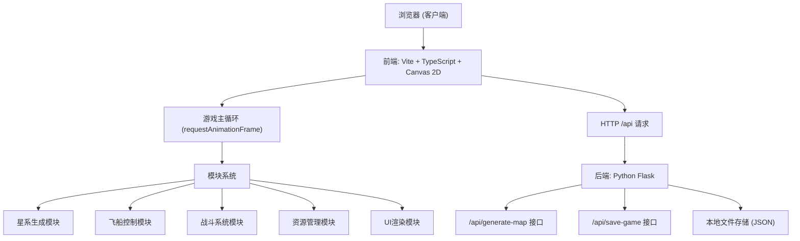
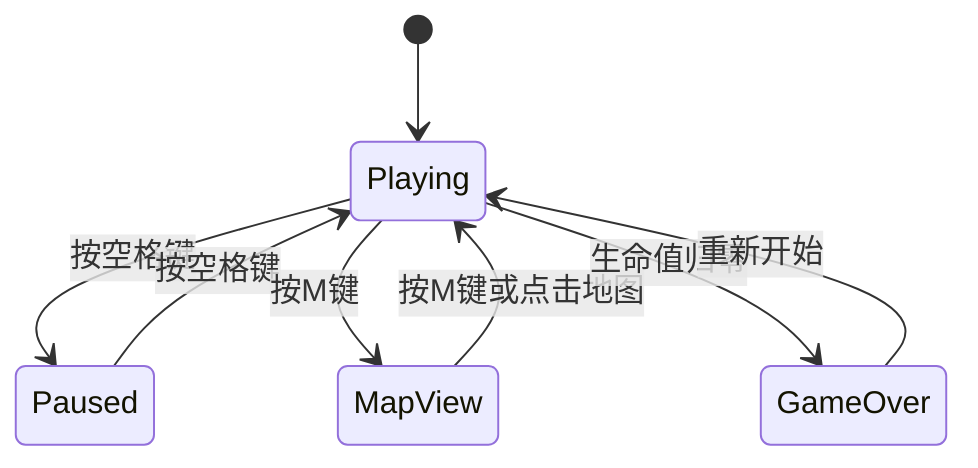

## 1. 架构设计

本项目采用前后端分离架构，前端使用 TypeScript + Canvas 2D 实现游戏渲染与逻辑，后端使用 Python Flask 提供简单的 RESTful API 用于地图种子生成和游戏存档持久化。



## 2. 技术选型说明

- **前端框架**：无游戏引擎依赖，纯 TypeScript + Canvas 2D API 实现
- **构建工具**：Vite 5.x，目标 ES2020，开发服务器端口 3000
- **语言版本**：TypeScript 5.x，严格模式，target ES2020，module ESNext
- **后端框架**：Python Flask + flask-cors，端口 5000
- **数据存储**：本地 JSON 文件持久化存档
- **通信方式**：前端通过 Vite 代理 `/api` 路径到 Flask 后端

## 3. 前端模块架构

| 文件路径 | 导出内容 | 职责描述 |
|----------|----------|----------|
| `src/main.ts` | - | 游戏主入口，初始化Canvas、加载所有模块、启动requestAnimationFrame主循环，调用各模块update和render |
| `src/modules/map_generation.ts` | `generateGalaxy(seed: number)` | 程序化生成恒星和行星数据，使用随机种子保证可复现 |
| `src/modules/ship_control.ts` | `ShipController` 类 | 处理键盘输入、飞船移动、A*自动寻路、朝向控制、火焰粒子渲染 |
| `src/modules/combat_system.ts` | `CombatSystem` 类 | 管理外星生物波次生成、AI追击、攻击逻辑、伤害计算、掉落物 |
| `src/modules/resource_manager.ts` | `ResourceManager` 类 | 资源采集进度、背包数据、护盾升级逻辑、冷却管理 |
| `src/modules/ui_manager.ts` | `UIManager` 类 | HUD绘制、面板渲染、动画进度管理、暂停/地图全览界面 |

## 4. API 接口定义

### 4.1 GET /api/generate-map
生成星系地图数据。

**请求参数：**
```typescript
interface GenerateMapRequest {
  seed: number;  // 随机种子
}
```

**响应：**
```typescript
interface GenerateMapResponse {
  seed: number;
  stars: Star[];
  planets: Planet[];
}

interface Star {
  id: string;
  name: string;
  type: 'yellow_dwarf' | 'red_giant' | 'blue_giant';
  x: number;
  y: number;
  color: string;
  size: number;
  resourceAbundance: number;
}

interface Planet {
  id: string;
  name: string;
  starId: string;
  orbitRadius: number;
  orbitAngle: number;
  color: string;
  size: number;
  resourceAbundance: number;
  resources: {
    ore: number;
    crystal: number;
    gas: number;
  };
}
```

### 4.2 POST /api/save-game
保存游戏存档到本地文件。

**请求体：**
```typescript
interface SaveGameRequest {
  seed: number;
  shipPosition: { x: number; y: number };
  shipHealth: number;
  shieldLevel: number;
  inventory: {
    ore: number;
    crystal: number;
    gas: number;
  };
  wave: number;
  kills: number;
  timestamp: number;
}
```

**响应：**
```typescript
interface SaveGameResponse {
  success: boolean;
  message: string;
  filePath: string;
}
```

## 5. 项目文件结构

```
auto103/
├── package.json
├── index.html
├── tsconfig.json
├── vite.config.js
├── src/
│   ├── main.ts
│   └── modules/
│       ├── map_generation.ts
│       ├── ship_control.ts
│       ├── combat_system.ts
│       ├── resource_manager.ts
│       └── ui_manager.ts
├── backend/
│   ├── app.py
│   └── saves/
│       └── (存档JSON文件)
└── .trae/
    └── documents/
        ├── PRD.md
        └── TECH_ARCHITECTURE.md
```

## 6. 核心数据模型

### 6.1 实体类型定义

```typescript
// 恒星
interface Star {
  id: string;
  name: string;
  type: 'yellow_dwarf' | 'red_giant' | 'blue_giant';
  x: number;
  y: number;
  color: string;
  size: number;
  resourceAbundance: number;
}

// 行星
interface Planet {
  id: string;
  name: string;
  starId: string;
  orbitRadius: number;
  orbitAngle: number;
  orbitSpeed: number;
  color: string;
  size: number;
  resourceAbundance: number;
  resources: { ore: number; crystal: number; gas: number };
}

// 飞船状态
interface ShipState {
  x: number;
  y: number;
  vx: number;
  vy: number;
  angle: number;
  health: number;
  maxHealth: number;
  shieldLevel: number;
  navTarget: { x: number; y: number } | null;
  navPath: Array<{ x: number; y: number }>;
}

// 外星生物
interface Alien {
  id: string;
  x: number;
  y: number;
  angle: number;
  color: string;
  health: number;
  lastAttackTime: number;
}

// 掉落物
interface DropItem {
  id: string;
  x: number;
  y: number;
  type: 'ore' | 'crystal' | 'gas';
  createdAt: number;
}

// 背包
interface Inventory {
  ore: number;
  crystal: number;
  gas: number;
}

// 游戏状态
interface GameState {
  isPaused: boolean;
  showMap: boolean;
  selectedBody: Star | Planet | null;
  currentPlanetName: string | null;
  nearestStarDistance: number;
  wave: number;
  kills: number;
  collecting: {
    active: boolean;
    planetId: string | null;
    progress: number;
    duration: number;
  };
  upgradeCooldown: number;
  damageFlash: number;
}
```

### 6.2 游戏状态流转



## 7. 性能优化策略

1. **Canvas渲染优化**：
   - 使用 `requestAnimationFrame` 驱动渲染循环
   - 静态星空背景缓存为离屏Canvas
   - 只在变化时重绘，减少不必要的绘制操作

2. **计算优化**：
   - A*寻路算法使用网格简化，限制最大搜索步数
   - 距离计算使用平方距离比较，避免开方运算
   - 碰撞检测使用空间分区（网格）减少对检数量

3. **动画优化**：
   - CSS动画用于星星闪烁、面板淡入等UI层动画
   - Canvas粒子系统限制最大粒子数量（火焰10个）
   - 使用 `deltaTime` 确保不同帧率下移动速度一致

4. **内存管理**：
   - 对象池复用外星生物和粒子对象
   - 及时移除死亡实体和过期掉落物
   - 避免在主循环中创建临时对象
