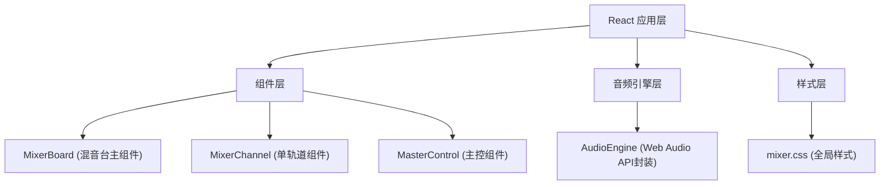

## 1. 架构设计



## 2. 技术描述

- **前端**：React 18 + TypeScript + Vite
- **构建工具**：Vite，target ES2020，开发服务器端口 3000
- **音频处理**：Web Audio API（原生浏览器API）
- **状态管理**：React Hooks (useState, useRef, useEffect)
- **样式**：原生CSS（mixer.css）

### 依赖包列表
- react
- react-dom
- typescript
- vite
- @vitejs/plugin-react
- @types/react
- @types/react-dom

## 3. 路由定义

| 路由 | 用途 |
|------|------|
| / | 混音台主页面 |

## 4. 核心模块说明

### 4.1 AudioEngine 音频引擎

负责封装 Web Audio API，提供以下能力：

```typescript
interface AudioEngine {
  audioContext: AudioContext;
  masterGain: GainNode;
  tracks: Track[];
  loadAudio(file: File, trackIndex: number): Promise<void>;
  start(): void;
  stop(): void;
  setVolume(trackIndex: number, value: number): void;
  setPan(trackIndex: number, value: number): void;
  setMasterVolume(value: number): void;
  toggleMute(trackIndex: number): void;
  toggleSolo(trackIndex: number): void;
  setBPM(bpm: number): void;
  getCurrentTime(): number;
  getDuration(): number;
  seek(time: number): void;
  getAnalyser(trackIndex: number): AnalyserNode;
}
```

### 4.2 MixerChannel 单轨道组件

Props:
- trackIndex: number
- volume: number
- pan: number
- muted: boolean
- solo: boolean
- audioFile?: File
- onVolumeChange: (v: number) => void
- onPanChange: (p: number) => void
- onToggleMute: () => void
- onToggleSolo: () => void
- onFileDrop: (file: File) => void
- onDragStart: () => void
- onDragOver: () => void
- onDrop: () => void
- isDragging: boolean
- dragOver: boolean

### 4.3 MasterControl 主控组件

Props:
- masterVolume: number
- isPlaying: boolean
- bpm: number
- currentTime: number
- duration: number
- onMasterVolumeChange: (v: number) => void
- onTogglePlay: () => void
- onBPMChange: (bpm: number) => void
- onSeek: (time: number) => void

### 4.4 MixerBoard 主组件

- 管理4条轨道状态
- 处理拖拽排序逻辑
- 整合MixerChannel和MasterControl

## 5. 项目文件结构

```
.
├── package.json
├── index.html
├── vite.config.js
├── tsconfig.json
└── src/
    ├── models/
    │   └── AudioEngine.ts
    ├── components/
    │   ├── MixerChannel.tsx
    │   ├── MasterControl.tsx
    │   └── MixerBoard.tsx
    ├── styles/
    │   └── mixer.css
    ├── App.tsx
    └── main.tsx
```
