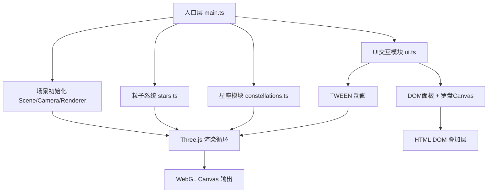

## 1. 架构设计

纯前端三维星空可视化应用，无后端服务。采用模块化分层架构：



## 2. 技术说明

- **前端框架**: TypeScript@5 + Three.js@0.160 + Vite@5
- **渲染器**: WebGLRenderer + CSS2DRenderer（双渲染器叠加）
- **动画库**: @tweenjs/tween.js@21（相机飞行、缓动过渡）
- **构建工具**: Vite，target ES2020，开发端口3000
- **无后端/数据库**: 所有星座数据硬编码为TypeScript常量

## 3. 目录结构

| 路径 | 用途 |
|------|------|
| `index.html` | 入口HTML，设置黑色背景、无滚动条、挂载canvas容器 |
| `package.json` | 依赖与脚本（dev/build/preview） |
| `tsconfig.json` | 严格模式TS配置，target ES2020，module ESNext |
| `vite.config.js` | Vite构建配置，build.target es2020，server.port 3000 |
| `src/main.ts` | 应用入口：初始化场景/相机/渲染器，启动动画循环，串联各模块 |
| `src/stars.ts` | 粒子生成模块：`createStarField()` 返回 BufferGeometry + 初始位置数组 |
| `src/constellations.ts` | 星座模块：`createConstellations()` 定义5星座数据+绘制连线+标签；`highlightConstellation()` 高亮指定星座 |
| `src/ui.ts` | UI模块：`initUI()` 渲染左侧面板/星座列表/罗盘；`toggleRotation()` 控制时间模拟开关；TWEEN相机飞行辅助函数 |

## 4. 关键数据结构

### 4.1 星座数据定义
```typescript
interface ConstellationStar {
  name: string;          // 星名如 'Betelgeuse'
  position: [number, number, number]; // 球坐标转笛卡尔
}

interface Constellation {
  id: string;
  name: string;          // 中文/拉丁名
  stars: ConstellationStar[];
  lines: [number, number][]; // 星索引对，定义连线路径
  group?: THREE.Group;   // 运行时：存储连线+标签组
}
```

### 4.2 运行时状态
```typescript
interface AppState {
  isRotating: boolean;       // 时间模拟开关
  rotationAngle: number;     // 累计自转角
  highlightedId: string | null; // 当前高亮星座
  initialCameraPos: THREE.Vector3;
  initialCameraTarget: THREE.Vector3;
}
```

## 5. 性能优化策略

1. **粒子几何**: 使用 `BufferGeometry` 存储800-1200点position/color/size attribute，**避免每帧遍历**
2. **旋转更新**: 仅当 `isRotating` 切换时更新attribute；自转通过旋转父级 `THREE.Group` 而非逐点变换
3. **闪烁模拟**: 通过 shader uniform `time` 驱动 size 在 ±0.3 范围正弦波动；或每帧仅更新PointsMaterial.size + 随机seed扰动（不遍历buffer）
4. **连线闪烁**: 材质 `opacity` 随 `clock.getElapsedTime()` 正弦插值，不重绘几何
5. **OrbitControls**: 开启 `enableDamping` 但 `dampingFactor=0.05` 保持低开销
6. **CSS2DRenderer**: 仅关键星（~40个）创建DOM标签，其余粒子不创建
7. **Canvas罗盘**: 每帧requestAnimationFrame轻量重绘60px圆，开销可忽略
