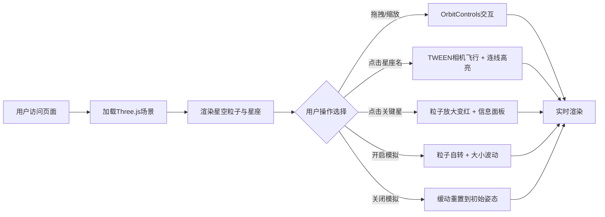

## 1. 产品概述

三维星空粒子系统 - 一个基于Web的交互式动态星座图查看器，解决天文爱好者无法在网页端直观探索星空排列、模拟恒星运动及查看星座连线与星名标注的问题。目标用户为天文爱好者、教育工作者和普通兴趣用户，提供沉浸式的3D星空探索体验。

## 2. 核心功能

### 2.1 用户角色
| 角色 | 注册方式 | 核心权限 |
|------|----------|----------|
| 访客用户 | 无需注册，直接访问 | 浏览星空、交互旋转、查看星座信息、开启时间模拟 |

### 2.2 功能模块
1. **三维星空场景**: 800-1200颗恒星粒子系统，球壳分布，渐变颜色与发光效果
2. **星座连线标注**: 5个经典星座（猎户座、大熊座、仙后座、天鹅座、天蝎座）的连线与星名悬浮标签
3. **交互控制面板**: 左侧星座列表、时间模拟开关、点击高亮与相机飞行
4. **时间模拟模式**: 天体自转与恒星闪烁效果模拟
5. **视角罗盘**: 右上角迷你方向指示罗盘

### 2.3 页面详情
| 页面名称 | 模块名称 | 功能描述 |
|----------|----------|----------|
| 主界面 | 三维星空场景 | 全屏3D粒子星空，纯黑背景，支持鼠标拖拽旋转、滚轮缩放 |
| 主界面 | 星座连线层 | 5个星座白色半透明闪烁连线，关键星CSS2D标签显示星名 |
| 主界面 | 左侧控制面板 | 星座列表（点击相机飞行+高亮）、时间模拟开关按钮 |
| 主界面 | 信息弹窗 | 点击关键星弹出星名、坐标、所属星座信息面板 |
| 主界面 | 迷你罗盘 | Canvas绘制的视角方向指示，红色三角指针 |
| 主界面 | 响应式布局 | 窗口<768px时面板折叠为底部横条，罗盘隐藏 |

## 3. 核心流程

用户进入页面 → 加载三维星空与星座数据 → 默认视角展示全景 → 用户可选择：
- 拖拽旋转/滚轮缩放浏览星空
- 点击左侧星座名称 → 相机飞向该星座并高亮连线
- 点击某颗关键星 → 放大变红并弹出信息面板
- 开启时间模拟 → 星空自转+粒子闪烁

## 4. 用户界面设计

### 4.1 设计风格
- **主色调**: 纯黑背景 #000000，恒星白黄渐变 #ffffff → #fffacd
- **强调色**: 高亮金色 #ffd700，选中红色 #ff4757，罗盘指针红 #e74c3c
- **按钮样式**: 圆角8px星座标签，圆角12px半透明面板，圆角4px星名标签
- **字体**: 系统无衬线字体，星名14px白色，标签内边距20px/8px
- **布局风格**: 全屏沉浸式3D，左上控制面板+右上罗盘，响应式适配
- **动效**: 0.3s缓动切换，连线2s周期闪烁，相机2s飞行动画，粒子1.5s闪烁周期

### 4.2 页面设计概览
| 页面名称 | 模块名称 | UI元素 |
|----------|----------|---------|
| 主界面 | 星空粒子 | BufferGeometry+PointsMaterial，800-1200颗粒子，发光圆形纹理 |
| 主界面 | 星座连线 | LineSegments，半透明白色线宽1px，2s闪烁周期(0.3-0.8) |
| 主界面 | 星名标签 | CSS2DRenderer，14px白色，rgba(0,0,0,0.6)背景圆角4px |
| 主界面 | 左侧面板 | rgba(0,0,0,0.7)背景圆角12px内边距20px，固定定位 |
| 主界面 | 星座按钮 | rgba(255,255,255,0.1)背景，hover: #ffd700 30%，active: 50% |
| 主界面 | 迷你罗盘 | Canvas直径60px，半透明白色底圆，红色三角指针 |
| 主界面 | 信息面板 | 点击星弹出，显示星名/坐标/所属星座，1秒后粒子恢复 |

### 4.3 响应式
- **桌面优先**: 窗口≥768px，左侧垂直面板+右上罗盘
- **移动端自适应**: 窗口<768px，面板折叠为底部横条，罗盘隐藏，触控优化

### 4.4 3D场景指引
- **环境**: 纯黑背景，无HDRI，深空氛围
- **光照**: 仅粒子自发光（PointsMaterial emissive），无场景光源
- **相机**: PerspectiveCamera(fov=60)，初始距离球心150单位
- **运动**: OrbitControls(enableDamping=0.05)，TWEEN相机飞行2s
- **合成**: 无后期处理，CSS2DRenderer叠加HTML标签
- **性能预算**: 60FPS，BufferGeometry单次更新，禁止每帧遍历全粒子
