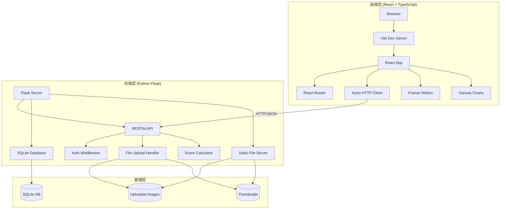

# 摄影比赛在线作品提交与评委打分系统 - 技术架构文档

## 1. 整体架构设计

### 1.1 架构图



### 1.2 技术栈选型

| 层级 | 技术 | 版本 | 用途 |
|-----|------|------|------|
| 前端框架 | React | 18.x | UI组件库 |
| 前端语言 | TypeScript | 5.x | 类型安全 |
| 构建工具 | Vite | 5.x | 构建和开发服务器 |
| 路由 | React Router DOM | 6.x | 客户端路由 |
| HTTP客户端 | Axios | 1.x | API请求 |
| 动画 | Framer Motion | 11.x | 交互动画 |
| 后端框架 | Flask | 3.x | Web框架 |
| 数据库 | SQLite | 3.x | 数据存储 |
| 认证 | PyJWT | 2.x | JWT令牌 |
| 密码加密 | Werkzeug | 3.x | 密码哈希 |
| 图片处理 | Pillow | 10.x | 缩略图生成 |

---

## 2. 前端架构

### 2.1 目录结构

```
src/
├── App.tsx                 # 根组件，路由配置
├── main.tsx                # 应用入口
├── index.css               # 全局样式
├── components/
│   ├── Navbar.tsx          # 导航栏组件
│   ├── WorkCard.tsx        # 作品卡片组件
│   ├── RadarChart.tsx      # 雷达图组件
│   ├── BarChart.tsx        # 条形图组件
│   ├── ScoreSlider.tsx     # 打分滑块组件
│   └── LazyImage.tsx       # 懒加载图片组件
├── pages/
│   ├── Home.tsx            # 首页（作品列表）
│   ├── Login.tsx           # 登录页
│   ├── Register.tsx        # 注册页
│   ├── Upload.tsx          # 作品上传页
│   ├── Judge.tsx           # 评委打分列表页
│   ├── Score.tsx           # 评分详情页
│   ├── Rankings.tsx        # 排行榜页
│   └── WorkDetail.tsx      # 作品详情页
├── context/
│   └── AuthContext.tsx     # 认证上下文
├── services/
│   ├── api.ts              # API配置
│   ├── auth.ts             # 认证API
│   ├── works.ts            # 作品API
│   └── scores.ts           # 评分API
├── types/
│   └── index.ts            # TypeScript类型定义
└── utils/
    └── csv.ts              # CSV导出工具
```

### 2.2 核心模块说明

#### 2.2.1 路由配置（App.tsx）
- 使用BrowserRouter
- 路由：/、/login、/register、/upload、/judge、/score/:id、/rankings、/work/:id
- 路由守卫：未登录用户访问/upload重定向到/login；非评委访问/judge重定向到/

#### 2.2.2 认证上下文（AuthContext）
- 存储用户信息和JWT Token
- 提供login、logout、register方法
- Token持久化到localStorage
- Axios请求自动携带Authorization头

#### 2.2.3 懒加载图片组件（LazyImage）
- 使用IntersectionObserver API
- 滚动到视口时加载图片
- 显示加载占位图
- 加载失败显示错误占位

#### 2.2.4 雷达图组件（RadarChart）
- Canvas 2D绘制五边形雷达图
- 支持5个维度（构图、色彩、创意、情感表达、总分）
- 实时更新分数可视化
- 配色：#667eea、#764ba2、#f093fb、#f5576c、#4facfe

#### 2.2.5 条形图组件（BarChart）
- 横向条形图展示四个维度平均分
- 渐变填充：#3b82f6 → #8b5cf6
- 显示具体数值标签

### 2.3 状态管理

| 状态 | 存储位置 | 用途 |
|-----|---------|------|
| 用户信息 | AuthContext + localStorage | 登录状态、用户角色 |
| JWT Token | localStorage | API认证 |
| 作品列表 | Home组件state | 首页展示 |
| 作品详情 | WorkDetail组件state | 详情页展示 |
| 评分状态 | Score组件state | 打分表单 |
| 排行榜数据 | Rankings组件state | 榜单展示 |

### 2.4 API服务封装

```typescript
// services/api.ts
const axiosInstance = axios.create({
  baseURL: '/api',
  timeout: 5000,
});

// 请求拦截器：添加JWT Token
axiosInstance.interceptors.request.use((config) => {
  const token = localStorage.getItem('token');
  if (token) {
    config.headers.Authorization = `Bearer ${token}`;
  }
  return config;
});

// 响应拦截器：处理401错误
axiosInstance.interceptors.response.use(
  (response) => response,
  (error) => {
    if (error.response?.status === 401) {
      localStorage.removeItem('token');
      localStorage.removeItem('user');
      window.location.href = '/login';
    }
    return Promise.reject(error);
  }
);
```

---

## 3. 后端架构

### 3.1 目录结构

```
backend/
├── app.py                  # Flask应用入口
├── models.py               # 数据模型
├── routes/
│   ├── __init__.py
│   ├── auth.py             # 认证路由
│   ├── works.py            # 作品路由
│   └── scores.py           # 评分路由
├── middleware/
│   └── auth.py             # 认证中间件
├── utils/
│   ├── image.py            # 图片处理工具
│   └── csv_export.py       # CSV导出工具
├── instance/
│   └── app.db              # SQLite数据库
└── uploads/
    ├── images/             # 原图存储
    └── thumbnails/         # 缩略图存储
```

### 3.2 API接口设计

#### 3.2.1 认证接口

| 方法 | 路径 | 说明 | 参数 | 返回 |
|-----|------|------|------|------|
| POST | /api/register | 用户注册 | username, email, password | {user, token} |
| POST | /api/login | 用户登录 | email/username, password | {user, token} |
| GET | /api/auth/me | 获取当前用户 | - | {user} |

#### 3.2.2 作品接口

| 方法 | 路径 | 说明 | 参数 | 返回 |
|-----|------|------|------|------|
| GET | /api/works | 获取作品列表 | page, limit | {works, total} |
| GET | /api/works/:id | 获取作品详情 | - | {work} |
| POST | /api/works | 上传作品 | title, description, image(file) | {work} |
| GET | /uploads/* | 访问上传文件 | - | 静态文件 |

#### 3.2.3 评分接口

| 方法 | 路径 | 说明 | 参数 | 返回 |
|-----|------|------|------|------|
| GET | /api/scores/pending | 获取待评分作品 | - | {works} |
| GET | /api/scores/work/:id | 获取作品评分 | - | {scores} |
| POST | /api/scores | 提交评分 | work_id, composition, color, creativity, emotion | {score} |
| GET | /api/scores/rankings | 获取排行榜 | - | {rankings} |
| GET | /api/scores/export | 导出CSV | - | CSV文件 |

### 3.3 数据库模型

#### 3.3.1 User模型
```python
class User(db.Model):
    id = db.Column(db.Integer, primary_key=True)
    username = db.Column(db.String(80), unique=True, nullable=False)
    email = db.Column(db.String(120), unique=True, nullable=False)
    password_hash = db.Column(db.String(256), nullable=False)
    is_judge = db.Column(db.Boolean, default=False)
    created_at = db.Column(db.DateTime, default=datetime.utcnow)
    works = db.relationship('Work', backref='author', lazy=True)
    scores = db.relationship('Score', backref='judge', lazy=True)
```

#### 3.3.2 Work模型
```python
class Work(db.Model):
    id = db.Column(db.Integer, primary_key=True)
    title = db.Column(db.String(200), nullable=False)
    description = db.Column(db.String(500), nullable=True)
    image_path = db.Column(db.String(500), nullable=False)
    thumbnail_path = db.Column(db.String(500), nullable=False)
    user_id = db.Column(db.Integer, db.ForeignKey('user.id'), nullable=False)
    created_at = db.Column(db.DateTime, default=datetime.utcnow)
    scores = db.relationship('Score', backref='work', lazy=True)
```

#### 3.3.3 Score模型
```python
class Score(db.Model):
    id = db.Column(db.Integer, primary_key=True)
    work_id = db.Column(db.Integer, db.ForeignKey('work.id'), nullable=False)
    judge_id = db.Column(db.Integer, db.ForeignKey('user.id'), nullable=False)
    composition = db.Column(db.Integer, nullable=False)
    color = db.Column(db.Integer, nullable=False)
    creativity = db.Column(db.Integer, nullable=False)
    emotion = db.Column(db.Integer, nullable=False)
    total_score = db.Column(db.Integer, nullable=False)
    created_at = db.Column(db.DateTime, default=datetime.utcnow)
    __table_args__ = (db.UniqueConstraint('work_id', 'judge_id', name='_work_judge_uc'),)
```

### 3.4 核心业务逻辑

#### 3.4.1 图片处理流程
1. 接收上传文件，验证格式（jpg/png）和大小（≤5MB）
2. 生成唯一文件名，保存原图到uploads/images
3. 使用Pillow生成16:9比例缩略图
4. 保存缩略图到uploads/thumbnails
5. 将路径存入数据库

#### 3.4.2 评分计算逻辑
```python
# 单个评委总分
total = composition + color + creativity + emotion

# 作品平均分计算
avg_total = sum(scores.total_score for scores in work.scores) / len(work.scores)
avg_composition = sum(scores.composition for scores in work.scores) / len(work.scores)
# ... 其他维度同理

# 最高分、最低分
max_score = max(score.total_score for score in work.scores)
min_score = min(score.total_score for score in work.scores)
```

#### 3.4.3 排行榜生成逻辑
1. 查询所有作品及其评分
2. 计算每个作品的平均分、各维度平均分、最高分、最低分
3. 按平均分降序排序
4. 生成排名序号

---

## 4. 前端构建配置

### 4.1 package.json

```json
{
  "name": "photo-contest",
  "private": true,
  "version": "0.1.0",
  "type": "module",
  "scripts": {
    "dev": "vite",
    "build": "tsc && vite build",
    "preview": "vite preview"
  },
  "dependencies": {
    "react": "^18.2.0",
    "react-dom": "^18.2.0",
    "axios": "^1.6.0",
    "react-router-dom": "^6.20.0",
    "framer-motion": "^11.0.0"
  },
  "devDependencies": {
    "@types/react": "^18.2.0",
    "@types/react-dom": "^18.2.0",
    "@types/node": "^20.10.0",
    "@vitejs/plugin-react": "^4.2.0",
    "typescript": "^5.3.0",
    "vite": "^5.0.0"
  }
}
```

### 4.2 vite.config.js

```javascript
import { defineConfig } from 'vite';
import react from '@vitejs/plugin-react';

export default defineConfig({
  plugins: [react()],
  build: {
    target: 'es2020',
  },
  server: {
    port: 5173,
    proxy: {
      '/api': {
        target: 'http://localhost:5000',
        changeOrigin: true,
      },
      '/uploads': {
        target: 'http://localhost:5000',
        changeOrigin: true,
      },
    },
  },
});
```

### 4.3 tsconfig.json

```json
{
  "compilerOptions": {
    "target": "ES2020",
    "useDefineForClassFields": true,
    "lib": ["ES2020", "DOM", "DOM.Iterable"],
    "module": "ESNext",
    "skipLibCheck": true,
    "moduleResolution": "bundler",
    "allowImportingTsExtensions": true,
    "resolveJsonModule": true,
    "isolatedModules": true,
    "noEmit": true,
    "jsx": "react-jsx",
    "strict": true,
    "noUnusedLocals": true,
    "noUnusedParameters": true,
    "noFallthroughCasesInSwitch": true
  },
  "include": ["src"],
  "references": [{ "path": "./tsconfig.node.json" }]
}
```

---

## 5. 样式系统

### 5.1 CSS变量定义

```css
:root {
  --color-primary: #3b82f6;
  --color-secondary: #5a67d8;
  --color-bg: #f9fafb;
  --color-card: #ffffff;
  --color-text: #1f2937;
  --color-text-secondary: #6b7280;
  --color-border: #e5e7eb;
  --color-card-border: #e0e0e0;
  --color-success: #10b981;
  --color-error: #ef4444;
  --radius-card: 12px;
  --radius-button: 8px;
  --radius-input: 6px;
  --shadow-card: rgba(0, 0, 0, 0.15);
  --transition: 0.3s cubic-bezier(0.4, 0, 0.2, 1);
  --max-width: 1200px;
}
```

### 5.2 响应式断点

```css
@media (max-width: 768px) {
  .work-grid {
    grid-template-columns: 1fr;
    gap: 12px;
  }
  .navbar-menu {
    display: none;
  }
}
```

---

## 6. 性能优化策略

### 6.1 前端优化
- **图片懒加载**：IntersectionObserver实现，减少首屏请求
- **代码分割**：React.lazy + Suspense实现路由级代码分割
- **图片压缩**：后端自动生成优化后的缩略图
- **缓存策略**：静态资源设置合理的Cache-Control
- **防抖节流**：搜索、滚动等场景应用

### 6.2 后端优化
- **数据库索引**：works.created_at、scores.work_id等字段加索引
- **分页查询**：作品列表使用limit/offset分页
- **并发控制**：使用数据库唯一约束防止重复评分
- **文件存储**：原图和缩略图分离，CDN可扩展

---

## 7. 安全措施

### 7.1 认证安全
- JWT Token有效期24小时
- 密码使用Werkzeug PBKDF2哈希
- 登录失败次数限制

### 7.2 文件上传安全
- 验证文件MIME类型
- 限制文件大小（5MB）
- 白名单文件格式（jpg、png）
- 随机化文件名防止路径遍历

### 7.3 输入验证
- 后端参数校验
- SQL注入防护（SQLAlchemy ORM）
- XSS防护（React自动转义）
- CSRF防护（JWT Token）

---

## 8. 部署方案

### 8.1 开发环境
- 前端：Vite开发服务器（端口5173）
- 后端：Flask开发服务器（端口5000）
- 数据库：SQLite本地文件
- 代理：Vite dev server代理API请求

### 8.2 启动命令
```bash
# 安装前端依赖
npm install

# 启动前端开发服务器
npm run dev

# 安装后端依赖
pip install flask flask-sqlalchemy flask-cors pillow pyjwt werkzeug python-dotenv

# 启动后端服务器
python backend/app.py
```
