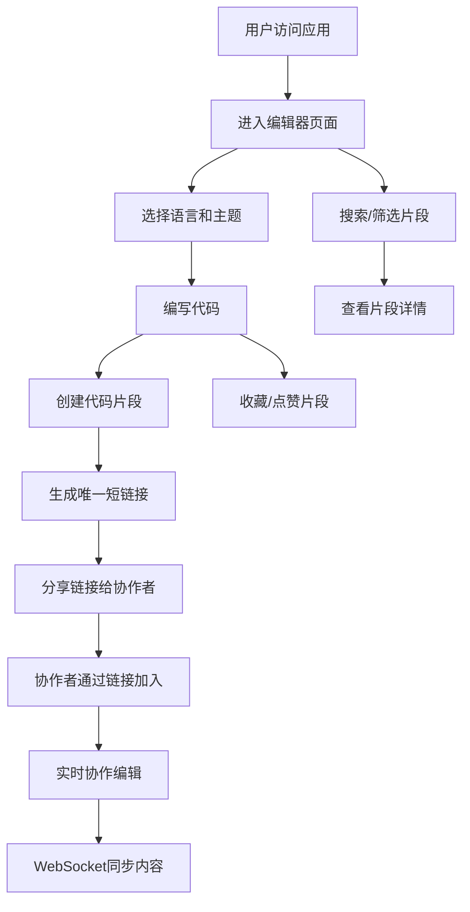

## 1. 产品概述

CodeShare 是一个在线代码片段分享与协作编辑平台，旨在为开发者提供便捷的代码共享和实时协作体验。
- 主要目标：让用户可以快速创建、分享代码片段，支持多人实时协作编辑和语法高亮显示
- 目标用户：开发者、技术团队、编程学习者
- 产品价值：提升代码分享效率，实现团队实时协作，降低沟通成本

## 2. 核心功能

### 2.1 用户角色
| 角色 | 注册方式 | 核心权限 |
|------|---------|----------|
| 普通用户 | 无需注册（匿名访问） | 创建、查看、编辑代码片段，收藏和点赞 |

### 2.2 功能模块
1. **代码编辑器**：语法高亮、语言选择、主题切换、自动缩进、括号匹配
2. **实时协作编辑**：WebSocket同步、多人光标显示、内容实时同步
3. **代码片段管理**：创建片段、生成短链接、片段列表展示、搜索筛选
4. **收藏与点赞**：星形收藏、心形点赞、动画反馈、收藏列表

### 2.3 页面详情
| 页面名称 | 模块名称 | 功能描述 |
|---------|---------|----------|
| 首页/编辑器页 | 顶部导航栏 | Logo、搜索框、用户头像、响应式汉堡菜单 |
| 首页/编辑器页 | 左侧边栏 | 代码片段列表、语言筛选、搜索结果展示 |
| 首页/编辑器页 | 主编辑区 | 代码编辑器、语言选择、主题切换、协作光标 |
| 片段详情页 | 代码展示区 | 只读/可编辑切换、语法高亮、最后编辑信息 |
| 收藏页面 | 收藏列表 | 用户收藏的代码片段卡片展示 |

## 3. 核心流程

用户打开应用后，默认进入编辑器页面。左侧展示代码片段列表，可通过搜索框实时过滤。用户选择编程语言和主题后，在编辑器中编写代码，点击创建按钮生成唯一短链接进行分享。其他用户通过链接加入后可实时协作编辑，所有编辑操作通过WebSocket同步。用户可对片段进行收藏和点赞操作。

## 4. 用户界面设计

### 4.1 设计风格
- 主色调：深色主题，背景 #1e1e1e，卡片背景 #2d2d2d，文字 #dcdcdc
- 语言标签色：JavaScript #f7df1e，Python #3572a5，HTML/CSS #e34c26
- 协作者光标色：#ff6b6b、#4ecdc4、#45b7d1
- 头像色盘：#e74c3c、#3498db、#2ecc71
- 按钮风格：圆角设计，悬停阴影效果
- 字体：使用等宽字体用于代码编辑区域
- 布局：左侧边栏280px + 主编辑区约70%宽度，顶部导航栏
- 图标风格：使用lucide-react线性图标

### 4.2 页面设计概述
| 页面名称 | 模块名称 | UI元素 |
|---------|---------|--------|
| 首页/编辑器页 | 顶部导航栏 | Logo加粗16px、搜索框圆角20px背景#3c3c3c、用户头像圆形 |
| 首页/编辑器页 | 左侧边栏 | 片段卡片悬停右移8px+深色阴影、垂直滚动条 |
| 首页/编辑器页 | 主编辑区 | react-syntax-highlighter渲染、语言选择下拉、主题切换下拉 |
| 片段详情页 | 展示区 | 只读/编辑切换按钮、底部编辑信息（首字母头像36px圆形） |
| 收藏页面 | 收藏列表 | 卡片式布局、收藏/点赞状态标记 |

### 4.3 响应式
- 桌面优先设计，移动端自适应
- 屏幕宽度小于768px时，左侧边栏隐藏，通过汉堡菜单展开
- 编辑器区域自适应屏幕宽度
- 触摸操作优化

### 4.4 动画效果
- 页面切换：淡入淡出过渡0.3秒
- 卡片悬停：向右平移8px + 深色阴影
- 点赞动画：图标填充红色 + 0.2秒缩放动画
- 搜索防抖：300ms实时过滤
