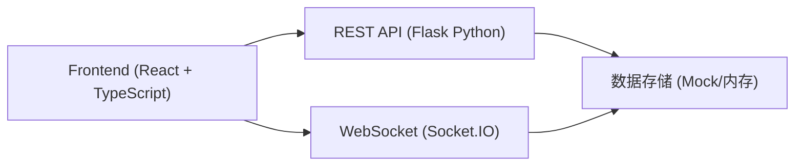
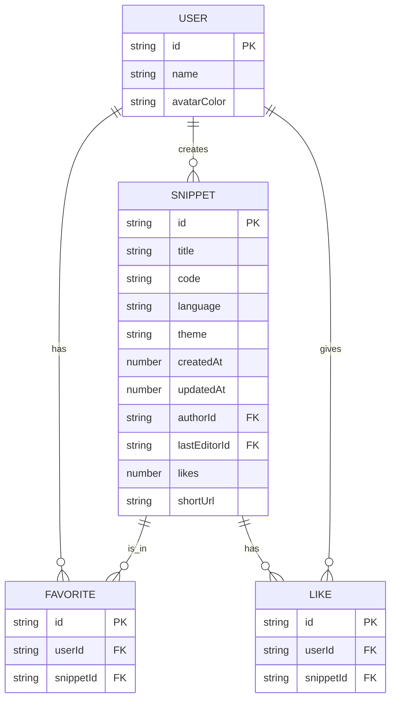

## 1. 架构设计



## 2. 技术说明

- 前端：React 18 + TypeScript + Vite
- 状态管理：React Hooks + Context
- 路由：React Router DOM 6
- HTTP客户端：Axios
- 实时通信：Socket.IO Client
- 语法高亮：react-syntax-highlighter
- 动画：Framer Motion
- 后端：Python Flask + Flask-SocketIO（说明性，主要实现前端）
- 构建工具：Vite

## 3. 路由定义

| 路由 | 用途 |
|------|------|
| / | 首页，代码编辑器 + 片段列表 |
| /snippet/:id | 代码片段详情页 |
| /favorites | 收藏的代码片段列表 |

## 4. API定义

### 4.1 TypeScript类型定义

```typescript
// 代码片段
interface Snippet {
  id: string;
  title: string;
  code: string;
  language: 'javascript' | 'python' | 'html' | 'typescript';
  theme: 'vs-dark' | 'monokai' | 'light';
  createdAt: number;
  updatedAt: number;
  author: User;
  lastEditor?: User;
  likes: number;
  isLiked: boolean;
  isFavorited: boolean;
  shortUrl: string;
}

// 编辑操作
interface EditOperation {
  type: 'insert' | 'delete' | 'replace';
  position: number;
  text?: string;
  length?: number;
  userId: string;
  timestamp: number;
}

// 协作者光标
interface CollaboratorCursor {
  userId: string;
  user: User;
  position: number;
  color: string;
}

// 用户
interface User {
  id: string;
  name: string;
  avatarColor: string;
}
```

### 4.2 REST API端点

| 方法 | 路径 | 说明 |
|------|------|------|
| GET | /api/snippets | 获取代码片段列表 |
| GET | /api/snippets/:id | 获取单个片段详情 |
| POST | /api/snippets | 创建新代码片段 |
| PUT | /api/snippets/:id | 更新代码片段 |
| POST | /api/snippets/:id/like | 点赞/取消点赞 |
| POST | /api/snippets/:id/favorite | 收藏/取消收藏 |
| GET | /api/favorites | 获取收藏列表 |
| GET | /api/search?q= | 搜索代码片段 |

### 4.3 WebSocket事件

| 事件名 | 方向 | 数据 | 说明 |
|--------|------|------|------|
| join-room | 客户端→服务端 | { snippetId, user } | 加入协作房间 |
| leave-room | 客户端→服务端 | { snippetId, userId } | 离开协作房间 |
| edit-operation | 客户端→服务端 | EditOperation | 发送编辑操作 |
| edit-operation | 服务端→客户端 | EditOperation | 接收编辑操作 |
| cursor-update | 客户端→服务端 | CollaboratorCursor | 更新光标位置 |
| cursor-update | 服务端→客户端 | CollaboratorCursor[] | 广播所有协作者光标 |
| collaborators | 服务端→客户端 | User[] | 当前房间协作者列表 |

## 5. 项目文件结构

```
.
├── package.json
├── vite.config.js
├── tsconfig.json
├── index.html
└── src/
    ├── App.tsx
    ├── main.tsx
    └── modules/
        ├── editor/
        │   ├── Editor.tsx
        │   ├── CollabSync.ts
        │   ├── SnippetPanel.tsx
        │   └── types.ts
        └── shared/
            └── ApiService.ts
```

## 6. 数据模型

### 6.1 实体关系



### 6.2 初始Mock数据

应用启动时内置以下示例代码片段：
- JavaScript：Hello World示例
- Python：快速排序算法
- HTML：响应式布局模板
- TypeScript：泛型工具函数示例
