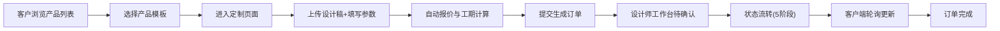

## 1. 产品概述

面向小微企业和个体手工艺人的在线定制产品工坊平台，解决传统定制流程依赖邮件沟通、效率低、易出错的痛点。

- 支持设计师发布可定制产品模板，客户上传个性化设计需求并获取实时报价
- 通过订单追踪看板实现全流程透明化，提升交易效率与用户体验
- 目标用户：设计师/手工艺人（B端）、有定制需求的个人与企业客户（C端）

## 2. 核心功能

### 2.1 用户角色

| 角色 | 注册方式 | 核心权限 |
|------|----------|----------|
| 设计师 | 邮箱注册 | 创建产品模板、管理订单状态、查看订单看板 |
| 客户 | 邮箱注册 | 浏览产品列表、提交定制订单、追踪订单进度 |

### 2.2 功能模块

1. **首页/产品列表页**：响应式网格布局展示产品模板，支持筛选与图片懒加载
2. **定制表单页**：上传设计稿、填写尺寸/数量/材质、自动计算报价与工期
3. **订单详情页**：订单信息展示、状态进度条、设计稿预览、30秒轮询刷新
4. **设计师工作台**：按状态分组的订单卡片网格、状态更新操作
5. **登录/注册页**：双角色选择的身份认证系统
6. **创建产品模板页**：设计师发布可定制产品（名称、价格、材质、工期）

### 2.3 页面详情

| 页面名称 | 模块名称 | 功能描述 |
|----------|----------|----------|
| 产品列表页 | 产品卡片网格 | 2列响应式布局、懒加载图片、16:9缩略图、圆角16px |
| 产品列表页 | 导航栏 | 深灰背景暖橙强调色、移动端汉堡菜单 |
| 定制表单页 | 左侧预览区 | 设计稿上传预览、实时压缩显示进度百分比 |
| 定制表单页 | 右侧表单区 | 尺寸/数量输入、材质下拉、备注、提交按钮带加载动画 |
| 订单详情页 | 顶部信息区 | 订单号(大号粗体)、状态进度条(五色分段)、预计完成日期 |
| 订单详情页 | 设计稿区 | 大图预览、支持缩放 |
| 订单详情页 | 详情列表 | 客户信息、材质、数量、尺寸、报价明细、状态历史 |
| 设计师工作台 | 订单看板 | 按5种状态分组卡片、悬停缩放1.05倍加深阴影 |
| 设计师工作台 | 状态操作 | 状态流转按钮(待确认→生产→质检→配送→完成) |
| 登录注册页 | 表单 | 角色切换Tab、邮箱密码登录注册 |
| 创建模板页 | 表单 | 产品名称、价格区间、材质列表(可增删)、默认工期 |

## 3. 核心流程

客户浏览产品模板 → 选择模板进入定制页面 → 上传设计稿并填写参数 → 系统自动计算报价与工期 → 提交生成订单 → 设计师在看板看到待确认订单 → 设计师逐步更新状态 → 客户端轮询查看进度 → 订单完成

## 4. 用户界面设计

### 4.1 设计风格

- **主色调**：深灰 #2c3e50（工业风沉稳基调）
- **强调色**：暖橙 #e67e22（温暖活力，突出操作重点）
- **状态色**：
  - 待确认：橙色 #f39c12
  - 生产中：蓝色 #3498db
  - 质检：紫色 #9b59b6
  - 配送：绿色 #2ecc71
  - 完成：灰色 #95a5a6
- **辅助色**：淡灰 #f9f9f9（输入背景）、淡蓝 #bdc3c7（默认边框）、浅灰 #ecf0f1（卡片边框）

- **按钮样式**：暖橙背景、白色文字、圆角8px、hover亮度+10%、过渡0.2s
- **卡片样式**：圆角16px、1px #ecf0f1边框、悬停缩放1.05+加深阴影(0.2s过渡)
- **字体方案**：正文使用现代无衬线字体，标题使用粗体工业风字重
  - 大号标题：28px bold
  - 中号标题：20px semibold
  - 正文：14px regular
  - 辅助文字：12px light
- **布局风格**：卡片式布局、顶部导航栏、内容区留白充足
- **图标风格**：线性简洁图标（Lucide React）

### 4.2 页面设计概览

| 页面名称 | 模块名称 | UI元素描述 |
|----------|----------|-------------|
| 产品列表页 | 导航栏 | 深灰底白字、暖橙Logo色、右侧登录按钮 |
| 产品列表页 | Hero区 | 渐变背景+大标题+副标题+CTA按钮 |
| 产品列表页 | 卡片网格 | 2列(≥768px)/1列(<768px)、间距24px、懒加载骨架屏 |
| 定制表单页 | 双栏布局 | 左预览(55%)右表单(45%)、间距32px |
| 定制表单页 | 上传区 | 虚线边框拖拽区、暖橙强调、进度条动画 |
| 订单详情页 | 进度条 | 5段彩色分段、当前段高亮发光 |
| 设计师工作台 | 看板 | 5列状态分组、卡片网格、标签颜色区分 |
| 页面切换 | 动画 | 向右滑入0.3s ease-out |

### 4.3 响应式设计

- **桌面优先**：≥1024px 为基准设计
- **平板**：768-1023px，产品列表保持2列，定制页双栏变单栏堆叠
- **手机**：<768px，全单列布局，导航栏变汉堡菜单，表单全宽
- **触摸优化**：触控目标最小44px，按钮内边距充足

### 4.4 性能约束

- 产品列表首屏加载 ≤ 1.5s（图片懒加载+骨架屏）
- 订单状态轮询间隔 ≥ 30s（推荐30-60s）
- 设计稿上传压缩 ≤ 3s，显示进度百分比
