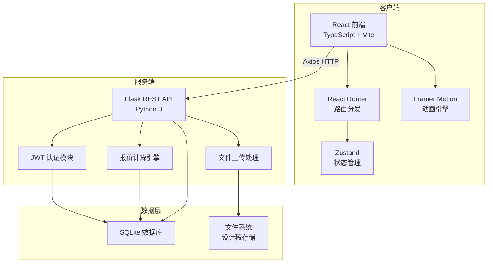
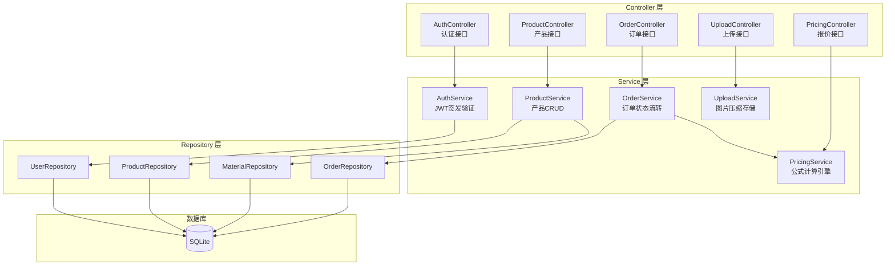
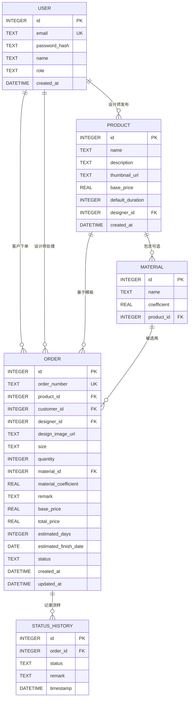

## 1. 架构设计



## 2. 技术选型说明

- **前端框架**：React 18 + TypeScript（类型安全、组件化）
- **构建工具**：Vite 5（极速开发体验、HMR）
- **路由管理**：react-router-dom v6（声明式路由、参数化路由）
- **HTTP客户端**：axios（拦截器、请求取消、进度监听）
- **动画库**：framer-motion（声明式动画、页面过渡）
- **状态管理**：zustand（轻量、无 boilerplate）
- **后端框架**：Python Flask（轻量RESTful、灵活）
- **数据库**：SQLite（零配置、本地文件、适合原型）
- **认证**：PyJWT（无状态Token认证）
- **文件处理**：Pillow（图片压缩）、werkzeug（安全文件名）
- **图标**：lucide-react（线性图标、按需引入）

## 3. 路由定义

| 路由 | 页面 | 用途 |
|------|------|------|
| `/` | ProductList | 首页：产品模板列表展示 |
| `/customize/:productId` | CustomizePage | 定制表单：上传设计稿、填写参数、提交订单 |
| `/orders/:orderId` | OrderDetail | 订单详情：状态追踪、进度显示、轮询刷新 |
| `/login` | Login | 登录/注册：双角色认证 |
| `/designer/dashboard` | DesignerDashboard | 设计师工作台：订单分组看板、状态操作 |
| `/designer/products/new` | CreateProduct | 创建产品模板：设计师发布新品 |

## 4. API 定义

### 4.1 TypeScript 类型定义

```typescript
// 用户类型
type UserRole = 'designer' | 'customer';
interface User {
  id: number;
  email: string;
  name: string;
  role: UserRole;
  createdAt: string;
}

// 材质类型
interface Material {
  id: number;
  name: string;
  coefficient: number; // 价格系数
}

// 产品模板
interface Product {
  id: number;
  name: string;
  description: string;
  thumbnail: string;
  basePrice: number;
  defaultDuration: number; // 天
  materials: Material[];
  designerId: number;
  designerName: string;
  createdAt: string;
}

// 订单状态
type OrderStatus = 'pending' | 'production' | 'quality' | 'shipping' | 'completed';

// 状态历史记录
interface StatusHistory {
  status: OrderStatus;
  timestamp: string;
  remark?: string;
}

// 订单
interface Order {
  id: number;
  orderNumber: string; // 唯一订单号，如 ORD-2024-0001
  productId: number;
  productName: string;
  customerId: number;
  customerName: string;
  designerId: number;
  designImage: string;
  size: string;
  quantity: number;
  materialId: number;
  materialName: string;
  materialCoefficient: number;
  remark: string;
  basePrice: number;
  totalPrice: number;
  estimatedDays: number;
  estimatedFinishDate: string;
  status: OrderStatus;
  statusHistory: StatusHistory[];
  createdAt: string;
  updatedAt: string;
}

// 报价请求
interface QuoteRequest {
  basePrice: number;
  coefficient: number;
  quantity: number;
  defaultDuration: number;
}

// 报价结果
interface QuoteResult {
  totalPrice: number;
  estimatedDays: number;
  estimatedFinishDate: string;
}
```

### 4.2 API 端点

| 方法 | 路径 | 认证 | 功能 | 请求体 | 响应 |
|------|------|------|------|--------|------|
| POST | `/api/auth/register` | 否 | 注册用户 | `{email, password, name, role}` | `{token, user}` |
| POST | `/api/auth/login` | 否 | 用户登录 | `{email, password}` | `{token, user}` |
| GET | `/api/auth/me` | 是 | 获取当前用户 | - | `{user}` |
| GET | `/api/products` | 否 | 获取产品列表 | query: `?page=&size=` | `{products, total}` |
| GET | `/api/products/:id` | 否 | 获取产品详情 | - | `{product}` |
| POST | `/api/products` | 设计师 | 创建产品模板 | `{name, description, basePrice, defaultDuration, materials[]}` | `{product}` |
| POST | `/api/pricing/calculate` | 否 | 计算报价与工期 | `{basePrice, coefficient, quantity, defaultDuration}` | `{totalPrice, estimatedDays, finishDate}` |
| POST | `/api/orders` | 客户 | 创建订单（含文件上传） | multipart: designImage, size, quantity, materialId, remark, productId | `{order}` |
| GET | `/api/orders` | 设计师/客户 | 获取订单列表 | query: `?status=&role=` | `{orders}` |
| GET | `/api/orders/:id` | 设计师/客户 | 获取订单详情 | - | `{order}` |
| PATCH | `/api/orders/:id/status` | 设计师 | 更新订单状态 | `{status, remark}` | `{order}` |
| POST | `/api/upload/design` | 客户 | 上传设计稿 | multipart: file | `{url, filename, size}` |

## 5. 后端服务架构



## 6. 数据模型

### 6.1 ER 图



### 6.2 报价计算公式（可配置）

```
# 总价公式：基础价格 × 材质系数 × 数量^0.9
total_price = base_price * material_coefficient * (quantity ** 0.9)

# 工期公式：默认工期 + floor(数量 / 100)
estimated_days = default_duration + (quantity // 100)

# 预计完成日期 = 当前日期 + 工期天
estimated_finish_date = today + timedelta(days=estimated_days)
```
