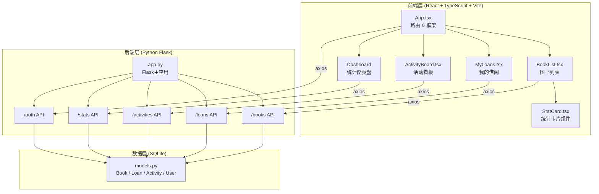
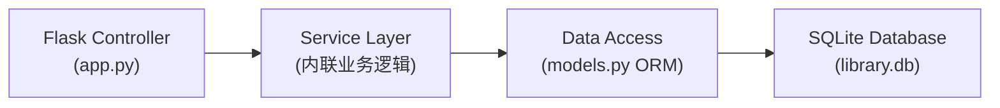
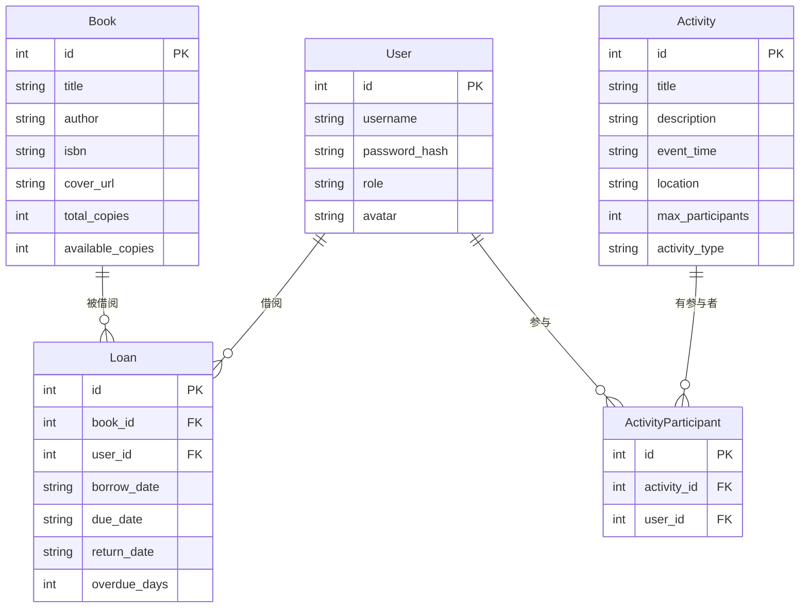

## 1. 架构设计



## 2. 技术说明

- **前端**：React@18 + TypeScript + Vite + framer-motion + axios + react-router-dom
- **初始化工具**：Vite (vite-init)
- **后端**：Python Flask（RESTful API，端口5000）
- **数据库**：SQLite（文件存储，轻量级，适合小型社区图书馆）
- **开发模式**：Vite开发服务器代理API请求至Flask后端

## 3. 路由定义

| 路由 | 用途 |
|------|------|
| `/` | 图书列表页（首页），展示图书卡片网格 |
| `/my-loans` | 我的借阅页，个人借阅记录与逾期提醒 |
| `/activities` | 活动看板页，活动列表与报名管理 |
| `/admin` | 管理员统计仪表盘，数据统计与趋势图 |
| `/login` | 登录/注册页 |

## 4. API定义

### 4.1 认证相关

```typescript
POST /api/auth/register
Request: { username: string; password: string; role: "admin" | "reader" }
Response: { id: number; username: string; role: string; token: string }

POST /api/auth/login
Request: { username: string; password: string }
Response: { id: number; username: string; role: string; token: string }
```

### 4.2 图书相关

```typescript
GET /api/books?page=1&per_page=12&search=keyword
Response: {
  books: Array<{ id: number; title: string; author: string; isbn: string; cover_url: string; total_copies: number; available_copies: number }>;
  total: number; page: number; per_page: number
}

POST /api/books
Request: { title: string; author: string; isbn: string; cover_url: string; total_copies: number }
Response: { id: number; title: string; author: string; isbn: string; cover_url: string; total_copies: number; available_copies: number }
```

### 4.3 借阅相关

```typescript
GET /api/loans?page=1&per_page=10&search=keyword
Response: {
  loans: Array<{ id: number; book_id: number; book_title: string; book_cover: string; borrow_date: string; due_date: string; return_date: string | null; overdue_days: number }>;
  total: number; page: number; per_page: number; has_overdue: boolean
}

POST /api/loans
Request: { book_id: number }
Response: { id: number; book_id: number; borrow_date: string; due_date: string }

PUT /api/loans/:id/return
Response: { id: number; return_date: string }
```

### 4.4 活动相关

```typescript
GET /api/activities
Response: Array<{
  id: number; title: string; description: string; event_time: string;
  location: string; max_participants: number; activity_type: "读书会" | "讲座" | "亲子活动";
  participants: Array<{ id: number; username: string; avatar: string }>;
  is_registered: boolean; can_cancel: boolean
}>

POST /api/activities
Request: { title: string; description: string; event_time: string; location: string; max_participants: number; activity_type: string }
Response: { id: number; title: string; ... }

POST /api/activities/:id/register
Response: { success: boolean; message: string }

DELETE /api/activities/:id/register
Response: { success: boolean; message: string }
```

### 4.5 统计相关

```typescript
GET /api/stats
Response: {
  total_books: number; total_readers: number; current_loans: number;
  overdue_books: number; total_activities: number;
  recent_loans: Array<{ date: string; count: number }>
}
```

## 5. 服务器架构图



## 6. 数据模型

### 6.1 数据模型定义



### 6.2 数据定义语言

```sql
CREATE TABLE IF NOT EXISTS users (
    id INTEGER PRIMARY KEY AUTOINCREMENT,
    username TEXT UNIQUE NOT NULL,
    password_hash TEXT NOT NULL,
    role TEXT NOT NULL DEFAULT 'reader',
    avatar TEXT DEFAULT ''
);

CREATE TABLE IF NOT EXISTS books (
    id INTEGER PRIMARY KEY AUTOINCREMENT,
    title TEXT NOT NULL,
    author TEXT NOT NULL,
    isbn TEXT DEFAULT '',
    cover_url TEXT DEFAULT '',
    total_copies INTEGER NOT NULL DEFAULT 1,
    available_copies INTEGER NOT NULL DEFAULT 1
);

CREATE TABLE IF NOT EXISTS loans (
    id INTEGER PRIMARY KEY AUTOINCREMENT,
    book_id INTEGER NOT NULL,
    user_id INTEGER NOT NULL,
    borrow_date TEXT NOT NULL,
    due_date TEXT NOT NULL,
    return_date TEXT DEFAULT NULL,
    overdue_days INTEGER DEFAULT 0,
    FOREIGN KEY (book_id) REFERENCES books(id),
    FOREIGN KEY (user_id) REFERENCES users(id)
);

CREATE TABLE IF NOT EXISTS activities (
    id INTEGER PRIMARY KEY AUTOINCREMENT,
    title TEXT NOT NULL,
    description TEXT DEFAULT '',
    event_time TEXT NOT NULL,
    location TEXT DEFAULT '',
    max_participants INTEGER NOT NULL DEFAULT 20,
    activity_type TEXT NOT NULL DEFAULT '读书会'
);

CREATE TABLE IF NOT EXISTS activity_participants (
    id INTEGER PRIMARY KEY AUTOINCREMENT,
    activity_id INTEGER NOT NULL,
    user_id INTEGER NOT NULL,
    UNIQUE(activity_id, user_id),
    FOREIGN KEY (activity_id) REFERENCES activities(id),
    FOREIGN KEY (user_id) REFERENCES users(id)
);
```
