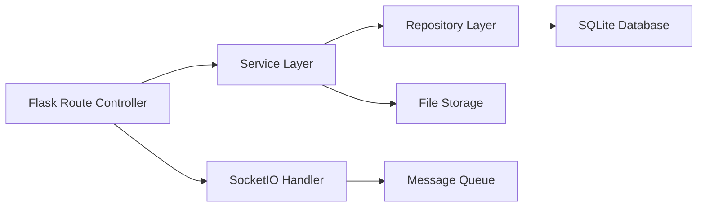
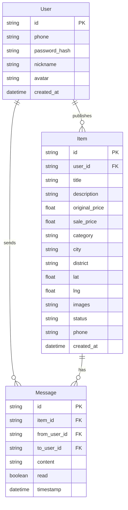

## 1. 架构设计

```mermaid
graph TB
    subgraph "前端 (React + TypeScript + Vite)"
        A[App.tsx 根组件] --> B[路由: React Router]
        B --> C[Welcome 欢迎页]
        B --> D[Browse 浏览页]
        B --> E[Detail 详情页]
        B --> F[Chat 消息页]
        B --> G[Publish 发布页]
        B --> H[Profile 个人中心]
        D --> I[react-leaflet 地图]
        D --> J[虚拟列表]
        A --> K[useWebSocket Hook]
        K --> L[socket.io-client]
    end

    subgraph "后端 (Python Flask)"
        M[Flask App] --> N[RESTful API]
        M --> O[WebSocket (flask-socketio)]
        N --> P[物品CRUD]
        N --> Q[用户认证]
        N --> R[图片上传/压缩]
        O --> S[实时消息推送]
    end

    subgraph "数据层"
        T[SQLite 数据库]
        U[本地文件存储(图片)]
    end

    I -->|"HTTP/GET 物品数据"| N
    J -->|"HTTP/GET 物品列表"| N
    G -->|"HTTP/POST 发布物品"| P
    L -->|"WebSocket 消息"| O
    P --> T
    R --> U
    S --> T
```

## 2. 技术说明

- 前端：React 18 + TypeScript + Vite + Tailwind CSS
- 初始化工具：vite-init (react-ts template)
- 后端：Python Flask + flask-socketio + flask-cors
- 数据库：SQLite (轻量级本地存储，无需额外配置)
- 实时通信：WebSocket (socket.io)

### 前端依赖

| 依赖 | 用途 |
|------|------|
| react, react-dom | UI框架 |
| react-router-dom | 前端路由 |
| axios | HTTP请求 |
| react-leaflet, leaflet | 地图渲染 |
| socket.io-client | WebSocket客户端 |
| framer-motion | 页面切换与交互动画 |
| zustand | 状态管理 |

### 后端依赖

| 依赖 | 用途 |
|------|------|
| flask | Web框架 |
| flask-socketio | WebSocket支持 |
| flask-cors | 跨域支持 |
| Pillow | 图片压缩处理 |

## 3. 路由定义

| 路由 | 用途 |
|------|------|
| / | 欢迎页/首页 |
| /browse | 浏览页（地图+列表） |
| /item/:id | 物品详情页 |
| /publish | 发布物品页 |
| /chat | 消息列表页 |
| /chat/:id | 聊天对话页 |
| /profile | 个人中心页 |

## 4. API定义

### 4.1 物品相关API

| 方法 | 路径 | 描述 | 请求参数 | 响应 |
|------|------|------|----------|------|
| GET | /api/items | 获取物品列表 | category, minPrice, maxPrice, location, lat, lng, zoom, keyword, sortBy | { items: Item[] } |
| GET | /api/items/:id | 获取物品详情 | - | { item: ItemDetail } |
| POST | /api/items | 发布物品 | FormData(图片+字段) | { item: Item } |
| PUT | /api/items/:id | 更新物品 | 部分字段 | { item: Item } |
| DELETE | /api/items/:id | 删除物品 | - | { success: boolean } |

### 4.2 用户相关API

| 方法 | 路径 | 描述 | 请求参数 | 响应 |
|------|------|------|----------|------|
| POST | /api/auth/register | 注册 | phone, password, nickname | { user, token } |
| POST | /api/auth/login | 登录 | phone, password | { user, token } |
| GET | /api/user/profile | 获取个人信息 | - | { user } |
| PUT | /api/user/profile | 更新个人信息 | nickname, avatar | { user } |

### 4.3 消息相关API

| 方法 | 路径 | 描述 | 请求参数 | 响应 |
|------|------|------|----------|------|
| GET | /api/messages | 获取消息列表 | - | { conversations: Conversation[] } |
| GET | /api/messages/:itemId | 获取某物品的聊天记录 | - | { messages: Message[] } |
| POST | /api/messages | 发送消息 | itemId, content | { message: Message } |

### 4.4 WebSocket事件

| 事件名 | 方向 | 数据 | 描述 |
|--------|------|------|------|
| new_inquiry | 服务端→客户端 | { itemId, fromUser } | 新的询价通知 |
| chat_message | 双向 | { itemId, content, from, to, timestamp } | 聊天消息 |

### 4.5 数据类型定义

```typescript
interface Item {
  id: string;
  title: string;
  description: string;
  originalPrice: number;
  salePrice: number;
  category: string;
  city: string;
  district: string;
  lat: number;
  lng: number;
  images: string[];
  status: 'pending' | 'active';
  phone: string;
  userId: string;
  createdAt: string;
}

interface ItemDetail extends Item {
  user: {
    id: string;
    nickname: string;
    avatar: string;
  };
}

interface Message {
  id: string;
  itemId: string;
  from: string;
  to: string;
  content: string;
  timestamp: string;
  read: boolean;
}

interface Conversation {
  itemId: string;
  itemTitle: string;
  itemImage: string;
  otherUser: {
    id: string;
    nickname: string;
  };
  lastMessage: string;
  unreadCount: number;
  updatedAt: string;
}

interface User {
  id: string;
  phone: string;
  nickname: string;
  avatar: string;
  createdAt: string;
}
```

## 5. 服务器架构图



## 6. 数据模型

### 6.1 数据模型定义



### 6.2 数据定义语言

```sql
CREATE TABLE users (
    id TEXT PRIMARY KEY,
    phone TEXT UNIQUE NOT NULL,
    password_hash TEXT NOT NULL,
    nickname TEXT NOT NULL,
    avatar TEXT DEFAULT '',
    created_at DATETIME DEFAULT CURRENT_TIMESTAMP
);

CREATE TABLE items (
    id TEXT PRIMARY KEY,
    user_id TEXT NOT NULL REFERENCES users(id),
    title TEXT NOT NULL,
    description TEXT DEFAULT '',
    original_price REAL DEFAULT 0,
    sale_price REAL NOT NULL,
    category TEXT DEFAULT 'other',
    city TEXT DEFAULT '',
    district TEXT DEFAULT '',
    lat REAL DEFAULT 0,
    lng REAL DEFAULT 0,
    images TEXT DEFAULT '[]',
    status TEXT DEFAULT 'pending',
    phone TEXT DEFAULT '',
    created_at DATETIME DEFAULT CURRENT_TIMESTAMP
);

CREATE TABLE messages (
    id TEXT PRIMARY KEY,
    item_id TEXT NOT NULL REFERENCES items(id),
    from_user_id TEXT NOT NULL REFERENCES users(id),
    to_user_id TEXT NOT NULL REFERENCES users(id),
    content TEXT NOT NULL,
    read INTEGER DEFAULT 0,
    timestamp DATETIME DEFAULT CURRENT_TIMESTAMP
);

CREATE INDEX idx_items_user ON items(user_id);
CREATE INDEX idx_items_status ON items(status);
CREATE INDEX idx_items_lat_lng ON items(lat, lng);
CREATE INDEX idx_messages_item ON messages(item_id);
CREATE INDEX idx_messages_from ON messages(from_user_id);
CREATE INDEX idx_messages_to ON messages(to_user_id);
```

## 7. 文件结构与调用关系

```
project/
├── package.json                    # 前端依赖与脚本
├── vite.config.js                  # Vite配置（代理/api到后端）
├── tsconfig.json                   # TypeScript配置
├── index.html                      # 入口HTML
├── server/                         # Flask后端
│   ├── app.py                      # Flask应用入口，注册蓝图和SocketIO
│   ├── config.py                   # 配置文件
│   ├── models.py                   # 数据模型（SQLAlchemy）
│   ├── routes/
│   │   ├── items.py                # 物品API路由 → models.py
│   │   ├── auth.py                 # 认证API路由 → models.py
│   │   └── messages.py             # 消息API路由 → models.py
│   ├── sockets.py                  # WebSocket事件处理 → models.py
│   └── utils.py                    # 工具函数（图片压缩等）
├── src/
│   ├── App.tsx                     # 根组件：路由+WebSocket初始化
│   ├── main.tsx                    # 入口
│   ├── api/
│   │   └── items.ts               # API封装 → axios → /api/*
│   ├── hooks/
│   │   └── useWebSocket.ts        # WebSocket Hook → socket.io-client
│   ├── store/
│   │   └── useStore.ts            # Zustand全局状态
│   ├── components/
│   │   ├── ItemCard.tsx            # 物品卡片 → 接收item props
│   │   ├── Navbar.tsx              # 导航栏 → 路由导航
│   │   ├── Footer.tsx              # 页脚
│   │   ├── SearchBar.tsx           # 搜索栏（防抖）
│   │   ├── FilterPanel.tsx         # 筛选面板
│   │   ├── ChatBubble.tsx          # 聊天气泡
│   │   ├── ContactItem.tsx         # 联系人列表项
│   │   └── ImageUpload.tsx         # 图片上传组件
│   ├── pages/
│   │   ├── Welcome.tsx             # 欢迎页
│   │   ├── Browse.tsx              # 浏览页 → ItemCard, MapContainer
│   │   ├── Detail.tsx              # 详情页
│   │   ├── Publish.tsx             # 发布页 → ImageUpload
│   │   ├── Chat.tsx                # 消息页 → ContactItem, ChatBubble
│   │   └── Profile.tsx             # 个人中心
│   └── types/
│       └── index.ts                # TypeScript类型定义
```

### 数据流向

1. **用户操作** → React组件事件 → Zustand store更新
2. **数据获取** → 组件调用api/items.ts → axios发HTTP请求 → Vite代理到Flask后端 → 数据库查询 → 返回JSON
3. **实时消息** → useWebSocket Hook → socket.io-client ↔ Flask-SocketIO → 广播给相关用户
4. **物品发布** → Publish页面 → ImageUpload压缩图片 → api/items.ts POST → Flask存储图片+入库 → 状态pending
