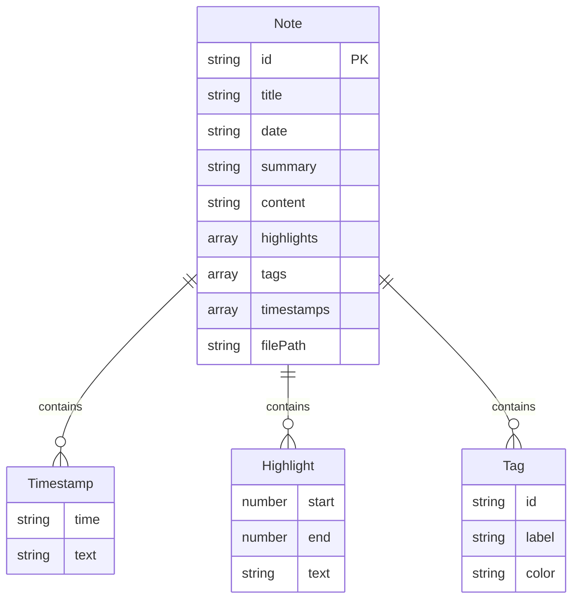

## 1. 架构设计

```mermaid
flowchart TB
    subgraph "前端 (React + TypeScript + Vite)"
        "App.tsx 路由入口"
        "notesStore 状态管理"
        "notesApi / exportApi API调用层"
        "NotesPage 笔记编辑页"
        "ExportPage 导出页面"
    end

    subgraph "后端 (Python Flask)"
        "转录接口 /api/transcribe"
        "关键词提取 /api/keywords"
        "笔记CRUD /api/notes"
        "导出接口 /api/export"
    end

    subgraph "数据存储"
        "文件存储 (uploads/)"
        "JSON数据存储 (data/)"
    end

    "App.tsx 路由入口" --> "notesApi / exportApi API调用层"
    "notesApi / exportApi API调用层" --> "后端 (Python Flask)"
    "NotesPage 笔记编辑页" --> "notesStore 状态管理"
    "notesStore 状态管理" --> "notesApi / exportApi API调用层"
    "后端 (Python Flask)" --> "数据存储"
```

## 2. 技术说明

- **前端**：React@18 + TypeScript + Vite + framer-motion + zustand
- **初始化工具**：vite-init (react-ts模板)
- **后端**：Python Flask + SpeechRecognition + FPDF + markdown
- **数据库**：JSON文件存储(无需外部数据库)
- **通信方式**：前端通过axios调用Flask REST API，Vite代理转发至5050端口

## 3. 路由定义

| 路由 | 用途 |
|------|------|
| / | 笔记列表页，展示瀑布流卡片和上传区域 |
| /notes/:id | 笔记编辑页，Markdown编辑器+预览+标签+复习模式 |

## 4. API定义

### 4.1 上传与转录

```
POST /api/transcribe
Request: multipart/form-data { file: File }
Response: { id: string, title: string, timestamps: [{ time: string, text: string }], progress: number }
```

### 4.2 关键词提取

```
POST /api/keywords
Request: { text: string }
Response: { keywords: string[], highlights: [{ start: number, end: number, text: string }] }
```

### 4.3 笔记CRUD

```
GET /api/notes
Response: [{ id: string, title: string, date: string, summary: string, content: string, highlights: [], tags: [] }]

GET /api/notes/:id
Response: { id: string, title: string, date: string, content: string, timestamps: [], highlights: [], tags: [] }

PUT /api/notes/:id
Request: { title?: string, content?: string, highlights?: [], tags?: [] }
Response: { success: boolean }
```

### 4.4 文档导出

```
POST /api/export
Request: { noteId: string, format: "pdf" | "markdown" }
Response: { downloadUrl: string }
```

## 5. 服务器架构图

```mermaid
flowchart LR
    "Flask Router" --> "TranscriptionService"
    "Flask Router" --> "KeywordService"
    "Flask Router" --> "NoteService"
    "Flask Router" --> "ExportService"
    "TranscriptionService" --> "SpeechRecognition"
    "KeywordService" --> "TF-IDF提取"
    "NoteService" --> "JSON文件存储"
    "ExportService" --> "FPDF/Markdown生成"
```

## 6. 数据模型

### 6.1 数据模型定义



### 6.2 数据定义

```sql
-- 使用JSON文件存储，无需DDL
-- 数据结构示例：
-- notes.json: [{ id, title, date, summary, content, highlights: [{start, end, text}], tags: [{id, label, color}], timestamps: [{time, text}], filePath }]
```

## 7. 文件结构与调用关系

```
project/
├── package.json                    # 前端依赖与启动脚本
├── vite.config.js                  # React路径别名 + 代理转发至Flask:5050
├── tsconfig.json                   # TypeScript strict模式, target es2020
├── index.html                      # 入口页面，引入Noto Sans SC字体
├── src/
│   ├── App.tsx                     # 路由主入口 → / 和 /notes/:id
│   ├── modules/
│   │   ├── noteEditing/
│   │   │   ├── Pages/
│   │   │   │   └── NotesPage.tsx   # 笔记编辑页 → 调用notesApi + exportApi
│   │   │   ├── hooks/
│   │   │   │   └── useNotes.ts     # 自定义Hook → 调用notesApi管理状态
│   │   │   └── styles/
│   │   │       └── notesStyles.css # 编辑页深色主题样式
│   │   └── documentExport/
│   │       └── Pages/
│   │           └── ExportPage.tsx  # 导出页面 → 调用exportApi
│   ├── api/
│   │   ├── notesApi.ts             # 笔记CRUD + 转录API调用
│   │   └── exportApi.ts            # 导出API调用
│   ├── store/
│   │   └── notesStore.ts           # Zustand状态管理
│   └── components/
│       ├── Sidebar.tsx             # 左侧导航栏
│       ├── NoteCard.tsx            # 笔记卡片组件
│       ├── MarkdownEditor.tsx      # Markdown编辑器
│       ├── MarkdownPreview.tsx     # Markdown预览区
│       ├── ProgressBar.tsx         # 转录进度条
│       ├── TagBubble.tsx           # 标签气泡组件
│       ├── ExportModal.tsx         # 导出模态框
│       ├── ReviewMode.tsx          # 复习模式组件
│       └── NotificationBar.tsx     # 通知栏
├── api/                            # Flask后端
│   ├── app.py                      # Flask应用入口
│   ├── routes/
│   │   ├── transcribe.py           # 转录路由
│   │   ├── notes.py                # 笔记CRUD路由
│   │   └── export.py               # 导出路由
│   ├── services/
│   │   ├── transcription_service.py # 语音转录服务
│   │   ├── keyword_service.py       # 关键词提取服务
│   │   ├── note_service.py          # 笔记数据服务
│   │   └── export_service.py        # 文档生成服务
│   ├── data/
│   │   └── notes.json               # 笔记数据存储
│   └── uploads/                     # 上传文件存储
└── requirements.txt                 # Python依赖
```

### 数据流向

1. **用户操作** → 组件调用 `notesApi/exportApi` → axios请求Flask API → Flask路由分发到Service → 操作数据/文件
2. **转录流程**：上传文件 → `/api/transcribe` → transcription_service → 返回时间戳文本 + 进度
3. **关键词提取**：笔记内容 → `/api/keywords` → keyword_service → 返回高亮段落
4. **导出流程**：选择格式 → `/api/export` → export_service → 生成PDF/Markdown → 返回下载链接
