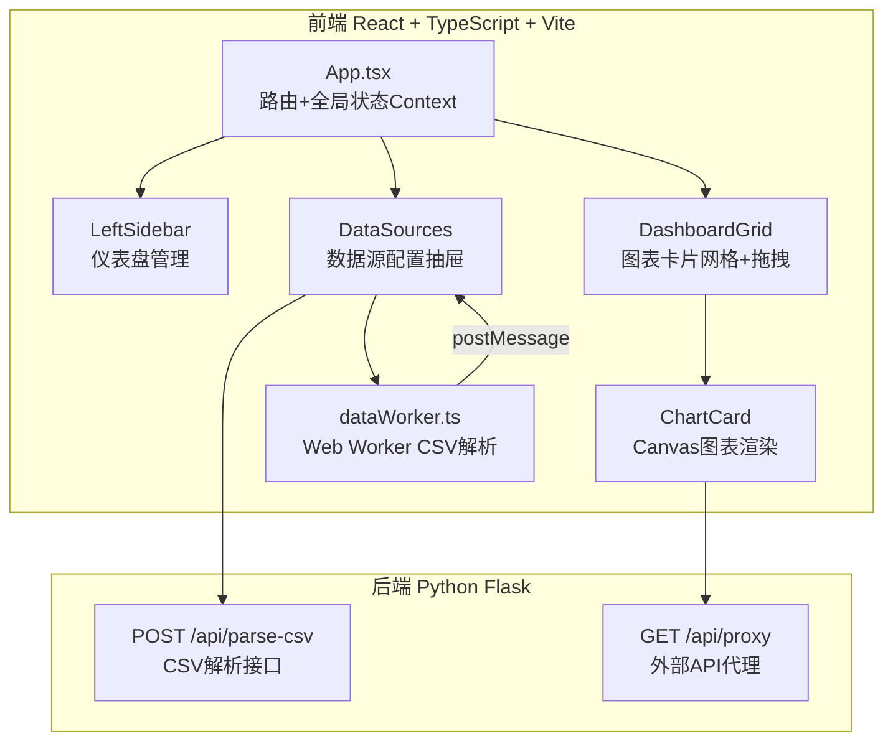
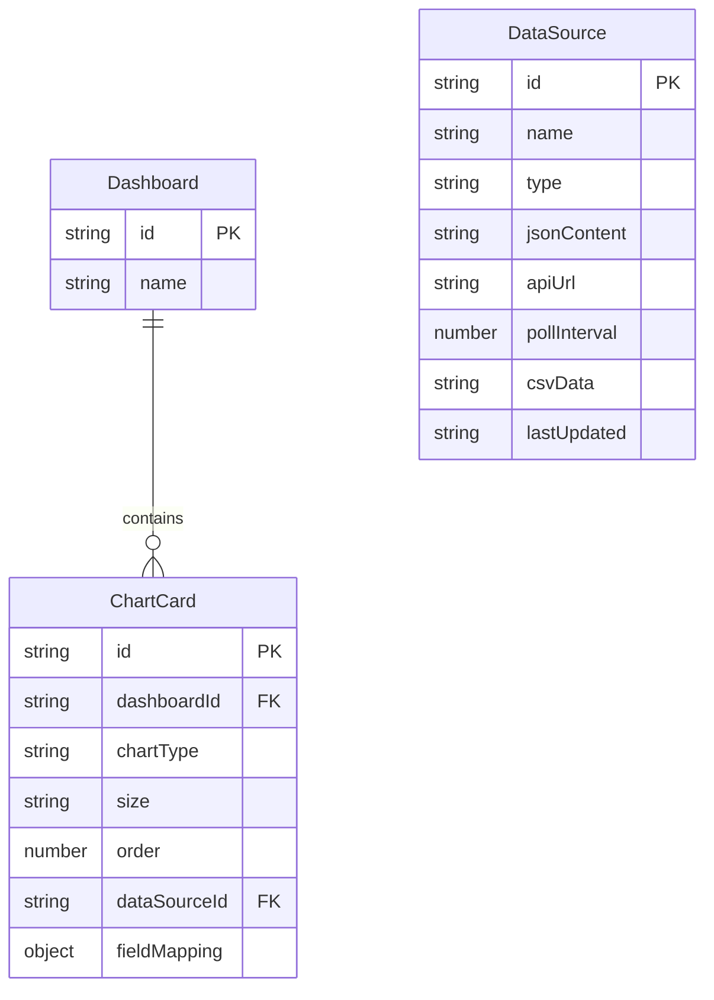

## 1. 架构设计



## 2. 技术说明

- **前端**：React@18 + TypeScript + Vite + framer-motion + zustand
- **初始化工具**：vite-init (react-ts模板)
- **后端**：Python Flask（数据源CRUD API和CSV解析接口）
- **数据库**：无，使用前端内存状态管理（zustand store持久化到localStorage）
- **图表渲染**：Canvas 2D API原生绘制
- **拖拽**：framer-motion Reorder组件
- **CSS**：Tailwind CSS + CSS变量主题

## 3. 路由定义

| 路由 | 用途 |
|------|------|
| / | 仪表盘编辑主页（含左侧边栏、网格区域、右侧抽屉） |

## 4. API定义

### 4.1 POST /api/parse-csv

请求：`multipart/form-data`，字段 `file` 为CSV文件

响应：
```typescript
interface ParseCSVResponse {
  columns: string[];
  rows: Record<string, string | number>[];
  columnTypes: Record<string, "string" | "number" | "date">;
}
```

### 4.2 GET /api/proxy

请求参数：`?url=encodeURIComponent(targetUrl)`

响应：
```typescript
interface ProxyResponse {
  data: any;
  fetchedAt: string;
}
```

## 5. 数据模型

### 5.1 数据模型定义



### 5.2 TypeScript 类型定义

```typescript
type ChartType = "line" | "bar" | "pie" | "area";
type CardSize = "small" | "medium" | "large";
type DataSourceType = "json" | "api" | "csv";

interface Dashboard {
  id: string;
  name: string;
}

interface ChartCard {
  id: string;
  dashboardId: string;
  chartType: ChartType;
  size: CardSize;
  order: number;
  dataSourceId: string;
  fieldMapping: { x?: string; y?: string; label?: string; value?: string };
}

interface DataSource {
  id: string;
  name: string;
  type: DataSourceType;
  jsonContent?: string;
  apiUrl?: string;
  pollInterval?: number;
  csvData?: string;
  parsedData?: { columns: string[]; rows: Record<string, any>[]; columnTypes: Record<string, string> };
  lastUpdated: string;
}
```
