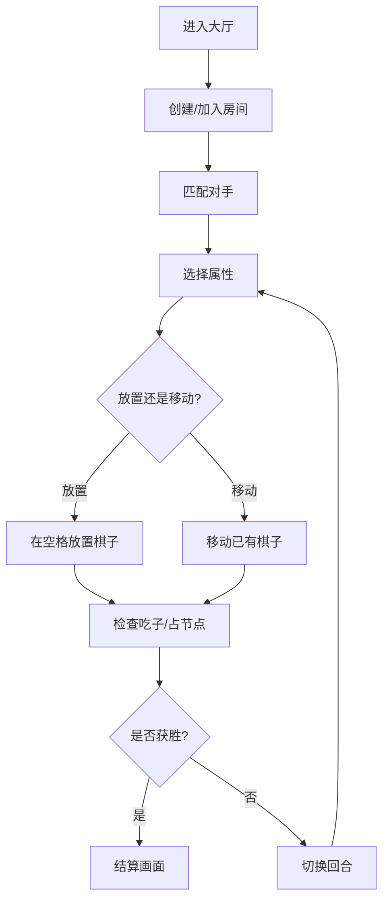

## 1. 产品概述

幻光棋局是一款双人即时战略小游戏，两位玩家在8x8棋盘上通过放置和移动带有光、暗、幻三属性的棋子争夺能量节点，先获得10分或完全封锁对手行动者获胜。

- 目标用户：喜欢策略对弈的休闲游戏玩家
- 核心价值：三属性相克机制（光克暗、暗克幻、幻克光）结合节点争夺带来的策略深度

## 2. 核心功能

### 2.1 用户角色

| 角色 | 注册方式 | 核心权限 |
|------|----------|----------|
| 玩家 | 房间匹配加入 | 放置/移动棋子、查看对局状态 |
| AI对手 | 系统自动生成 | 自动走棋（每2秒一步） |

### 2.2 功能模块

1. **游戏主界面**：8x8棋盘渲染、棋子动画、状态栏、操作按钮
2. **对局大厅**：房间创建/加入、匹配等待
3. **对局记录**：历史战绩查看

### 2.3 页面详情

| 页面名称 | 模块名称 | 功能描述 |
|----------|----------|----------|
| 游戏主界面 | 棋盘区域 | 8x8棋盘渲染，格子背景随行列奇偶变化，选中格发光，棋子带属性光晕动画 |
| 游戏主界面 | 状态栏 | 两侧显示玩家信息、得分、属性克制提示，中间倒计时和回合指示 |
| 游戏主界面 | 操作按钮区 | 选择属性（光/暗/幻）、放置棋子、撤回操作 |
| 游戏主界面 | 日志面板 | 右侧显示游戏事件日志（移动、吃子、得分等） |
| 对局大厅 | 房间列表 | 显示可加入的房间，创建新房间按钮 |

## 3. 核心流程

1. 玩家进入对局大厅，创建或加入房间
2. 系统匹配对手（或使用AI对手）
3. 双方轮流操作：选择属性→放置/移动棋子
4. 棋子移入能量节点获得分数，三属性相克决定吃子规则
5. 先达10分或封锁对手获胜
6. 对局记录保存至数据库

## 4. 用户界面设计

### 4.1 设计风格

- **主题**：赛博朋克暗色主题
- **主色**：#0d0d1a（深黑蓝底色）
- **强调色**：#00f5ff（青色霓虹）和 #ff00ff（品红霓虹）
- **棋盘格色**：奇数行奇数列 #2a2a3e，其他 #1e1e2e
- **按钮**：渐变背景 #6c5ce7 → #a29bfe，圆角12px，悬停缩放1.05
- **字体**：Orbitron（标题/数字）+ Rajdhani（正文）
- **布局**：顶部状态栏 + 左侧棋盘 + 右侧日志面板

### 4.2 页面设计概览

| 页面名称 | 模块名称 | UI元素 |
|----------|----------|--------|
| 游戏主界面 | 棋盘区域 | 8x8格子，60px见方，圆角4px，选中发光3px白色，棋子属性光晕动画，弹性回弹动画，移动轨迹渐隐 |
| 游戏主界面 | 状态栏 | 全宽60px高，深色半透明背景，两侧玩家信息，中间倒计时 |
| 游戏主界面 | 按钮区 | 三个按钮：属性选择/放置/撤回，渐变背景，圆角12px |
| 游戏主界面 | 日志面板 | 右侧面板，滚动显示事件日志 |

### 4.3 响应式

- 桌面优先设计
- 最小宽度1024px保证棋盘完整显示
- 日志面板在窄屏时可折叠

### 4.4 动画效果

- **棋子光晕**：光属性金色脉冲 #ffd700，暗属性紫色旋涡 #9b59b6，幻属性青色闪烁 #00ffff
- **放置动画**：弹性回弹效果（0.4秒，弹簧阻尼）
- **选中发光**：3px白色外发光，0.3秒过渡
- **移动轨迹**：渐隐彩色轨迹，透明度0.8→0，持续0.6秒
- **性能目标**：动画帧率稳定60fps，AI决策不超过50ms
