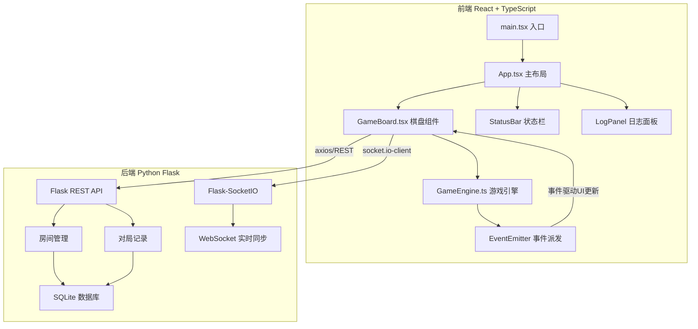
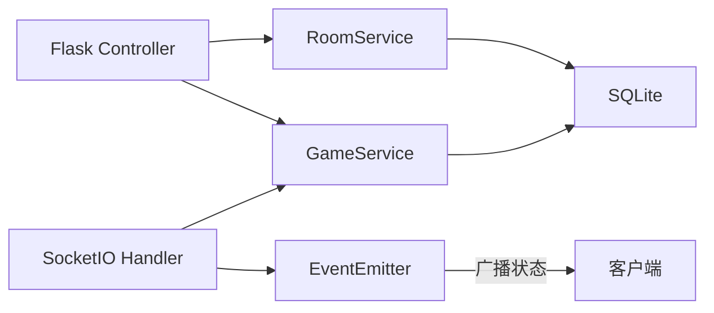
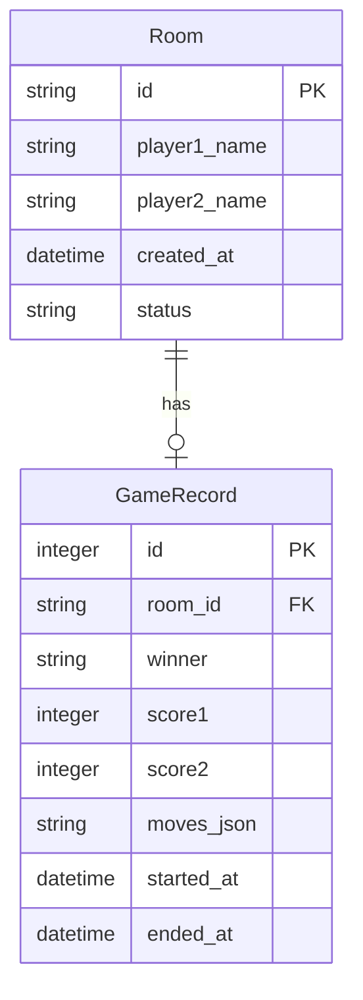

## 1. 架构设计



## 2. 技术说明

- **前端**：React@18 + TypeScript + Vite + Framer Motion（动画）+ Zustand（状态管理）
- **初始化工具**：vite-init
- **后端**：Python Flask + Flask-SocketIO + Eventlet
- **数据库**：SQLite（对局记录存储）
- **实时通信**：WebSocket（Flask-SocketIO + socket.io-client）
- **3D/动画**：Framer Motion 负责UI动画，Three.js/React Three Fiber 备用（棋子特效）

## 3. 路由定义

| 路由 | 用途 |
|------|------|
| `/` | 游戏主界面（棋盘+状态栏+日志） |
| `/lobby` | 对局大厅（房间列表+创建房间） |

## 4. API 定义

### 4.1 REST API

| 方法 | 端点 | 请求体 | 响应 |
|------|------|--------|------|
| POST | `/api/rooms` | `{ "playerName": string }` | `{ "roomId": string, "wsUrl": string }` |
| GET | `/api/rooms` | - | `{ "rooms": Array<{ "id": string, "players": number }> }` |
| POST | `/api/rooms/:id/join` | `{ "playerName": string }` | `{ "success": boolean }` |
| GET | `/api/games/:id` | - | `{ "game": GameRecord }` |

### 4.2 WebSocket 事件

| 事件名 | 方向 | 数据 |
|--------|------|------|
| `join` | Client→Server | `{ "roomId": string, "playerName": string }` |
| `move` | Client→Server | `{ "from": Position, "to": Position, "attribute": Attribute }` |
| `place` | Client→Server | `{ "position": Position, "attribute": Attribute }` |
| `state` | Server→Client | `{ "board": BoardState, "scores": [number, number], "turn": number }` |
| `gameOver` | Server→Client | `{ "winner": number, "reason": string }` |

### 4.3 TypeScript 类型定义

```typescript
type Attribute = 'light' | 'dark' | 'phantom';
type Position = { row: number; col: number };

interface Piece {
  id: string;
  attribute: Attribute;
  player: 0 | 1;
  position: Position;
}

interface BoardState {
  cells: (Piece | null)[][];
  energyNodes: Position[];
}

interface GameState {
  board: BoardState;
  scores: [number, number];
  turn: 0 | 1;
  pieces: Piece[];
  isGameOver: boolean;
  winner: number | null;
}
```

## 5. 服务器架构



## 6. 数据模型

### 6.1 数据模型定义



### 6.2 数据定义语言

```sql
CREATE TABLE rooms (
    id TEXT PRIMARY KEY,
    player1_name TEXT NOT NULL,
    player2_name TEXT,
    status TEXT DEFAULT 'waiting',
    created_at TIMESTAMP DEFAULT CURRENT_TIMESTAMP
);

CREATE TABLE game_records (
    id INTEGER PRIMARY KEY AUTOINCREMENT,
    room_id TEXT REFERENCES rooms(id),
    winner TEXT,
    score1 INTEGER DEFAULT 0,
    score2 INTEGER DEFAULT 0,
    moves_json TEXT,
    started_at TIMESTAMP DEFAULT CURRENT_TIMESTAMP,
    ended_at TIMESTAMP
);
```

## 7. 核心游戏逻辑

### 7.1 三属性相克规则

- 光（light）克 暗（dark）
- 暗（dark）克 幻（phantom）
- 幻（phantom）克 光（light）

### 7.2 能量节点

- 棋盘上预设4个能量节点（位于对称位置）
- 棋子占据节点获得1分，并激活特殊能力
- 特殊能力：光属性节点恢复被吃棋子，暗属性节点封锁相邻格，幻属性节点瞬移至任意空格

### 7.3 AI决策逻辑

- 每2秒自动走一步
- 优先级：攻击可克制棋子 > 占据空能量节点 > 随机移动
- 决策时间不超过50ms

### 7.4 GameEngine 事件

| 事件名 | 数据 | 说明 |
|--------|------|------|
| `move` | `{ piece, from, to }` | 棋子移动 |
| `capture` | `{ attacker, captured }` | 吃子 |
| `score` | `{ player, points }` | 得分 |
| `win` | `{ winner, reason }` | 获胜 |
