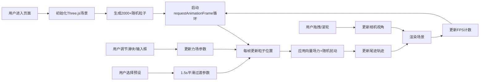

## 1. 产品概述

三维流体粒子可视化工具是一款基于Web的交互式科学可视化应用，旨在解决流体动力学教学中难以直观展示粒子运动轨迹与参数变化影响的问题。通过实时调节向量场参数和预设形态，用户可以沉浸式观察2000+粒子在三维空间中的运动规律。

- **核心价值**：将抽象的流体动力学概念转化为直观可视的三维粒子运动，降低学习门槛
- **目标用户**：物理/工程专业学生、教师、科学可视化爱好者
- **使用场景**：课堂教学演示、自主学习探索、研究参数可视化

## 2. 核心 Features

### 2.1 粒子系统核心模块
- 2000+ 半透明球体粒子（半径 0.08），颜色从 #00d4ff 到 #ff6b35 渐变
- 随机初始位置和速度，受向量场力与随机扰动力共同作用
- 粒子尾迹效果：保留最近 30 帧位置历史，渲染为逐渐淡出的线条（宽度 0.02）
- 尾迹透明度从 0.8 到 0.0 渐变，颜色与粒子相同

### 2.2 力场控制器模块
- 右侧可拖拽面板（宽 280px，磨砂玻璃效果）
- 三个垂直滑块分别控制 X、Y、Z 方向力（范围 -2.0 到 2.0）
- 实时显示当前数值（精确到 0.01）
- 支持输入框直接键入数值
- 参数调整后下一帧立即响应（延迟 ≤ 16ms）

### 2.3 场景控制模块
- 鼠标拖拽旋转视角（绕 Y 轴和 X 轴）
- 滚轮缩放（范围 0.5 到 3.0）
- 左下角视角切换按钮组（正面、侧面、俯视、自由）
- 一键重置视角功能

### 2.4 粒子形态预设模块
- 顶部预设选择栏（高度 60px）
- 5 种预设：湍流、螺旋、涡流、引力场、布朗运动
- 平滑过渡动画（1.5 秒，easeInOutCubic 缓动）
- 预设卡片选中时边框高亮（2px solid #7c3aed）

### 2.5 性能监控模块
- 左上角 FPS 计数器（monospace 字体，#00ff88 颜色）
- 每帧更新 FPS 显示
- FPS 低于 30 时自动缩短尾迹至 15 帧
- 距离相机超过 50 单位的粒子尾迹 LOD 优化（缩短至 10 帧）

## 3. 核心流程

## 4. 用户界面设计

### 4.1 设计风格
- **主题风格**：深蓝星空科技风，半透明毛玻璃 UI 覆盖层
- **主色调**：#0a0a1a（深空背景）、#1a1a2e（面板背景）、#7c3aed（强调紫色）
- **辅助色**：#00d4ff（冷色粒子）、#ff6b35（暖色粒子）、#00ff88（性能绿）
- **字体**：系统无衬线字体 + monospace 数字显示
- **交互反馈**：hover 时 scale(1.05) + brightness(1.2)，0.2s 过渡

### 4.2 页面布局
| 区域 | 位置 | 组件 | 说明 |
|------|------|------|------|
| 顶部预设栏 | fixed top:0, width:100%, height:60px | PresetSelector | 5 个预设卡片横向排列 |
| 3D 场景 | 全屏背景 | Scene | Three.js Canvas 占满视口 |
| 力场控制器 | absolute right:20px, 垂直居中 | ForceController | 280px 宽面板，三滑块 |
| 视角按钮组 | fixed left:20px, bottom:20px | ViewControls | 四个视角按钮 |
| FPS 监控 | fixed top:20px, left:20px | PerformanceMonitor | 悬浮计数器 |

### 4.3 响应式设计
- **桌面端（≥768px）**：右侧力场控制器垂直居中
- **移动端（<768px）**：力场控制器收至底部可折叠面板（默认折叠，高度 300px）
- 触控设备优化拖拽和缩放交互

### 4.4 3D 场景设计
- **背景**：从 #0a0a1a 到 #1a1a3e 的径向渐变，模拟星空氛围
- **光照**：环境光 + 两盏方向光，突出粒子半透明质感
- **相机**：PerspectiveCamera，初始距离 10 单位，fov 60°
- **粒子材质**：MeshBasicMaterial / PointsMaterial，半透明，加深度写入优化
- **后处理**：可选 bloom 效果增强辉光（需平衡性能）
