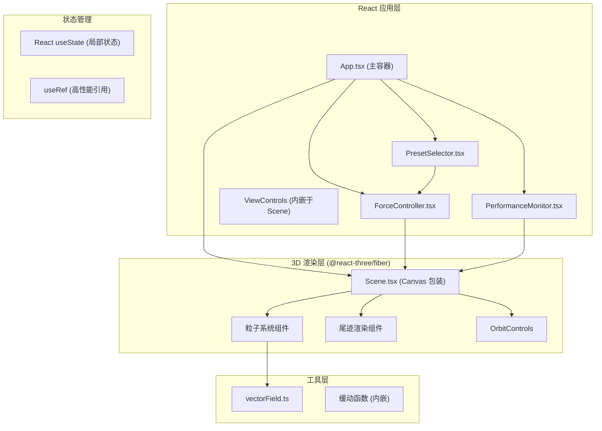

## 1. 架构设计



## 2. 技术栈说明

| 类别 | 技术选型 | 版本说明 | 用途 |
|------|----------|----------|------|
| 框架 | React 18 | 最新稳定版 | UI 组件化开发 |
| 语言 | TypeScript | 5.x | 类型安全 |
| 构建 | Vite | 5.x | 快速开发构建 |
| 3D 引擎 | Three.js | r160+ | WebGL 3D 渲染 |
| React 桥接 | @react-three/fiber | 8.x | React 声明式 Three.js |
| 辅助库 | @react-three/drei | 9.x | 常用 3D 组件（OrbitControls 等） |
| 状态管理 | React useState/useRef | - | 轻量状态管理 |
| 样式 | CSS Modules / 内联样式 | - | 组件级样式隔离 |

## 3. 目录结构

```
auto127/
├── package.json
├── vite.config.js
├── tsconfig.json
├── index.html
├── src/
│   ├── main.tsx              # React 入口
│   ├── App.tsx               # 主应用组件
│   ├── components/
│   │   ├── Scene.tsx         # 3D 场景核心组件
│   │   ├── ForceController.tsx   # 力场控制器面板
│   │   ├── PresetSelector.tsx    # 预设选择栏
│   │   └── PerformanceMonitor.tsx # FPS 性能监控
│   └── utils/
│       └── vectorField.ts    # 向量场计算与预设配置
└── .trae/
    └── documents/
        ├── PRD.md
        └── technical-architecture.md
```

## 4. 核心数据结构

### 4.1 粒子数据结构
```typescript
interface Particle {
  position: THREE.Vector3;
  velocity: THREE.Vector3;
  trail: THREE.Vector3[];  // 位置历史记录
  color: THREE.Color;
}
```

### 4.2 力场参数
```typescript
interface ForceParams {
  x: number;  // -2.0 ~ 2.0
  y: number;  // -2.0 ~ 2.0
  z: number;  // -2.0 ~ 2.0
  turbulence: number;  // 随机扰动力度
}
```

### 4.3 预设配置
```typescript
interface Preset {
  id: string;
  name: string;
  forces: ForceParams;
}
```

## 5. 性能优化策略

### 5.1 渲染优化
- 使用 `BufferGeometry` 而非 `Geometry`（已废弃）
- 粒子使用 `Points` + `ShaderMaterial` 或 `InstancedMesh` 批量渲染
- 尾迹使用 `LineGeometry` 或 `BufferGeometry` 共享顶点数据

### 5.2 计算优化
- 粒子更新逻辑放在 `useFrame` 回调中，每帧计算时间控制在 5ms 内
- 使用 `Float32Array` 存储位置数据，减少 GC 压力
- 避免在循环中创建新对象，复用 Vector3 实例

### 5.3 LOD 策略
- 距离相机 > 50 单位的粒子：尾迹长度缩短至 10 帧
- FPS < 30 时：全局尾迹长度缩短至 15 帧
- 粒子数 > 2000 时：自动启用 LOD

## 6. 动画与过渡

### 6.1 预设过渡
- 使用 `easeInOutCubic` 缓动函数
- 过渡时长 1.5 秒
- 力场参数线性插值过渡

### 6.2 缓动函数
```typescript
function easeInOutCubic(t: number): number {
  return t < 0.5 ? 4 * t * t * t : 1 - Math.pow(-2 * t + 2, 3) / 2;
}
```

## 7. 响应式策略

### 7.1 断点设计
- **桌面端**：width ≥ 768px，右侧力场面板
- **移动端**：width < 768px，底部折叠面板

### 7.2 实现方式
- CSS Media Queries + 条件渲染
- `window.matchMedia` 监听尺寸变化
- 移动端折叠面板使用 CSS transform 动画
